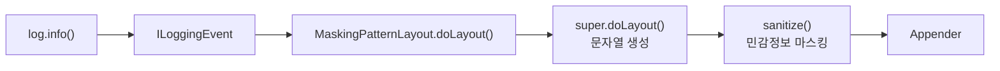
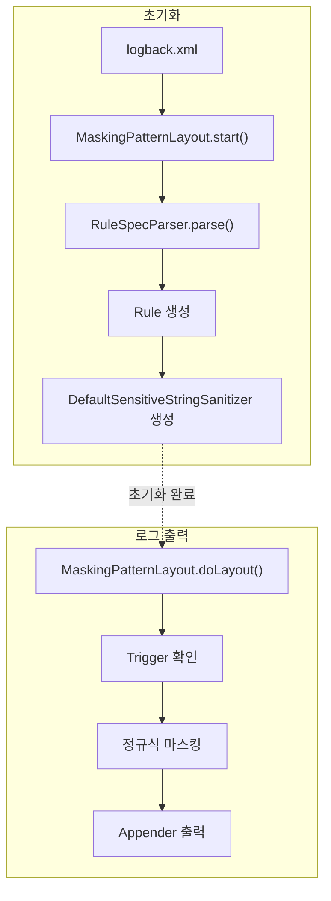

지난 포스팅에서는 여러 로그 마스킹 방식을 비교하고, `PatternLayout` 기반의 문자열 처리 방식을 선택했습니다. 

이제부터 `PatternLayout`을 직접 확장하여 로그 출력 직전에 전화번호와 이메일 주소를 자동으로 마스킹하는 기능을 구현해보겠습니다.

---

## 1. Logback의 로그 출력 과정

`Logback`에서 로그 출력을 처리하는 과정은 다음과 같습니다.

1. 애플리케이션에서 `log.info()` 메서드 호출
2. `ILoggingEvent` 생성
3. `PatternLayout`이 이벤트 내용을 문자열로 변환
4. 변환된 문자열이 `Appender`를 통해 출력



로그 마스킹은 `PatternLayout`을 확장한 `MaskingPatternLayout`에서 수행됩니다. `super.doLayout()`으로 문자열을 생성한 뒤, `Appender`로 전달하기 전에 민감정보를 마스킹하는 구조입니다.

---

## 2. PatternLayout 확장

그래서 `PatternLayout`을 상속받은 `MaskingPatternLayout`에서 이벤트 내용을 문자열로 변환할 때 호출되는 `doLayout()` 메서드를 오버라이드했습니다. 

**MaskingPatternLayout.java**
```java
public class MaskingPatternLayout extends PatternLayout {
    
    ...
    
    private volatile SensitiveStringSanitizer sanitizer;
    
    ...
    
    @Override
    public String doLayout(ILoggingEvent event) {
        String out = super.doLayout(event);
        if (!enabled)
            return out;

        SensitiveStringSanitizer s = sanitizer;
        // start() 호출 전에 doLayout 메서드가 호출되는 경우에는 원본 로그 그대로 출력(방어 로직 실행)
        if (s == null) 
            return out; 

        return s.sanitize(out);
    }
    
    ...
    
}
```

핵심은 `super.doLayout()`으로 원본 로그 문자열을 생성하고 `sanitize()`를 호출해 민감정보를 마스킹하는 것입니다. 이 구조 덕분에 애플리케이션 코드는 변경하지 않고 로그 출력 계층에서만 민감정보를 마스킹할 수 있습니다.

---

## 3. Logback의 초기화

`Logback`은 애플리케이션이 시작될 때 `logback.xml`을 읽고 `Layout`, `Appender`, `MaskingPatternLayout` 등 필요한 객체를 생성합니다. 

일반적으로 `Logback` 초기화 절차는 다음과 같습니다.

1. `Layout` 객체 생성: `PatternLayout`을 상속받은 `MaskingPatternLayout`
2. 설정값 주입 : `rule`,`enabled`,`triggers` 등
3. `Layout` 객체의 `start()` 메서드 호출
4. 로그 출력 시작

`MaskingPatternLayout`에서 선언한 `sanitizer`에는 `start()` 메서드 내부에서 생성한 `DefaultSensitiveStringSanitizer`가 할당됩니다.

**MaskingPatternLayout.java**
```java
public class MaskingPatternLayout extends PatternLayout {
    
    ...
    
    @Override
    public void start() {
        List<DefaultSensitiveStringSanitizer.Rule> rules = new ArrayList<>();
        for (String spec : ruleSpecs) {
            rules.add(RuleSpecParser.parse(spec));
        }

        this.sanitizer = new DefaultSensitiveStringSanitizer(rules, parseTriggers(triggers));
        super.start();
    }
    
    ...
    
}
```

일반적으로는 `start()` 메서드 호출 이후에 로그가 출력됩니다. 

하지만, 초기화 과정 중 예외적인 상황을 대비하여 `sanitizer`가 `null`인 경우에는 원본 로그가 그대로 출력하도록 `doLayout()` 메서드에 방어 로직을 추가했습니다.

```java
SensitiveStringSanitizer s = sanitizer;
// start() 호출 전에 doLayout 메서드가 호출되는 경우에는 원본 로그 그대로 출력(방어 로직 실행)
if (s == null) 
    return out; 
```

이번 프로젝트에서는 마스킹 처리의 예외로 인해 로그 출력 전체가 중단되는 상황을 피하고자 했습니다. 그래서 로그 출력의 안정성을 우선해 `sanitizer`가 초기화되지 않은 경우 원본 로그를 출력하는 `fail-open` 방식을 선택했습니다. 

실제 운영 환경에서는 마스킹되지 않은 로그가 남을 수 있으므로 해당 로그의 출력을 차단하거나 애플리케이션 초기화를 실패시키는 `fail-closed` 방식도 보안 요구사항에 따라 검토할 필요가 있습니다.

---

## 4. Trigger 기반 사전 필터링

정규식으로 로그 문자열에서 민감정보에 해당되는 패턴을 찾아서 마스킹하는 방식은 구조적으로 단순합니다. 

**"하지만, 모든 로그 출력에 대해서 매번 정규식 검사를 수행해도 괜찮을까요?"** 

INFO 레벨의 로그 출력이 많은 서비스라면 문자열 치환이 누적되면서 성능에 부담이 될 수 있습니다. 그래서 `Trigger` 기반 사전 필터링 기능을 추가했습니다.

예를 들어, 다음과 같이 전화번호를 마스킹하는 정규식이 있다고 가정해보겠습니다.

```text
(\b01[016789]-?)\d{3,4}(-?\d{4}\b)
```

이 정규식은 비교적 복잡합니다. 그런데 사실 대부분의 로그에는 전화번호가 포함되어 있지 않습니다. 그래서 매번 정규식 검사를 수행할 필요는 없습니다. 

대신 로그 문자열에 특정 키워드가 포함된 경우에만 정규식 검사를 수행하도록 했습니다.

이 키워드는 정확한 검증을 위한 조건이 아니라, 정규식 수행 여부를 빠르게 판단하기 위한 1차 필터입니다.

키워드는 `logback.xml` 파일에 `<triggers>` 태그에 정의하면 됩니다. 여러 키워드는 쉼표(,)로 구분합니다.

**logback.xml에 키워드 정의 예시**
```xml
<triggers>010-,@</triggers>
```
* 010- → 전화번호 가능성
* @ → 이메일 가능성
* Bearer → 토큰 가능성

지금까지 설명한 Trigger 기반 사전 필터링의 동작 절차는 다음과 같습니다.

1. 로그 문자열 입력
2. Trigger 키워드 확인
3. 키워드가 포함되어 있으면 정규식 검사를 수행하고, 그렇지 않으면 생략

Trigger에 포함되지 않은 형식의 민감정보는 정규식 검사 자체가 생략될 수 있습니다. 따라서 Trigger는 성능뿐 아니라 탐지 누락 가능성까지 고려해 정의해야 하며, 안전성을 우선한다면 Trigger를 비워 모든 Rule을 적용할 수도 있습니다.

---

### 4.1. maybeSensitive 메서드 구현

Trigger 기반 사전 필터링 기능은 `DefaultSensitiveStringSanitizer.maybeSensitive()` 메서드에 구현했습니다.

**DefaultSensitiveStringSanitizer.java**

```java
public final class DefaultSensitiveStringSanitizer implements SensitiveStringSanitizer{
    
    ...
    
    private boolean maybeSensitive(String input) {
        if (triggers.isEmpty()) {
            return true;
        }

        for (String trigger : triggers) {
            if (input.contains(trigger)) {
                return true;
            }
        }
        return false;
    }
    
    ...
    
}
```

---

### 4.2. sanitize 메서드 구현

로그 문자열은 `DefaultSensitiveStringSanitizer.sanitize()` 메서드로 입력됩니다. 여기에서 `maybeSensitive()` 메서드가 호출되면서 Trigger 기반 사전 필터링 기능이 작동하게 됩니다. 

Trigger 키워드가 포함되어 있는 경우에만 Rule에 정의된 정규식이 적용됩니다.

**DefaultSensitiveStringSanitizer.java**
```java
public final class DefaultSensitiveStringSanitizer implements SensitiveStringSanitizer{
    
    ...
    
    @Override
    public String sanitize(String input) {
        if (input == null || input.isEmpty())
            return input;

        // triggers가 있으면 "민감 가능성" 빠른 체크로 대부분 로그는 정규식 검사&마스킹 처리를 생략
        if (!maybeSensitive(input))
            return input;

        String out = input;
        for (Rule r : rules) {
            out = r.apply(out);
        }
        return out;
    }

    ...

}
```

| 단계      | 역할         |
| ------- | ---------- |
| Trigger | 정규식 실행 여부를 판단하는 사전 필터  |
| 정규식   | 실제 민감정보 탐지 및 마스킹 |

Trigger는 정규식 실행 여부를 빠르게 판단하고, 실제 민감정보 탐지와 치환은 Rule이 수행합니다.

이번 프로젝트에서는 구조를 단순하게 하기 위해서 Trigger 키워드와 하나라도 매칭되면 모든 Rule이 적용되도록 구현했습니다.

---

## 5. 마스킹 규칙(Rule) 정의

마스킹 규칙은 `logback.xml` 파일의 `<rule>` 태그에 정의하면 됩니다. 

**logback.xml 파일 예시**
```xml
<layout class="sanghoon.study.logging.mask.logback.MaskingPatternLayout">

    <enabled>true</enabled>

    <triggers>010-,@</triggers>

    <rule>phone|(\\b01[016789]-?)\\d{3,4}(-?\\d{4}\\b)|$1****$2</rule>
    <rule>email|([A-Za-z0-9._%+-]{2})[A-Za-z0-9._%+-]*(@[A-Za-z0-9.-]+\\.[A-Za-z]{2,})|$1****$2</rule>

</layout>
```

각 `<rule>` 태그는 다음의 형식을 따릅니다.

```text
name | regex | replacement
```

| 항목          | 설명     |
| ----------- | ------ |
| name        | 규칙 이름  |
| regex       | 정규식    |
| replacement | 치환 문자열 |

---

### 5.1. Rule 객체 생성

`MaskingPatternLayout`의 `start()` 메서드 내부에서 `logback.xml` 파일의 `<rule>` 태그에 정의된 마스킹 규칙을 가져오기 위해서 `RuleSpecParser`가 사용됩니다.

```java
List<DefaultSensitiveStringSanitizer.Rule> rules = new ArrayList<>();
for (String spec : ruleSpecs) {
    rules.add(RuleSpecParser.parse(spec));
}
```

---

### 5.2. Rule 문자열 파싱

`ruleSpecs`는 `logback.xml` 파일의 `<rule>` 태그에 정의된 마스킹 규칙에 해당되는 문자열을 나타냅니다. 

이 문자열을 name, regex, replacement로 분리하는 코드는 `RuleSpecParser.parse()` 메서드에 구현했습니다.

**RuleSpecParser.java**
```java
public final class RuleSpecParser {
    
    ...

    public static DefaultSensitiveStringSanitizer.Rule parse(String spec) {
        
        ...
    
        String[] parts = spec.split("\\|", 3);
        if (parts.length != 3) {
            throw new IllegalArgumentException("invalid rule spec. expected name|regex|replacement. got: " + spec);
        }

        String name = parts[0];
        String regex = parts[1];
        String replacement = parts[2];

        ...

        return new DefaultSensitiveStringSanitizer.Rule(name, Pattern.compile(regex), replacement);
    }

    ...

}
```

`parse()` 메서드는 정규식 문자열을 `Pattern`으로 컴파일한 뒤 `Rule` 객체를 생성합니다. 생성된 `Rule` 객체는 `DefaultSensitiveStringSanitizer`에 전달됩니다.

---

## 6. 전체 흐름 정리

지금까지 살펴본 코드의 전체 흐름을 한 번 정리해보겠습니다.

1. `logback.xml` 파일에 정의된 마스킹 규칙(Rule)과 Trigger 키워드를 조회
2. Logback 초기화 과정에서 `MaskingPatternLayout.start()` 메서드 호출
3. `RuleSpecParser.parse()`가 마스킹 규칙 문자열을 파싱하여 `Rule` 객체 생성
4. `DefaultSensitiveStringSanitizer` 객체 생성
5. 로그 출력 시 `MaskingPatternLayout.doLayout()` 메서드 호출
6. Trigger 1차 필터링
7. 정규식 기반 마스킹 수행
8. 최종 문자열 출력



구조는 단순하지만, 설정과 코드가 명확하게 분리되어 있습니다.

코드를 수정하지 않고도 `logback.xml` 파일의 내용만 변경하면 마스킹 정책을 바꿀 수 있다는 점이 장점입니다.

---

## 7. 다음 포스팅

지금까지 `PatternLayout`을 확장하여 로그 출력 시점에 민감정보를 자동으로 마스킹하는 구조를 어떻게 구현했는지 살펴봤습니다.

다음 포스팅에서는 다양한 입력 데이터를 이용해 로그 마스킹 기능이 정상적으로 동작하는지 검증해보도록 하겠습니다.

---

## 8. 소스코드 
* [logging-pattern-mask](https://github.com/sanghoon-lee/logging-pattern-mask)


