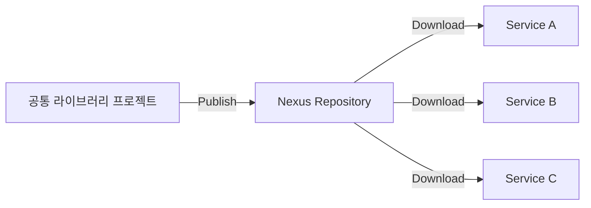
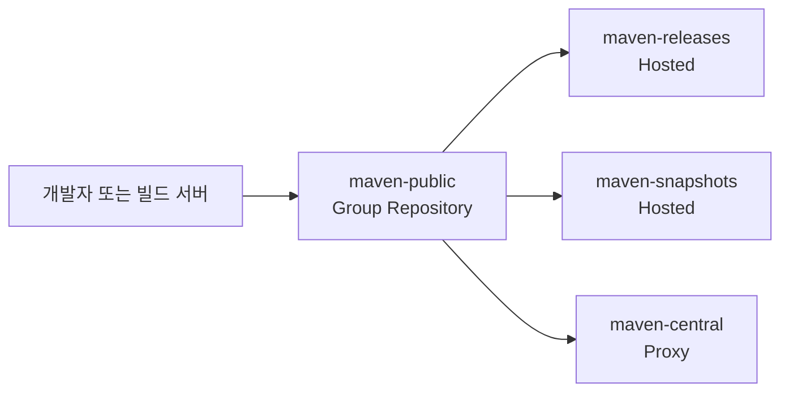

로깅·인증·암호화·예외 처리처럼 여러 애플리케이션에서 반복되는 기능을 공통 라이브러리로 분리하면 검증된 코드를 재사용할 수 있습니다. 반복되는 구현은 라이브러리 내부로 감춰지고, 애플리케이션의 코드는 더욱 간결해지며 복잡도도 낮아집니다. 이로 인해 개발자는 핵심 비즈니스 로직의 구현에 더욱 집중할 수 있습니다.

공통 라이브러리를 여러 프로젝트에서 활용하려면 이를 배포하고 버전별로 관리할 수 있는 내부 라이브러리 저장소(Private Repository)가 필요합니다. 조직 내부에서 개발한 라이브러리를 `Maven Central`과 같은 공개 저장소에 배포하기는 어렵기 때문입니다.


`Nexus Repository`는 내부 라이브러리 저장소를 구축하는 데 널리 사용되는 오픈소스 도구입니다.

이번 포스팅에서는 Nexus를 이용해 다음과 같은 구조의 내부 라이브러리 저장소를 구축해보겠습니다. 이어서 간단한 Java 라이브러리를 배포하고, 다른 프로젝트에서 사용하는 과정까지 실습하면서 내부 라이브러리 저장소의 역할과 동작 방식을 함께 살펴보겠습니다.



---

## 1. Nexus 설치

Docker를 이용해 Nexus를 실행하기 위해 먼저 `latest` 태그의 이미지를 내려받았습니다.

```bash
$ sudo docker pull sonatype/nexus3:latest

```

그리고 아래와 같이 컨테이너를 구성해서 실행했습니다.

```bash
$ sudo docker run \
    --name nexus \
    -d \
    -p 8081:8081 \
    -v /nexus-data:/nexus-data \
    -u root \
    sonatype/nexus3:latest
```

* `-d`: 컨테이너를 백그라운드에서 실행
* `-p 8081:8081`: 호스트의 8081 포트를 컨테이너의 8081 포트에 매핑
* `-v /nexus-data:/nexus-data`: 호스트의 `/nexus-data` 디렉터리를 컨테이너의 `/nexus-data` 디렉터리에 마운트
* `-u root`: 컨테이너 내부의 Nexus 프로세스를 `root` 사용자 권한으로 실행

> 이번 실습에서는 `/nexus-data` 디렉터리에 대한 권한 문제를 피하기 위해 `root` 사용자 권한으로 실행했습니다. 다만 운영 환경에서는 볼륨 디렉터리의 소유권을 적절하게 설정하고, Nexus를 일반 사용자 권한으로 실행하는 것이 권장됩니다.

---

## 2. Nexus 접속

컨테이너가 정상적으로 실행되면 브라우저에서 `http://<서버 IP>:8081`(예: `http://10.68.65.187:8081`)로 Nexus 웹 UI에 접속할 수 있습니다. 최초로 접속하면 로그인 창에 `admin` 계정의 초기 비밀번호가 저장된 파일 경로가 표시됩니다. 해당 파일을 읽어 초기 비밀번호를 확인한 뒤 로그인할 수 있습니다.

**초기 비밀번호 조회 명령**

```bash
$ sudo docker exec nexus cat /nexus-data/admin.password
```

**최초 접속 시 로그인 화면**


초기 비밀번호를 이용해 로그인에 성공하면 Welcome 메시지를 확인할 수 있습니다. 

**Welcome 메시지 화면**


Welcome 메시지 화면이 표시되면 초기 비밀번호를 새로운 비밀번호로 변경해야 합니다. 비밀번호 변경이 완료되면 최초 로그인 절차가 마무리됩니다.

**초기 비밀번호 변경**


실습 환경에서는 최초 로그인 절차까지 완료되면 별도의 권한 설정 없이도 Nexus의 저장소를 사용할 수 있습니다.

---

## 3. Nexus 저장소의 종류

Nexus에서 사용하는 저장소는 다음과 같은 타입(type)으로 구분됩니다.

* `hosted`
* `proxy`
* `group`

**Nexus Repository 목록**


기본적으로 Maven 관련 저장소들이 생성되어 있습니다.

---

### 3.1. hosted

`hosted`는 직접 라이브러리를 업로드하여 관리하는 저장소입니다. 아래와 같은 `hosted` 저장소가 기본적으로 생성되어 있습니다.

* `maven-releases`: 정식 버전의 라이브러리를 배포
* `maven-snapshots`: 개발 중인 버전의 라이브러리를 배포

즉, `hosted` 저장소는 조직 내부에서 만든 라이브러리를 배포하는 목적으로 사용할 수 있습니다. 이번 포스팅에서 라이브러리는 `hosted` 저장소에 배포합니다.

---

### 3.2. proxy

`proxy`는 외부 라이브러리 저장소를 대신 조회하고, 다운로드한 파일을 캐시하는 저장소입니다. Gradle이나 Maven은 필요한 라이브러리를 `Maven Central`과 같은 외부 저장소에서 조회하여 다운로드합니다.

`Maven Central`의 기본 저장소 주소는 다음과 같습니다.

* `https://repo.maven.apache.org/maven2`

개발자 PC나 빌드 서버의 외부 인터넷 접근이 제한된 환경에서는 `Maven Central`에 직접 접근하지 않고, 외부 저장소에 접근할 수 있는 `proxy` 저장소를 경유하도록 구성할 수 있습니다. `proxy` 저장소는 외부 저장소에서 다운로드한 라이브러리를 캐시하고, 이후 동일한 요청에는 캐시된 파일을 제공합니다.

외부 인터넷과 완전히 분리된 폐쇄망에서는 `proxy` 저장소도 외부 라이브러리를 직접 가져올 수 없습니다. 이 경우에는 필요한 라이브러리를 외부에서 검증한 뒤 내부 `hosted` 저장소로 반입하는 별도의 절차가 필요합니다.

이와 관련해서는 [폐쇄망 개발환경의 내부 라이브러리 저장소 아키텍처 구성](https://sanghoon-lee.github.io/2026/03/15/proxy-nexus/)에서 자세히 다루고 있습니다.

`proxy` 저장소가 동작하는 방식은 다음과 같습니다.


최초 요청 시에는 `Maven Central`에서 라이브러리를 다운로드하지만, 이후에는 Nexus에 캐시된 라이브러리를 제공하므로 외부 저장소에 다시 요청하지 않습니다.

이 방식은 다음과 같은 장점이 있습니다.

* 외부 저장소 의존성 감소
* 다운로드 속도 향상
* 외부 네트워크 장애 대응

---

### 3.3 group

`group`은 이름처럼 여러 저장소를 하나의 저장소처럼 묶어주는 역할을 하는 저장소입니다.

예를 들어 다음과 같은 저장소들이 있다고 가정해보겠습니다.

* `maven-releases` (`hosted`)
* `maven-snapshots` (`hosted`)
* `maven-central` (`proxy`)

이들을 하나의 `group`으로 묶으면 다음과 같이 사용할 수 있습니다.



즉, 개발자는 여러 저장소를 각각 설정할 필요가 없습니다. `group` 저장소 하나만 설정하면 됩니다. `group` 저장소가 내부적으로 적절한 저장소를 선택해 라이브러리를 조회하기 때문입니다.

---

## 4. 라이브러리 배포

Nexus에는 기본적으로 `nx-admin`과 `nx-anonymous` 두 개의 역할(Role)이 정의되어 있습니다.


`nx-admin` 역할에는 Nexus의 모든 기능을 사용할 수 있는 관리자 권한이 부여되어 있습니다. 최초 로그인에 사용한 `admin` 계정에는 기본적으로 `nx-admin` 역할이 할당되어 있으므로 라이브러리 배포를 포함한 모든 관리 기능을 사용할 수 있습니다.

**참고**

> 운영 환경에서는 라이브러리 배포에 필요한 최소 권한만 가진 전용 계정을 별도로 생성해 사용하는 것이 바람직합니다.

---

### 4.1. 라이브러리 코드 작성

라이브러리 배포를 위해 `simple-lib`라는 간단한 Java 프로젝트를 만들었습니다.

**settings.gradle**
```groovy
rootProject.name = 'simple-lib'
```

이 프로젝트에 `SimpleLib` 클래스를 선언하고, 두 개의 숫자를 입력받아 합을 반환하는 코드를 작성했습니다.

**SimpleLib.java**
```java
package sanghoon.study.lib;

public class SimpleLib {

    public int sum(int x, int y) {
        return x + y;
    }
}
```

---

### 4.2. Gradle 배포 설정

Gradle을 통해 빌드와 배포 작업을 수행할 수 있도록 `build.gradle` 파일을 아래와 같이 작성했습니다.

```groovy
plugins {
    id 'java-library'
    id 'maven-publish'
}

group = 'sanghoon.study'
version = '0.0.1-SNAPSHOT'

java {
    toolchain {
        languageVersion = JavaLanguageVersion.of(17)
    }
    withSourcesJar()
}

repositories {
    mavenCentral()
}

publishing {
    publications {
        create('mavenJava', MavenPublication) {
            from components.java

            groupId = project.group
            artifactId = 'simple-lib'
            version = project.version
        }
    }

    repositories {
        maven {
            name = 'localNexus'
            url = uri('http://10.68.65.187:8081/repository/maven-snapshots/')
            allowInsecureProtocol = true

            credentials {
                username = findProperty('nexusUsername') ?: System.getenv('NEXUS_USERNAME')
                password = findProperty('nexusPassword') ?: System.getenv('NEXUS_PASSWORD')
            }
        }
    }
}
```

빌드 결과물을 Maven 형식의 저장소로 배포하기 위해 `maven-publish` 플러그인을 사용했습니다. `maven-publish` 플러그인의 `publishing.publications` 블록에는 배포할 라이브러리의 Maven 좌표를 다음과 같이 지정했습니다.

* `groupId`(조직이나 프로젝트 식별자): `sanghoon.study`
* `artifactId`(라이브러리 식별자): `simple-lib`
* `version`(라이브러리 버전): `0.0.1-SNAPSHOT`

`groupId`, `artifactId`, `version`의 값을 조합한 `sanghoon.study:simple-lib:0.0.1-SNAPSHOT`이 다른 프로젝트에서 라이브러리를 참조할 때 사용하는 Maven 좌표가 됩니다.

배포할 라이브러리의 버전은 `0.0.1-SNAPSHOT`입니다. `-SNAPSHOT`이 붙은 버전은 개발 중인 버전을 의미하므로 `publishing.repositories` 블록에는 `maven-snapshots` 저장소를 배포 대상으로 설정했습니다. 정식 버전을 배포할 때는 `-SNAPSHOT`을 제거하고 `maven-releases` 저장소를 사용해야 합니다.

현재 실습 환경에서는 Nexus에 HTTPS가 아닌 HTTP로 접속하므로 `allowInsecureProtocol`을 `true`로 설정했습니다. 운영 환경에서는 계정 정보와 배포 파일을 보호할 수 있도록 HTTPS를 적용하고 해당 설정을 제거하는 것이 바람직합니다.

**주의**

> 상단의 `repositories` 블록은 프로젝트를 빌드할 때 필요한 의존성을 조회할 저장소를 설정합니다. 반면 `publishing.repositories` 블록은 빌드한 라이브러리를 배포할 대상 저장소를 설정합니다.

**참고**

> `withSourcesJar()`를 설정하면 컴파일된 JAR와 함께 소스 코드가 포함된 Source JAR도 함께 생성하여 Nexus에 배포합니다.

---

### 4.3. Nexus 자격 증명 설정

Nexus 계정 정보는 코드에 직접 작성하지 않고 Gradle 속성이나 환경변수를 통해 전달하도록 `build.gradle` 파일을 구성했습니다.

```groovy
username = findProperty('nexusUsername') ?: System.getenv('NEXUS_USERNAME')
password = findProperty('nexusPassword') ?: System.getenv('NEXUS_PASSWORD')
```

Gradle 속성이 설정되어 있으면 해당 값을 우선 사용하고, 값이 없으면 환경변수에서 계정 정보를 가져옵니다. Gradle 속성을 사용하려면 사용자 홈 디렉터리의 `.gradle/gradle.properties` 파일을 다음과 같이 작성하면 됩니다.

```properties
nexusUsername=admin
nexusPassword=<비밀번호>
```

Gradle 속성 대신 환경변수에 Nexus 계정 정보를 설정할 수도 있습니다.

* `NEXUS_USERNAME`: `admin`
* `NEXUS_PASSWORD`: `<비밀번호>`

**주의**

> 계정 정보가 포함된 `gradle.properties` 파일은 프로젝트 저장소에 커밋하지 않도록 주의해야 합니다. 사용자 홈 디렉터리의 `.gradle/gradle.properties`에 저장하면 프로젝트 소스와 분리해 관리할 수 있습니다.

---

### 4.4. 빌드 및 배포

`build.gradle` 파일을 저장한 뒤 Gradle 프로젝트를 다시 불러오면 `publish` 작업이 생성됩니다. `publish` 작업을 실행하면 Gradle이 프로젝트를 빌드한 뒤 지정된 Nexus 저장소로 라이브러리를 배포합니다.

IDE에서 실행하는 대신 프로젝트 루트 디렉터리에서 다음 명령으로 `publish` 작업을 실행할 수도 있습니다.

```cmd
gradlew.bat publish
```

배포가 완료되면 Nexus의 `maven-snapshots` 저장소에서 `simple-lib`와 함께 POM, JAR, Source JAR 등의 파일을 확인할 수 있습니다.

**maven-snapshots 저장소에 배포된 simple-lib**


---

## 5. 라이브러리 사용

이제 `maven-snapshots` 저장소에 배포한 `simple-lib` 라이브러리를 다른 프로젝트에서 가져와 사용해보겠습니다.

---

### 5.1. 라이브러리 사용 코드 작성

아주 간단한 Java 프로젝트를 `simple-calc`라는 이름으로 만들었습니다.

**settings.gradle**

```groovy
rootProject.name = 'simple-calc'
```

이 프로젝트의 `Main` 클래스에서 `simple-lib` 라이브러리를 가져와 `sum()` 메서드를 호출하도록 코드를 작성했습니다.

**Main.java**
```java
import sanghoon.study.lib.SimpleLib;

public class Main {
    public static void main(String[] args) {
        SimpleLib simpleLib = new SimpleLib();

        System.out.println(simpleLib.sum(3, 5));
    }
}
```

---

### 5.2. Gradle 빌드 설정

`simple-lib` 라이브러리를 다른 프로젝트에서 사용하려면 `build.gradle` 파일의 `dependencies` 블록에 해당 라이브러리의 Maven 좌표를 추가해야 합니다.

```groovy
implementation 'sanghoon.study:simple-lib:0.0.1-SNAPSHOT'
```

**build.gradle**
```groovy
plugins {
    id 'java'
}

group = 'sanghoon.study'
version = '1.0-SNAPSHOT'

repositories {
    maven {
        url = uri('http://10.68.65.187:8081/repository/maven-snapshots/')
        allowInsecureProtocol = true
    }

    mavenCentral()
}

dependencies {
    implementation 'sanghoon.study:simple-lib:0.0.1-SNAPSHOT'
}

```

---

### 5.3. 빌드 및 실행

Gradle 빌드가 정상적으로 완료된 뒤 프로그램을 실행했습니다. 그 결과 `simple-lib`의 `sum()` 메서드가 호출되어 예상한 값인 `8`이 콘솔에 출력되는 것을 확인할 수 있었습니다.

```text
8
```

---

## 6. 마무리

이번 포스팅에서는 Docker를 이용해 `Nexus Repository`를 설치하고, 저장소의 종류와 역할을 살펴본 뒤, Gradle을 이용해 Java 라이브러리를 배포하고 다른 프로젝트에서 사용하는 과정까지 직접 실습해봤습니다.

내부 라이브러리 저장소를 구축하면 공통 코드를 체계적으로 관리하고, 여러 프로젝트에서 동일한 라이브러리를 일관되게 사용할 수 있습니다. 작은 프로젝트부터 적용해보면 라이브러리 관리의 필요성과 장점을 더욱 쉽게 체감할 수 있을 것입니다.