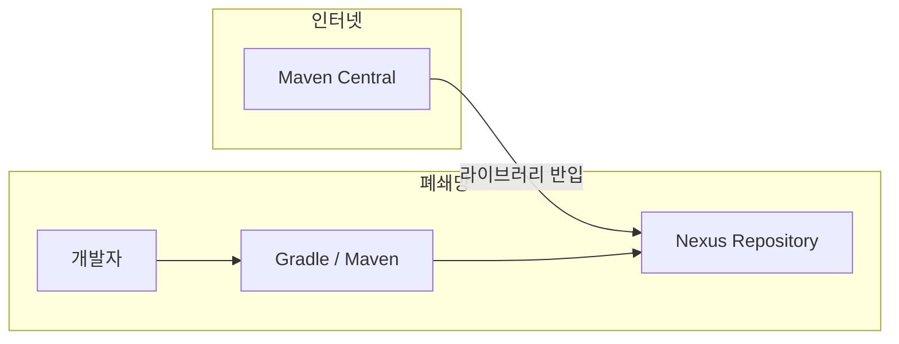
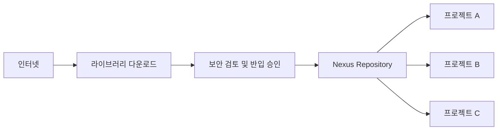

Gradle이나 Maven과 같은 빌드 도구의 등장으로 Java 애플리케이션의 빌드와 의존성 관리가 크게 단순해졌습니다.

이제는 과거처럼 필요한 JAR 파일을 직접 다운로드해 프로젝트에 추가할 필요가 없습니다. 필요한 라이브러리만 선언하면 빌드에 필요한 의존성이 자동으로 관리됩니다.

하지만 이러한 편리함은 인터넷에 자유롭게 접근할 수 있는 환경을 전제로 합니다.

그렇다면 인터넷이 차단된 폐쇄망 개발환경에서는 필요한 라이브러리를 어떻게 관리할까요?

---

## 1. 일반적인 개발환경에서는 라이브러리를 어떻게 가져올까?

인터넷 사용에 제약이 없는 일반적인 개발환경에서는 Gradle이나 Maven이 `Maven Central`과 같은 공개 저장소에서 필요한 라이브러리를 자동으로 다운로드합니다.


Gradle을 사용한다면 `build.gradle` 파일에 아래처럼 의존성만 추가하면 됩니다.

```gradle
implementation 'org.springframework.boot:spring-boot-starter-web'
```

개발자는 필요한 라이브러리를 선언하기만 하면 되므로 빌드 과정에 대해 크게 신경 쓸 일이 없습니다.

---

## 2. 폐쇄망 개발환경에서는 무엇이 달라질까?

폐쇄망 개발환경에서는 인터넷이 차단되어 있기 때문에 Gradle이나 Maven이 `Maven Central`과 같은 공개 저장소에 접근할 수 없습니다.


이 때문에 빌드 시점에 필요한 라이브러리를 자동으로 다운로드할 수 없습니다. 따라서 프로젝트를 정상적으로 빌드할 수 없게 됩니다.

즉, 폐쇄망에서는 **필요한 라이브러리를 어디에서 가져올 것인가**라는 새로운 문제가 발생합니다.

가장 단순한 해결 방법은 인터넷이 가능한 환경에서 라이브러리를 다운로드한 뒤 폐쇄망으로 반입하는 것입니다. 하지만 이 방식은 실제 운영 환경에서 여러 가지 문제를 발생시킬 수 있습니다.

---

## 3. 라이브러리를 수동으로 반입하는 방식의 문제점

폐쇄망 개발환경으로 라이브러리를 수동으로 반입하는 과정은 일반적으로 다음과 같습니다.


---

### 3.1. 라이브러리 반입 과정의 번거로움

하나의 라이브러리를 사용하려면 그 라이브러리가 필요로 하는 의존 라이브러리도 함께 반입해야 합니다. 즉, 하나의 라이브러리를 추가한다고 하나의 JAR 파일만 가져오면 되는 것이 아닙니다. 따라서 의존성까지 고려해 어떤 라이브러리들을 함께 가져와야 하는지 파악해야 합니다.

이 과정은 생각보다 복잡하며 매번 반복되어야 합니다. 결과적으로 개발 생산성 저하로 이어질 수 있습니다.

---

### 3.2. 버전 관리의 어려움

또한 어떤 버전의 라이브러리가 조직 내에서 사용되고 있는지 추적하는 것이 어렵습니다. 

그래서 이미 과거에 반입된 라이브러리임에도 불구하고, 다른 팀이나 프로젝트에서는 이를 알지 못해 다시 반입하는 일이 발생하기도 합니다.

동일한 라이브러리를 팀마다 서로 다른 버전으로 사용하고 있거나, 라이브러리를 직접 프로젝트 내부에 포함시켜서 유지보수를 어렵게 만들기도 합니다. 

결국 라이브러리를 프로젝트마다 개별적으로 관리하는 방식에는 한계가 있으며, 조직 차원에서 중앙 집중적으로 관리할 수 있는 방법이 필요하게 됩니다.

---


## 4. Nexus Repository를 사용하는 이유

앞에서 살펴본 것처럼 프로젝트마다 라이브러리를 수동으로 반입하여 관리하는 방식에는 여러 가지 한계가 있습니다. 그래서 많은 조직에서는 `Nexus Repository`를 이용해 구축한 내부 라이브러리 저장소를 운영합니다.

내부 라이브러리 저장소가 운영되면 개발자는 더 이상 프로젝트마다 라이브러리를 직접 관리하지 않아도 됩니다. 필요한 라이브러리를 내부 저장소에 등록해 두면 이후에는 모든 프로젝트가 동일한 저장소를 통해 사용할 수 있습니다.



이렇게 되면 조직 전체에서 사용하는 라이브러리를 하나의 저장소에서 중앙 집중적으로 관리할 수 있습니다.

또한 이미 반입한 라이브러리를 다른 프로젝트에서도 그대로 재사용할 수 있어 중복 반입을 줄일 수 있으며, 라이브러리 버전도 일관성 있게 관리할 수 있습니다.

내부 라이브러리 저장소는 단순히 라이브러리를 보관하는 서버가 아닙니다. 조직 내부에서 사용하는 라이브러리를 중앙에서 관리하고 통제하는 역할을 수행합니다.

이를 통해 다음과 같은 장점을 얻을 수 있습니다.

- 프로젝트 간 라이브러리 재사용
- 라이브러리 중복 반입 방지
- 라이브러리 버전의 일관성 유지
- 조직에서 사용하는 라이브러리 현황 관리
- 보안 취약점 발생 시 영향 범위 파악

**참고**

> Nexus Repository를 설치하는 방법은 [[토이프로젝트] Nexus Repository로 내부 라이브러리 저장소 구축하기: 라이브러리 배포와 사용까지](https://sanghoon-lee.github.io/2026/03/10/localNexus/)에서 다루고 있습니다.

---

## 5. 폐쇄망에서는 라이브러리를 어떻게 추가할까?

내부 라이브러리 저장소를 구축하더라도 폐쇄망의 인터넷 차단 정책이 변경되는 것은 아닙니다.

인터넷과 연결되는 작업은 필요한 라이브러리를 `Nexus Repository`에 등록할 때만 수행됩니다. 

새로운 라이브러리가 필요한 경우에는 인터넷 환경에서 다운로드한 뒤 보안 검토를 거쳐 `Nexus Repository`에 등록합니다.

한 번 등록된 라이브러리는 이후 모든 프로젝트에서 `Nexus Repository`를 통해 동일한 버전의 라이브러리를 사용할 수 있습니다.

따라서 프로젝트마다 라이브러리를 개별적으로 반입할 필요가 없어지고, 운영 효율성과 관리 일관성을 확보할 수 있습니다.



## 6. 마무리

폐쇄망 개발환경에서는 인터넷에 직접 접근할 수 없기 때문에 라이브러리 관리 방식도 일반적인 개발환경과 달라집니다.

프로젝트마다 라이브러리를 개별적으로 반입하는 방식은 시간이 지날수록 관리 비용이 증가하고, 버전 관리나 재사용 측면에서도 한계가 있습니다.

`Nexus Repository`와 같은 내부 라이브러리 저장소를 구축하면 라이브러리를 중앙에서 관리할 수 있으며, 개발 생산성과 운영 효율성을 함께 높일 수 있습니다.

결국 폐쇄망 개발환경에서 중요한 것은 라이브러리를 얼마나 많이 확보했느냐가 아니라, 조직 전체가 동일한 기준으로 라이브러리를 관리하고 재사용할 수 있는 체계를 갖추는 것입니다.
