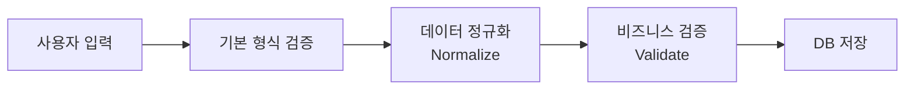
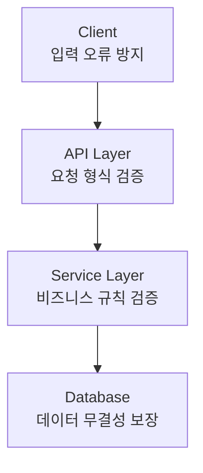

처음에는 정상적으로 동작하던 시스템도 운영 기간이 길어질수록 데이터 품질 문제가 발생하는 경우가 많습니다. 허용되지 않는 값들이 유입되거나, 동일한 의미의 데이터가 서로 다른 형태로 저장되면서 데이터 품질은 점점 저하될 수 있습니다.

전화번호 하나만 보더라도 다음과 같이 다양한 형태로 저장될 수 있습니다.

* 010-1234-5678
* 01012345678
* 010 1234 5678

사람은 모두 동일한 전화번호로 인식할 수 있지만, 시스템은 서로 다른 데이터로 인식하게 됩니다. 이런 데이터 품질 저하는 서비스 운영과 관련된 조회·통계·정산·고객 대응 과정에서 다양한 문제를 발생시킬 수 있습니다.

그렇다면 데이터는 어떻게 관리해야 할까요?
 
---

## 1. 데이터의 품질 문제가 발생하는 이유

서비스가 성장하면서 데이터가 생성되는 경로는 점점 다양해집니다. 신규 기능 추가, 외부 시스템 연동, 운영 과정에서의 예외 처리 등이 반복되면서 동일한 의미의 데이터가 서로 다른 형태로 저장될 가능성이 높아집니다. 또한 운영 과정에서 장애 대응이나 긴급한 요구사항 반영을 위한 예외 처리가 누적되면서 데이터 처리 기준이 일관되지 않게 변경될 수 있습니다. 

하지만 서비스로 유입되는 데이터가 명확하게 통제되지 못하면, 데이터의 품질도 그만큼 빠르게 저하되면서 잠재적인 결함과 오류만 누적되는 결과로 이어지게 됩니다.


데이터 품질 저하로 발생할 수 있는 대표적인 문제는 다음과 같습니다.

* 동일한 데이터를 하나로 식별 불가
* 중복 데이터 증가
* 검색 및 조회 결과 불일치
* 통계 및 분석 결과 오류
* 비즈니스 로직 예외 발생

따라서 서비스 초기부터 데이터가 어떤 형태로 저장되어야 하는지 기준을 정의하고 관리하는 것이 중요합니다. 이러한 기준이 없다면 작은 데이터 차이가 시간이 지나면서 실제 서비스 문제로 이어질 수 있습니다.

---

## 2. 실무에서 발생하는 데이터 품질 문제 사례


### 2.1. 전화번호 형식 불일치

* 010-1234-5678
* 01012345678

동일한 전화번호이지만, 서로 다른 데이터로 시스템에서 인식될 수 있습니다.

---

### 2.2. 대소문자 구분

* A001
* a001

동일한 코드이지만, 대소문자 차이로 인해 동일 코드 조회가 실패할 수 있습니다.

---

### 2.3 필수값 누락

회원 생성 과정에서 필수 정보가 누락되면 이후 알림 발송, 본인 인증, 고객 조회 등 후속 기능에서 오류가 발생할 수 있습니다.

---

## 3. 데이터 품질 관리를 위한 핵심 요소

데이터 품질을 유지하기 위한 핵심은 **정규화(normalization)**와 **검증(validation)**입니다. 정규화는 **데이터의 표현 방식을 통일하는 과정**이고, 검증은 **데이터가 정상적인 값인지 확인하는 과정**입니다. 즉, 정규화는 데이터의 형태를 관리하고, 검증은 데이터의 유효성을 관리합니다.

그리고 정규화와 검증을 통해 시스템이 허용할 수 있는 데이터만 받아들이도록 만드는 과정이 **데이터 통제**인 것입니다. 따라서 데이터 통제는 시스템의 데이터 품질을 결정하는 첫 번째 관문이 됩니다.

---

### 3.1. 정규화

여기서 말하는 정규화는 입력되는 데이터를 일정한 기준에 맞춰 변환하여 동일한 의미의 데이터가 동일한 형태로 저장되도록 만드는 과정을 의미합니다. DB 설계에서 사용하는 정규화의 개념과는 다릅니다.

예를 들어 전화번호 검색 기능을 구현했다고 가정해보겠습니다. 정규화 과정이 없다면 DB에 아래와 같이 다양한 형태로 전화번호가 저장되어 있을 것입니다.

**정규화 과정 없이 DB에 저장된 전화번호**
```nohighlight
* 010-1111-2222
* 01033334444
* 010 5555 6666
```

이런 경우에는 사용자가 "01011112222"로 검색했을 때 정확한 검색 결과를 반환하려면 별도의 변환 로직이 필요합니다. 

하지만 저장 단계에서 정규화가 수행되었다면 모든 데이터가 동일한 형태를 가지고 있기 때문에 조회 로직을 단순화할 수 있습니다.

**정규화 과정을 통해 DB에 저장된 전화번호**
```nohighlight
* 01011112222
* 01033334444
* 01055556666
```

정규화를 통해 얻을 수 있는 효과는 다음과 같습니다.

1. 서로 다른 표현 방식 때문에 발생하는 데이터 불일치를 방지할 수 있습니다.
2. 동일한 의미의 데이터가 서로 다른 형태로 저장되는 문제를 방지할 수 있습니다. 
3. 검색 조건이 저장된 데이터 형태에 따라 달라지는 문제를 방지할 수 있습니다. (예: 전화번호 검색 시 하이픈 포함 여부에 따라 결과가 달라지는 문제)

---

### 3.2. 검증

검증은 입력된 데이터가 시스템에서 허용 가능한 값인지 확인하는 과정입니다.

정규화가 "형태를 통일하는 과정"이라면 검증은 "정상적인 데이터인지 판단하는 과정"입니다.

일반적으로 다음 항목을 확인합니다.

- 필수값 존재 여부
- 데이터 형식
- 데이터 길이
- 허용 가능한 값 범위

검증을 생략하면 비정상적인 데이터도 정상 데이터로 저장됩니다. 

```nohighlight
01012345678 → 정상
0101234 → 비정상(길이 오류)
홍길동 → 비정상(형식 오류)
```

따라서 저장 전 데이터가 정상적인지 확인하는 과정은 반드시 필요합니다.

---

## 4. 데이터 처리 흐름

정규화와 검증은 처리 순서가 중요합니다. 일반적인 데이터 처리 흐름은 다음과 같습니다.



정규화와 검증은 모두 데이터 품질을 관리하기 위한 과정이며, 처리 목적에 따라 수행 순서가 달라질 수 있습니다.

일반적으로 입력값의 기본 형식을 확인한 뒤 데이터를 정규화하고, 정규화된 데이터를 기준으로 비즈니스 규칙을 검증하는 방식으로 처리합니다.

---

## 5. 데이터 검증은 어디에서 해야 할까?

데이터 검증은 특정 한 곳에서만 수행하는 것이 아니라 여러 계층에서 역할을 나누는 것이 일반적입니다.



| 위치            | 역할            |
| ------------- | ------------- |
| Client        | 사용자 입력 오류 방지  |
| API Layer     | 요청 데이터 형식 검증  |
| Service Layer | 비즈니스 규칙 검증    |
| Database      | 최종 데이터 무결성 보장 |

특히 중요한 점은 클라이언트 검증만으로 충분하지 않다는 것입니다.

클라이언트는 우회가 가능하기 때문에 서버와 데이터베이스에서도 반드시 검증 체계를 가져야 합니다. 애플리케이션 검증은 비즈니스 규칙을 검증하고, 데이터베이스 Constraint는 잘못된 데이터 저장 자체를 차단하는 최종 방어선 역할을 합니다.

---

## 6. 마무리

데이터 품질 문제는 갑자기 발생하는 것이 아니라 작은 예외들이 누적되면서 발생합니다. 처음에는 단순한 입력 차이처럼 보이는 문제가 시간이 지나면 데이터 중복, 조회 오류, 서비스 장애의 원인이 될 수 있습니다.

정규화와 검증은 선택사항이 아닙니다. 서비스 전체의 품질을 좌우하는 핵심 설계이며, 시스템이 데이터를 받아들이기 위한 최소한의 기준입니다.

이러한 기준이 없다면 데이터 품질은 지속적으로 저하되고, 시간이 지날수록 시스템 유지보수 비용은 증가하게 됩니다.
