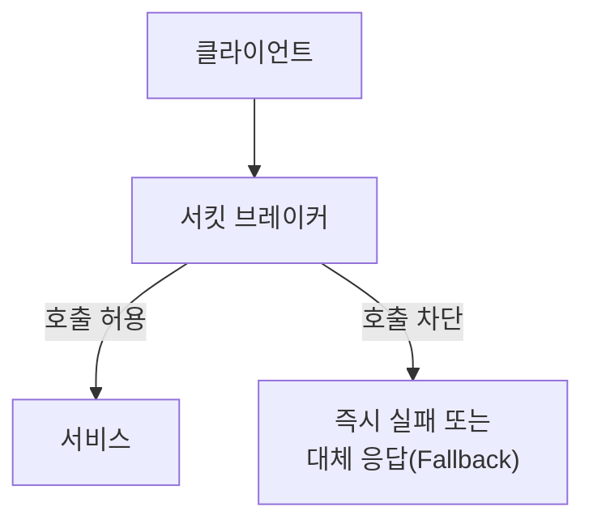
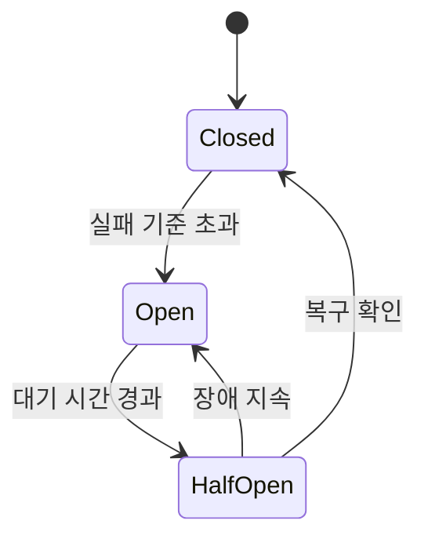

마이크로서비스 아키텍처(MSA)와 같이 서비스 간 호출이 빈번한 환경에서는 하나의 서비스 장애가 연쇄적으로 다른 서비스의 장애를 유발할 가능성이 있습니다. 서킷 브레이커는 이러한 문제를 방지하기 위해 사용되는 대표적인 장애 대응 패턴입니다.

서비스 간 호출 실패나 응답 지연을 적절히 제어하지 못하면 요청을 처리하는 스레드와 커넥션 등의 자원이 고갈되면서 장애가 다른 서비스로 확산될 수 있습니다.

---

## 1. 연쇄 장애(Cascading Failure)란?

**연쇄 장애**는 하나의 서비스에서 발생한 문제가 다른 서비스로 전파되며 전체 시스템의 동작에 영향을 주는 현상을 의미합니다.

다음과 같은 구조를 가진 시스템이 있다고 가정해보겠습니다.

결제 서비스에서 응답 지연이 발생하게 되면 주문 서비스는 결제 서비스의 응답을 기다리게 됩니다. 그 영향으로 API 게이트웨이 역시 주문 서비스의 응답을 기다리게 됩니다. 결국, 결제 서비스에서 발생한 응답 지연은 상위 서비스로 전파되며 전체 시스템의 성능 저하나 장애로 이어질 수 있습니다.

---

## 2. 단순 재시도(Retry) 처리 방식의 위험성

서비스 간 호출 실패나 일시적인 응답 지연이 발생하는 상황에서 가장 먼저 고려해볼 수 있는 대응 방법 중 하나는 재시도(Retry) 전략입니다. 

하지만 재시도 횟수와 간격을 적절히 제한하지 않거나, 이미 장애가 지속되는 서비스에 계속 재시도를 수행하면 상황을 오히려 악화시킬 수 있습니다. 문제가 발생한 서비스에 계속해서 요청을 보내게 되면서 이미 과부하 상태인 서비스에 추가적인 부하를 주기 때문입니다.

이러한 상태가 지속되면 처리되지 못한 요청은 점점 쌓이고, 요청을 보내는 상위 서비스의 처리 자원도 함께 고갈됩니다. 결국 정상적으로 동작하던 서비스까지 영향을 받게 되면서 장애가 시스템 전반으로 확산될 수 있습니다.

따라서 문제가 발생한 서비스에 대한 호출을 일정 시간 동안 차단하고, 서비스가 정상 상태로 회복되었는지 확인하면서 호출을 재개하는 접근 방식이 필요합니다. **서킷 브레이커**는 이러한 문제를 해결하기 위해 고안된 패턴입니다.

---

## 3. 서킷 브레이커(Circuit Breaker)란?

**서킷 브레이커**는 전기 회로의 차단기에서 유래한 개념입니다. 전기 회로에서 과전류나 이상 상태가 발생하면 회로를 차단하여 더 큰 사고를 방지하는 것처럼, 소프트웨어에서도 장애가 발생한 서비스에 대한 호출을 차단하여 시스템 전체를 보호합니다.

즉, 서킷 브레이커는 <mark>“장애가 지속되는 서비스에 대한 호출을 일시적으로 차단하는 전략”</mark>입니다. 이 방식은 장애가 발생한 서비스에 불필요한 부하를 주지 않으면서 전체 시스템을 보호하기 위한 목적을 가집니다.

동작 방식은 다음과 같습니다.

---

## 4. 서킷 브레이커의 상태(State)

서킷 브레이커 패턴이 적용된 시스템에서는 일정 수준 이상의 장애가 감지되면 해당 서비스에 대한 호출을 더 이상 시도하지 않고, 즉시 실패 응답이나 대체 응답(Fallback)을 반환합니다. 하지만 항상 호출을 차단하는 것은 아닙니다.

서비스 호출 결과를 지속적으로 관찰하다가 일정 수준 이상의 실패가 발생하면 호출을 차단하고, 일정 시간이 지난 후에는 서비스가 정상적으로 복구되었는지 다시 확인합니다.

이를 위해 서킷 브레이커에서는 다음과 같은 상태를 정의하고 있습니다. 

* `Closed`: 정상 상태
* `Open`: 차단 상태
* `Half-Open`: 복구 확인 상태

---

### 4.1. Closed (정상 상태)

정상적인 상태로 모든 요청이 그대로 전달됩니다.

* 요청을 실제 서비스로 전달
* 성공/실패 여부를 계속 기록

즉, 평소에는 일반적인 호출과 동일하게 동작합니다.

---

### 4.2. Open (차단 상태)

일정 기준 이상으로 실패가 발생하면 서킷 브레이커는 `Open` 상태로 전환됩니다.

이 상태에서는 더 이상 해당 서비스로 요청을 보내지 않습니다.

* 모든 요청을 즉시 차단
* 빠르게 실패하거나 대체 응답(Fallback) 반환

장애가 발생한 서비스에 추가적인 부하를 주지 않기 위한 상태입니다.

---

### 4.3. Half-Open (복구 확인 상태)

일정 시간이 지나면 일부 요청만 제한적으로 허용하여 서비스가 정상으로 돌아왔는지 확인합니다.

만약 모든 요청을 한 번에 허용한다면 아직 복구되지 않은 서비스에 다시 과도한 부하를 줄 수 있기 때문입니다.

* 일부 요청만 실제 서비스로 전달
* 제한적으로 허용한 요청의 결과를 확인하여 상태를 전환합니다.
   - 정상 응답이 복구 판단 기준을 충족하면 `Closed` 상태로 전환
   - 실패가 계속되어 장애 판단 기준을 충족하면 다시 `Open` 상태로 전환

---

## 5. 상태 전이(State Transition)

서킷 브레이커는 상태 전이를 통해 장애 상황에서는 빠르게 호출을 차단하고, 서비스가 회복되면 다시 정상적으로 요청을 전달합니다.

즉, 서킷 브레이커는 단순히 요청을 차단하는 것이 아니라 서비스 상태를 기반으로 호출 여부를 제어하는 메커니즘입니다. 특히 `Closed`, `Open`, `Half-Open` 상태를 통해 장애 확산을 방지하면서도 서비스 복구 여부를 지속적으로 확인할 수 있다는 점이 핵심입니다.

---

## 6. 재시도(Retry)와 서킷 브레이커(Circuit Breaker)의 조합

앞에서 언급했던 것처럼 장애가 지속되는 상황에서는 재시도가 오히려 문제를 악화시킬 수 있습니다. 하지만 재시도 전략을 사용하지 말라는 뜻은 아닙니다.

재시도는 다음과 같은 상황에서 효과적인 전략입니다.

* 일시적인 네트워크 오류
* 짧은 순간의 타임아웃
* 연동된 서비스의 일시적인 응답 지연

즉, **회복 가능성이 있는 상황에서는 재시도가 유효합니다.** 

반면, 장애가 지속되는 상황에서는 서킷 브레이커를 통해 호출을 차단하는 것이 필요합니다. 그래서 시스템의 안정성과 회복력을 동시에 확보할 수 있도록 재시도와 서킷 브레이커를 조합해서 사용하는 방법이 권장됩니다.

1. 일시적인 오류에 한해 제한된 횟수로 재시도
2. 호출 실패가 설정한 기준을 초과하면 서킷 브레이커를 `Open` 상태로 전환
3. Open 상태에서는 실제 호출 없이 빠르게 실패하거나 대체 응답 반환
4. 일정 시간이 지나면 제한된 요청으로 복구 여부 확인

* 재시도: **회복 가능성이 있는 상황에서 재시도**
* 서킷 브레이커: **회복 가능성이 낮을 때 차단**

**요약**

| 구분      | 재시도(Retry)                | 서킷 브레이커(Circuit Breaker) |
| ------- | ------------------------- | ------------------------ |
| 목적      | 일시적인 오류가 회복되기를 기대하고 다시 호출 | 장애가 지속되는 서비스에 대한 호출 차단   |
| 적합한 상황  | 순간적인 네트워크 오류, 일시적 타임아웃    | 지속적인 장애, 높은 실패율과 응답 지연   |
| 주요 위험   | 반복 호출로 장애 서비스의 부하 증가      | 기준이 부적절하면 정상 호출까지 차단     |
| 핵심 설정   | 재시도 횟수, 간격, 백오프           | 실패 기준, 대기 시간, 시험 호출 수    |
| 장애 시 동작 | 실제 서비스를 다시 호출             | 실제 호출 없이 빠르게 실패 가능       |

---

## 7. 마무리

서킷 브레이커의 핵심은 장애가 발생한 서비스를 보호하는 것이 아니라, 장애가 시스템 전체로 확산되는 것을 막는 것입니다. 따라서 실제 운영 환경에서는 재시도(Retry), 타임아웃(Timeout)과 같은 다른 장애 대응 전략과 함께 적절히 조합하여 사용하는 것이 중요합니다.

장애는 완전히 없앨 수 없지만, 적절한 장애 대응 전략을 조합하면 장애가 전체 시스템으로 확산되는 것은 충분히 막을 수 있습니다.

