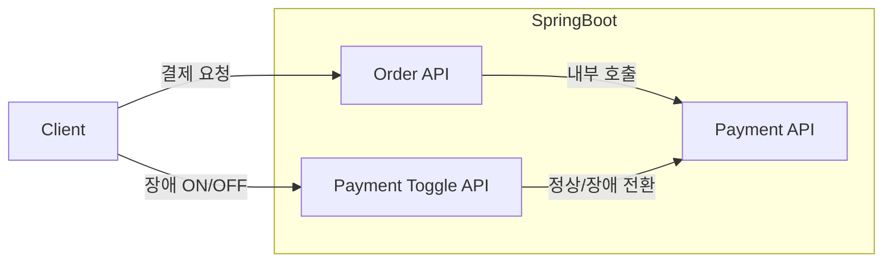
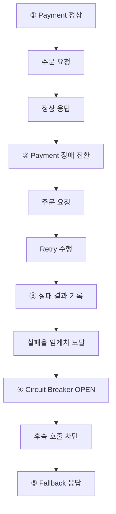

앞서 [[학습기록] 서킷 브레이커 패턴(Circuit Breaker Pattern): 개념정리](https://sanghoon-lee.github.io/2026/04/01/circuitbreaker/)를 작성하면서 `Retry`는 일시적인 장애를 재시도를 통해 극복하고, `Circuit Breaker`는 반복되는 장애 상황에서 불필요한 호출을 차단해 시스템 전체의 안정성을 높여준다는 점을 이해할 수 있었습니다.

개념은 이해했지만 Spring 애플리케이션에 실제로 두 패턴을 어떻게 적용하고 장애 상황에서 어떤 순서로 동작하는지 직접 확인해보고 싶었습니다.

그래서 간단한 토이 프로젝트를 만들어 장애를 재현하면서 `Retry`와 `Circuit Breaker`의 동작 과정을 단계별로 검증해봤습니다.

---

## 1. 프로젝트 구조

이번 프로젝트는 `Order` 서비스와 `Payment` 서비스를 하나의 Spring 애플리케이션에서 동작하도록 구현했습니다.

실제 운영 환경에서는 주문 서비스와 결제 서비스를 각각 독립된 애플리케이션으로 분리하는 경우가 많습니다. 하지만 이번 실습에서는 `Retry`와 `Circuit Breaker`의 동작을 확인하는 것이 목적입니다. 그래서 하나의 애플리케이션 내부에서 서비스 간 호출을 재현하는 방식을 선택했습니다.

### 1.1. 패키지 구성

프로젝트의 패키지는 다음과 같이 구성했습니다.

```text
src/main/java/sanghoon/study/circuitbreaker/demo
 │
 ├─ DemoApplication.java
 ├─ config
 │   └─ RestClientConfig.java
 ├─ order
 │   ├─ OrderController.java
 │   └─ OrderService.java
 └─ payment
     ├─ PaymentController.java
     └─ PaymentToggleService.java
```

* `order` (Order 서비스) : 주문 요청을 처리하고 Payment 서비스를 호출
* `payment` (Payment 서비스) : 결제 처리와 정상/장애 상태를 제어

---

### 1.2. 전체 호출 흐름

전체적인 호출 흐름은 아래와 같습니다.



이 구조를 통해 별도의 서버를 구성하지 않아도 장애 상황을 자유롭게 재현하면서 `Retry`와 `Circuit Breaker`의 동작을 확인할 수 있습니다.

---

### 1.3. 장애 검증 시나리오

`Payment` 서비스에서 정상 상태와 장애 상태를 자유롭게 전환하면서 `Order` 서비스에 적용한 `Retry`와 `Circuit Breaker`가 어떻게 동작하는지 확인합니다.

검증은 다음과 같은 순서로 진행합니다.



---

## 2. 핵심 구현 내용

클라이언트의 주문 요청은 다음 API를 호출하는 것으로 시작됩니다.

* POST `/orders/{orderId}/pay`

위 API가 호출되면 요청은 `OrderController`를 거쳐 `OrderService`의 `placeOrder()` 메서드로 전달됩니다.

---

### 2.1. OrderService

`OrderService`는 주문 요청을 처리하면서 내부적으로 `Payment` 서비스의 결제 API를 호출합니다. 이번 프로젝트에서 `Retry`와 `Circuit Breaker`의 핵심 동작을 담당하는 클래스이기도 합니다.

전체 코드를 먼저 살펴보겠습니다.

**OrderService.java**

```java
@Service
public class OrderService {
    private static final Logger log = LoggerFactory.getLogger(OrderService.class);

    private final RestClient restClient;

    public OrderService(RestClient restClient) {
        this.restClient = restClient;
    }

    @Retry(name = "paymentService")
    @CircuitBreaker(name = "paymentService", fallbackMethod = "paymentFallback")
    public Map<String, Object> placeOrder(String orderId) {
        log.info("OrderService.placeOrder - calling payment service. orderId={}", orderId);

        Map<String, Object> response = restClient.post()
                .uri("/payments/process/{orderId}", orderId)
                .retrieve()
                .body(new org.springframework.core.ParameterizedTypeReference<Map<String, Object>>() {});

        log.info("OrderService.placeOrder - payment success. orderId={}", orderId);
        return response;
    }

    public Map<String, Object> paymentFallback(String orderId, Throwable t) {
        log.warn("OrderService.paymentFallback - fallback executed. orderId={}, reason={}",
                orderId, t.toString());

        return Map.of(
                "success", false,
                "orderId", orderId,
                "message", "fallback: payment service temporarily unavailable",
                "reason", t.getClass().getSimpleName()
        );
    }
}
```

`Payment` 서비스의 `/payments/process/{orderId}` API를 호출하는 `placeOrder()` 메서드에 `@Retry`와 `@CircuitBreaker`를 적용했습니다.

```java
@Retry(name = "paymentService")
@CircuitBreaker(name = "paymentService", fallbackMethod = "paymentFallback")
public Map<String, Object> placeOrder(String orderId) {
  ...
}
```

`@Retry`를 적용하면 해당 메서드 호출이 실패했을 때 설정한 횟수만큼 자동으로 재시도합니다.

`@CircuitBreaker`는 호출 결과를 기록하고, 설정한 최소 호출 수와 실패율 기준을 바탕으로 상태를 판단합니다. 현재와 같이 두 어노테이션을 함께 사용하면 각 재시도 과정에서 발생한 호출 결과도 `Circuit Breaker`의 실패율 계산에 반영될 수 있습니다.

기록된 실패율이 설정한 임계치 이상이 되면 `Circuit Breaker`가 `OPEN` 상태로 전환됩니다. 이후 요청은 실제 `Payment` 서비스를 호출하지 않고 차단되며, `fallbackMethod`로 지정한 `paymentFallback()` 메서드가 실행됩니다.

즉, `Payment` 서비스에 장애가 발생하여 `placeOrder()` 메서드의 호출이 실패하면 `Retry`와 `Circuit Breaker`를 통해 장애에 대응하는 것입니다.

현재는 `paymentFallback()` 메서드가 결제 서비스를 일시적으로 사용할 수 없다는 응답만 반환하도록 구현했습니다. 하지만 실제 운영 환경에서는 주문을 대기 상태로 저장하거나 보상 트랜잭션을 수행하는 등 서비스 특성에 맞는 대체 로직을 구현해야 합니다.

---

### 2.2. PaymentController

`PaymentController`는 결제 요청을 처리하는 API와 장애 상황을 재현하기 위한 상태 전환 API를 제공합니다.

먼저 `/toggle` API를 호출하면 `PaymentToggleService`를 통해 `Payment` 서비스의 상태를 **정상** 또는 **장애** 상태로 변경할 수 있습니다.

**toggle() 메서드**

```java
@PostMapping("/toggle")
public Map<String, Object> toggle(@RequestParam boolean enabled) {
    boolean current = paymentToggleService.change(enabled);

    return Map.of(
            "paymentEnabled", current,
            "changedAt", LocalDateTime.now().toString()
    );
}
```

다음과 같이 API를 호출하면 결제 처리가 장애 상태로 전환됩니다.

```http
POST /payments/toggle?enabled=false HTTP/1.1
Host: localhost:8080
```

`OrderService`의 `placeOrder()` 메서드는 주문을 처리하는 과정에서 `Payment` 서비스의 `/payments/process/{orderId}` API를 호출합니다. 

이 API가 호출되면 `PaymentToggleService.isEnabled()` 메서드를 통해 현재 서비스의 상태를 확인합니다. 장애 상태라면 `ResponseStatusException`을 발생시켜 `500 Internal Server Error`를 반환합니다.

**process() 메서드**

```java
@PostMapping("/process/{orderId}")
public Map<String, Object> process(@PathVariable String orderId) {

    if (!paymentToggleService.isEnabled()) {
        throw new ResponseStatusException(
                HttpStatus.INTERNAL_SERVER_ERROR,
                "Payment service is unavailable"
        );
    }

    return Map.of(
            "success", true,
            "orderId", orderId,
            "message", "Payment completed",
            "processedAt", LocalDateTime.now().toString()
    );
}
```

`RestClient`는 `Payment` 서비스가 반환한 오류 응답을 예외로 처리합니다. 이에 따라 `OrderService`의 `placeOrder()` 메서드 호출이 실패하고, 앞에서 적용한 `Retry`와 `Circuit Breaker`가 동작하게 됩니다.

---

## 3. 설정

앞에서 살펴본 코드에서는 `@Retry`와 `@CircuitBreaker` 어노테이션만 선언되어 있는 것처럼 보입니다. 하지만 실제 동작 방식은 `application.yml`에 정의한 설정값에 따라 결정됩니다.

재시도 횟수와 대기 시간, 실패율을 계산하는 요청 범위와 `OPEN` 상태 유지 시간 등을 설정할 수 있습니다. 실무에서는 호출 대상과 장애 특성을 고려해 이러한 값을 적절하게 조정하는 것이 중요합니다.

이번 프로젝트에서는 장애 상황과 상태 전환을 빠르게 확인할 수 있도록 비교적 작은 값을 사용했습니다.

---

### 3.1. Retry

```yaml
resilience4j:
  retry:
    instances:
      paymentService:
        maxAttempts: 3
        waitDuration: 500ms
```

* `maxAttempts`: 최초 호출을 포함한 최대 시도 횟수
* `waitDuration`: 재시도 사이의 대기 시간

현재 설정에서는 최초 호출이 실패하면 최대 두 번 추가로 재시도합니다. 각 재시도 사이에는 500ms 동안 대기합니다.

---

### 3.2. Circuit Breaker

```yaml
resilience4j:
  circuitbreaker:
    instances:
      paymentService:
        slidingWindowSize: 4
        minimumNumberOfCalls: 4
        failureRateThreshold: 50
        waitDurationInOpenState: 10s
        permittedNumberOfCallsInHalfOpenState: 1
```

* `slidingWindowSize` : 실패율 계산에 사용할 최근 호출 수
* `minimumNumberOfCalls` : 실패율 계산을 시작하기 위한 최소 호출 수
* `failureRateThreshold` : `OPEN` 상태로 전환되는 실패율 기준
* `waitDurationInOpenState` : `OPEN` 상태를 유지하는 시간
* `permittedNumberOfCallsInHalfOpenState` : `HALF_OPEN` 상태에서 허용할 시험 호출 수

현재 설정에서는 최소 4건의 호출이 기록된 이후부터 실패율을 계산합니다. 최근 4건의 호출 중 2건 이상이 실패하면 실패율이 `failureRateThreshold`에 설정한 50% 이상이 되므로 `Circuit Breaker`가 `OPEN` 상태로 전환됩니다.

`OPEN` 상태에서 10초가 지나면 다음 호출을 계기로 `HALF_OPEN` 상태로 전환됩니다. 이번 프로젝트에서는 `HALF_OPEN` 상태에서 한 건의 시험 호출을 허용하도록 설정했습니다. 시험 호출이 성공하면 `CLOSED`로 복구되고, 실패하면 다시 `OPEN` 상태로 전환됩니다.


---

## 4. 동작 검증

이제 실제로 애플리케이션을 실행하고, `Retry`와 `Circuit Breaker`가 어떻게 동작하는지 확인해보겠습니다.

---

### 4.1. 정상 상태에서 호출

먼저 `Payment` 서비스가 정상 상태인지 확인했습니다.

**요청**
```bash
$ curl http://localhost:8080/payments/status
```

**응답**
```json
{
  "paymentEnabled": true
}
```

`Order` 서비스에 주문 요청을 하면 내부적으로 `Payment` 서비스가 호출됩니다. 현재 상태에서는 정상적인 응답을 받을 수 있었습니다.

**요청**
```bash
$ curl -X POST http://localhost:8080/orders/1001/pay
```

**응답**
```json
{
  "success": true,
  "orderId": "1001",
  "message": "Payment completed",
  "processedAt":"2026-04-05T19:19:46.857306400"
}
```

---

### 4.2. Retry 수행

이어서 `Payment` 서비스의 상태를 장애로 전환했습니다.

**요청**
```bash
$ curl -X POST http://localhost:8080/payments/toggle?enabled=false
```

**응답**
```json
{
  "paymentEnabled": false,
  "changedAt":"2026-04-05T19:24:05.503712700"
}
```

다시 `Order` 서비스에 주문 요청을 했지만 이번에는 오류로 처리된 응답이 반환되었습니다. 

**요청**
```bash
$ curl -X POST http://localhost:8080/orders/2001/pay
```

**응답**
```json
{
    "success":false,
    "reason":"InternalServerError",
    "message":"fallback: payment service temporarily unavailable",
    "orderId":"2001"
}
```

`maxAttempts`를 3으로 설정했기 때문에 최초 호출을 포함하여 총 3회 호출된 내역이 애플리케이션 로그에 기록되어 있었습니다.

**로그**
```text
calling payment service. orderId=2001
calling payment service. orderId=2001
calling payment service. orderId=2001
fallback executed. orderId=2001, reason=org.springframework.web.client.HttpServerErrorException$InternalServerError: 500 Internal Server Error: "{"timestamp":"2026-04-05T10:41:06.338+00:00","status":500,"error":"Internal Server Error","path":"/payments/process/2001"}"
```

이를 통해 `Retry`가 설정한 횟수만큼 정상적으로 동작한 것을 확인했습니다.

---

### 4.3. Circuit Breaker 차단

이후에도 `Order` 서비스에 주문 요청을 반복하여 실패 결과를 누적했습니다.

**요청**
```bash
curl -X POST http://localhost:8080/orders/2002/pay
curl -X POST http://localhost:8080/orders/2003/pay
curl -X POST http://localhost:8080/orders/2004/pay
curl -X POST http://localhost:8080/orders/2005/pay
```

실패한 호출 결과가 누적되면서 `Circuit Breaker`가 `OPEN` 상태로 전환되었습니다. 정확한 전환 시점은 앞서 기록된 정상·실패 호출과 Retry 과정에서 기록된 호출 결과에 따라 달라질 수 있습니다.

`OPEN` 상태에서 주문 요청을 보내면 애플리케이션 로그에서 다음과 같은 메시지를 확인할 수 있습니다.

**로그**

```text
fallback executed. orderId=2005, reason=io.github.resilience4j.circuitbreaker.CallNotPermittedException: CircuitBreaker 'paymentService' is OPEN and does not permit further calls
```

`CallNotPermittedException`은 `Circuit Breaker`가 `OPEN` 상태이므로 실제 호출을 허용하지 않았다는 의미입니다. 이때는 `Payment` 서비스가 호출되지 않으므로 로그에도 더 이상 `calling payment service` 메시지가 출력되지 않고, 즉시 Fallback 로직이 실행됩니다.

---

### 4.4. Circuit Breaker 복구

이번에는 `Payment` 서비스의 상태를 정상으로 전환했습니다. 

**요청**
```bash
curl -X POST http://localhost:8080/payments/toggle?enabled=true
```

`waitDurationInOpenState`로 설정된 10초가 지난 후 `Order` 서비스에 다시 주문 요청을 했습니다. 

**요청**
```bash
curl -X POST http://localhost:8080/orders/3001/pay
```

**응답**
```json
{
  "success": true,
  "orderId": "3001",
  "message": "Payment completed",
  "processedAt":"2026-04-05T19:55:54.306016500"
}
```

`Circuit Breaker`가 `HALF_OPEN` 상태로 전환되면서 서비스가 정상인지 확인하기 위한 시험 호출 한 건이 허용되었습니다. 해당 호출에서 정상 응답이 반환되면서 `Circuit Breaker`는 `CLOSED` 상태로 복구되었고, 이후 요청도 다시 정상적으로 처리할 수 있게 되었습니다.


---

## 5. 트러블슈팅: Retry와 Circuit Breaker가 동작하지 않았던 이유

`Resilience4j`의 `@Retry`와 `@CircuitBreaker` 어노테이션은 Spring AOP를 기반으로 동작합니다.

따라서 어노테이션 방식으로 기능을 적용하려면 다음 AOP 의존성이 프로젝트에 포함되어 있어야 합니다.

```gradle
implementation 'org.springframework.boot:spring-boot-starter-aop'
```

AOP 의존성이 없으면 `Resilience4j`의 Aspect가 적용되지 않으므로 `RestClient` 호출에서 발생한 예외가 그대로 메서드 외부로 전달됩니다. 이 때문에 처음에는 `Retry`와 `Circuit Breaker`가 동작하지 않았습니다.

---

## 6. 마무리

이번 프로젝트에서는 `Resilience4j`를 이용해 `Retry`와 `Circuit Breaker`를 직접 구현하고, 장애 상황에서 `Retry`, `OPEN`, `HALF_OPEN`, `CLOSED` 상태가 어떻게 동작하는지 실습을 통해 확인했습니다. 개념으로만 이해했던 장애 대응 패턴을 실제 코드와 로그를 통해 검증해보니 각각의 역할과 동작 순서를 훨씬 명확하게 이해할 수 있었습니다.

실제 운영 환경에서는 호출 대상의 특성과 장애 양상을 고려하여 재시도 횟수, 실패율, 대기 시간 등을 적절하게 조정하는 것이 중요합니다.

---

## 7. 소스코드 

* [Circuit Breaker Demo](https://github.com/sanghoon-lee/circuit-breaker)


