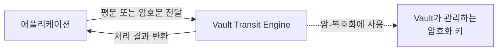

실습을 통해 시크릿 관리 기능을 제공하는 KV Secrets Engine을 활용하면 암호화 키를 중앙에서 저장하고 관리하는 기능을 구현할 수 있다는 사실을 확인할 수 있었습니다.

KMS를 암호화 키를 보관하고 조회하는 저장소 역할로만 사용한다면, KV Engine으로 유사한 구조를 구현할 수 있습니다. 하지만 이 방식에서는 암호화 키가 결국 애플리케이션으로 전달되므로 키 노출 가능성을 완전히 제거할 수 없습니다.

암호화 키의 노출 지점을 줄이려면 애플리케이션이 키를 직접 조회하는 대신, 외부 시스템에 암·복호화를 요청하는 방식을 고려할 수 있습니다.

Vault의 Transit Secrets Engine(이하, "Transit Engine")은 암호화 키를 생성·관리하고, 이를 이용한 암·복호화 기능을 함께 제공합니다. 이를 활용하면 애플리케이션에 암호화 키를 전달하지 않고도 KMS의 주요 기능을 구현할 수 있습니다.

---

## 1. Transit Engine

Vault의 Transit Engine은 Vault 내부에 보관하고 있는 암호화 키를 사용해 암·복호화 연산을 수행합니다.

이를 활용하면 애플리케이션은 암호화 키를 직접 다루지 않고, 암·복호화가 필요한 데이터만 Vault에 전달한 뒤 결과를 받아 사용할 수 있습니다.

Transit Engine의 동작 구조를 간단하게 표현하면 다음과 같습니다.



---

## 2. 실습: 암·복호화

지금까지 Transit Engine의 역할을 개념적으로 살펴봤습니다. 이제 Transit Engine을 활성화하고 암호화 키를 생성한 뒤, 실제로 암·복호화를 수행해보겠습니다.

---

### 2.1. 컨테이너 재구성

현재 Vault는 개발 모드로 실행하고 있습니다. 개발 모드는 데이터를 메모리에 저장하므로 컨테이너를 제거하면 앞서 생성한 Secrets Engine과 시크릿도 함께 사라집니다. 이번 실습은 Transit Engine의 동작을 독립적으로 확인하는 것이 목적이므로 기존 컨테이너를 제거하고 다시 구성했습니다.

**컨테이너 제거**
```bash
$ docker rm -f vault
```

지난 포스팅과 달리 이번에는 컨테이너를 생성할 때 `VAULT_ADDR`과 `VAULT_TOKEN` 환경변수를 함께 설정했습니다.

* `VAULT_ADDR=http://127.0.0.1:8200`
* `VAULT_TOKEN=root`

따라서 컨테이너에 접속할 때마다 `VAULT_ADDR`과 `VAULT_TOKEN`을 별도로 설정하지 않아도 됩니다. 

**컨테이너 재구성**
```bash
$ sudo docker run --cap-add=IPC_LOCK -d \
> -p 8200:8200 \
> --name vault \
> -e "VAULT_DEV_ROOT_TOKEN_ID=root" \
> -e "VAULT_DEV_LISTEN_ADDRESS=0.0.0.0:8200" \
> -e "VAULT_ADDR=http://127.0.0.1:8200" \
> -e "VAULT_TOKEN=root" \
> hashicorp/vault
```

> VAULT_TOKEN=root 설정은 개발 모드에서 CLI 실습을 간단하게 진행하기 위한 것입니다. 운영 환경에서는 root 토큰을 애플리케이션이나 컨테이너 환경변수에 고정해서는 안 되며, 필요한 권한만 부여된 토큰을 안전한 인증 절차를 통해 발급받아야 합니다.

---

### 2.2. Transit Engine 활성화

Transit Engine을 활성화하기 위해 컨테이너에 접속했습니다. 

```bash
$ sudo docker exec -it vault sh
```

이어서 다음 명령으로 엔진을 활성화하고, 정상적인 응답을 받을 수 있었습니다.

```nohighlight
/ # vault secrets enable transit
```

```nohighlight
Success! Enabled the transit secrets engine at: transit/
```

Transit Engine을 활성화하면 마운트된 `transit/` 경로를 통해 암호화 키를 생성하고 암·복호화 기능을 사용할 수 있습니다.

---

### 2.3. 암호화 키 생성

암·복호화 기능을 사용해보기 위해 `test-key`라는 이름의 암호화 키를 생성했습니다.

```nohighlight
/ # vault write -f transit/keys/test-key
```

암호화 키가 정상적으로 생성되고, 아래와 같은 응답이 반환되었습니다.

```nohighlight
Key                       Value
---                       -----
allow_plaintext_backup    false
auto_rotate_period        0s
deletion_allowed          false
derived                   false
exportable                false
imported_key              false
keys                      map[1:1775968290]
latest_version            1
min_available_version     0
min_decryption_version    1
min_encryption_version    0
name                      test-key
supports_decryption       true
supports_derivation       true
supports_encryption       true
supports_signing          false
type                      aes256-gcm96
```

Transit Engine에서 사용하는 암호화 알고리즘은 암호화 요청 시점에 선택하는 것이 아니라, 키를 생성할 때 설정된 키 유형에 따라 결정됩니다.

기본 키 유형은 `aes256-gcm96`입니다. 이는 256비트 AES 키와 96비트 nonce를 사용하는 AES-GCM 방식으로, 데이터의 기밀성뿐만 아니라 변조 여부를 확인할 수 있는 인증 암호화(AEAD) 방식입니다.

참고로 키를 생성하는 시점에 `type` 매개변수를 사용해 키 유형을 직접 설정할 수도 있습니다. 

아래는 키 유형을 `aes128-gcm96`으로 설정해서, `test-key-128`이라는 이름으로 암호화 키를 생성하는 예제입니다.  

```nohighlight
/ # vault write -f transit/keys/test-key-128 type=aes128-gcm96
```

---

### 2.4. 암호화

`hello,world`라는 문자열을 앞에서 생성한 `test-key`로 암호화해보고 싶었습니다. 

```nohighlight
/ # vault write transit/encrypt/test-key plaintext="hello,world"
```

하지만, 암호화를 요청하는 명령을 실행하면 아래와 같은 오류가 발생했습니다.

```nohighlight
Error writing data to transit/encrypt/test-key: Error making API request.

URL: PUT http://127.0.0.1:8200/v1/transit/encrypt/test-key
Code: 400. Errors:

* illegal base64 data at input byte 5
```

Transit Engine의 암호화 API는 `plaintext` 필드에 Base64로 인코딩된 값을 전달하도록 정의되어 있습니다. 따라서 일반 문자열을 그대로 전달하면 Vault가 이를 유효한 Base64 데이터로 해석하지 못해 오류가 발생합니다.

그래서 암호화할 `hello,world`를 다음과 같이 Base64로 인코딩해야 했습니다.

```nohighlight
/ # echo -n "hello,world" | base64
aGVsbG8sd29ybGQ=
```

Base64로 인코딩된 값을 사용해 다시 암호화를 요청하자 정상적으로 결과가 반환되었습니다.

```nohighlight
/ # vault write transit/encrypt/test-key plaintext="aGVsbG8sd29ybGQ="
```

```nohighlight
Key            Value
---            -----
ciphertext     vault:v1:jJE8zpj9O0rlSmRHH/VBEyJSBGnBZKFqJsmsXJpbmnyjfpjdzD/9
key_version    1
```

응답의 `ciphertext` 필드에는 Vault가 생성한 암호문이 반환됩니다.

암호화 과정에서 애플리케이션에는 암호화 키가 전달되지 않고 암호문만 반환됩니다. 따라서 애플리케이션이 암호화 키를 직접 조회하거나 메모리에 보유하지 않아도 된다는 점이 Transit Engine의 중요한 특징입니다.


---

### 2.5. 복호화

이번에는 앞에서 반환된 암호문을 이용해 복호화를 요청했습니다.

```nohighlight
/ # vault write transit/decrypt/test-key ciphertext="vault:v1:jJE8zpj9O0rlSmRHH/VBEyJSBGnBZKFqJsmsXJpbmnyjfpjdzD/9"
```

복호화 명령이 정상적으로 실행되고, 응답을 받을 수 있었습니다. 

```nohighlight
Key          Value
---          -----
plaintext    aGVsbG8sd29ybGQ=
```

`plaintext` 필드의 값도 Base64로 인코딩되어 반환됩니다. 따라서 원본 문자열을 확인하려면 해당 값을 다시 Base64로 디코딩해야 합니다. `plaintext` 값을 Base64로 디코딩한 결과, 원본 문자열인 `hello,world`가 정상적으로 출력되는 것을 확인했습니다.

```nohighlight
/ # echo "aGVsbG8sd29ybGQ=" | base64 -d
hello,world
```

---

## 3. Transit Engine과 HSM(Hardware Security Module)의 차이

Transit Engine을 사용하면 애플리케이션에 암호화 키를 전달하지 않고 암·복호화를 수행할 수 있다는 점에서 HSM과 비슷하게 느껴질 수 있습니다. 하지만 Transit Engine과 HSM은 역할과 구현 방식이 다릅니다.

Transit Engine은 Vault가 관리하는 키를 이용해 암·복호화, 전자서명, HMAC 등의 암호 연산을 API로 제공하는 소프트웨어 기능입니다. 애플리케이션은 키를 직접 조회하는 대신 Vault에 필요한 연산을 요청하고 결과만 전달받습니다.

반면 HSM(Hardware Security Module)은 암호화 키를 하드웨어 보안 경계 안에서 생성하고 보호하며, 장치 내부에서 암호화 연산을 수행하도록 설계된 전용 장비입니다. 물리적 변조 방지와 보안 인증 등이 요구되는 환경에서 주로 사용됩니다.

따라서 Transit Engine은 애플리케이션에서 암호화 키를 분리하고 암호화 연산을 중앙화하기 위한 서비스이며, HSM은 키 재료 자체를 하드웨어 수준에서 보호하기 위한 장치라고 볼 수 있습니다.

Vault Enterprise는 지원되는 HSM과 연동해 Auto-unseal이나 Seal Wrap 등의 기능을 구성할 수 있습니다. 이는 Transit Engine이 제공하는 암·복호화 API와는 별개의 Vault 보호 기능입니다.

> Auto-unseal은 Vault가 시작될 때 외부 키 관리 장치를 이용해 봉인을 자동으로 해제하는 기능입니다.

---

## 4. 다음 포스팅

지금까지 Transit Engine을 이용해 암호화 키를 애플리케이션으로 전달하지 않고 암·복호화 연산을 수행해봤습니다. 

이를 통해 Vault가 시크릿 저장 기능뿐만 아니라, 암호화 키를 중앙에서 관리하면서 암·복호화 기능을 API로 제공할 수 있다는 점을 확인했습니다. 애플리케이션이 암호화 키를 직접 조회하거나 메모리에 보유하지 않아도 된다는 점은 기존의 키 저장소 방식보다 키 노출 지점을 줄이는 데 도움이 됩니다. 

다만 실제 시스템에서 Transit Engine을 사용하려면 애플리케이션 인증과 접근 제어를 구성하고, Vault API를 안정적으로 호출할 수 있어야 합니다.

다음 포스팅에서는 Java 애플리케이션에서 Vault Transit Engine API를 호출해 암·복호화 기능을 연동해보겠습니다.
