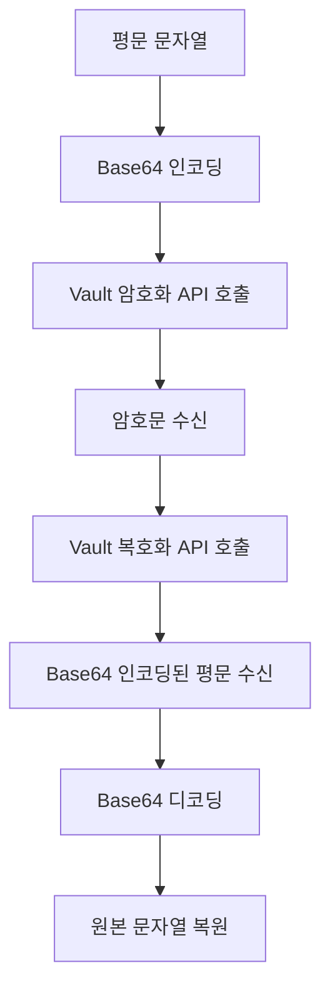

지금까지 KV Engine과 Transit Engine을 직접 실습해보면서 Vault가 제공하는 주요 기능들을 확인했습니다.

앞선 실습은 CLI를 사용해 진행할 수 있었지만, 실제 시스템에서는 애플리케이션이 API를 호출하는 방식으로 Vault와 연동해야 합니다.

그래서 이번에는 간단한 Java 애플리케이션을 구현하고, HTTP API를 통해 Transit Engine의  암·복호화 기능과 연동해보겠습니다.

---

## 1. 전체 코드

아래 예제는 `hello,vault` 문자열을 Transit Engine으로 암호화한 뒤, 다시 복호화하여 원본 문자열을 확인하는 코드입니다.

Spring의 `RestClient`, `WebClient` 또는 Vault 전용 라이브러리를 활용하여 보다 편리하게 연동할 수도 있지만, Vault API의 동작 방식을 이해하기 위해 Java 11 이상에서 제공하는 `HttpClient`를 사용해 직접 요청을 생성했습니다. 

또한 예제의 복잡도를 낮추기 위해 응답 값을 문자열로 추출했습니다. 이 방식은 JSON의 공백이나 응답 구조가 달라지면 정상적으로 동작하지 않을 수 있으므로 실제 애플리케이션에서는 사용하지 않는 것이 좋습니다. 실제 구현에서는 Jackson과 같은 JSON 라이브러리를 사용해 응답을 객체로 변환해야 합니다.

> 개발 모드로 실행한 Vault와 간단하게 연동하기 위해 서버 주소와 root 토큰을 코드에 직접 입력했습니다. 이는 실습을 위한 설정이며, 운영 환경에서는 주소와 인증 정보를 소스 코드에 하드코딩해서는 안 됩니다. 애플리케이션에는 필요한 기능만 사용할 수 있는 최소 권한의 정책을 적용하고, 적절한 인증 절차를 통해 토큰을 발급해야 합니다.


```java
import java.net.URI;
import java.net.http.HttpClient;
import java.net.http.HttpRequest;
import java.net.http.HttpResponse;
import java.nio.charset.StandardCharsets;
import java.util.Base64;

public class VaultConsoleExample {
    public static void main(String[] args) {
        String vaultAddr = "http://192.168.50.69:8200"; // Vault 주소는 환경에 맞게 변경
        String token = "root";

        try {
            HttpClient client = HttpClient.newHttpClient();

            // =========================
            // 1. 암호화
            // =========================

            String plaintext = "hello,vault";
            String encoded = Base64.getEncoder().encodeToString(plaintext.getBytes(StandardCharsets.UTF_8));

            String encryptJson = "{ \"plaintext\": \"" + encoded + "\" }";

            HttpRequest encryptRequest = HttpRequest.newBuilder()
                    .uri(URI.create(vaultAddr + "/v1/transit/encrypt/test-key"))
                    .header("X-Vault-Token", token)
                    .header("Content-Type", "application/json")
                    .POST(HttpRequest.BodyPublishers.ofString(encryptJson))
                    .build();

            HttpResponse<String> encryptResponse =
                    client.send(encryptRequest, HttpResponse.BodyHandlers.ofString());

            if (encryptResponse.statusCode() != 200) {
                System.out.println("암호화 실패");
                System.out.println(encryptResponse.body());
                return;
            }

            System.out.println("암호화 성공");
            System.out.println(encryptResponse.body());

            // 간단하게 ciphertext 추출 (문자열 파싱)
            String ciphertext = extractValue(encryptResponse.body(), "ciphertext");

            // =========================
            // 2. 복호화
            // =========================

            String decryptJson = "{ \"ciphertext\": \"" + ciphertext + "\" }";

            HttpRequest decryptRequest = HttpRequest.newBuilder()
                    .uri(URI.create(vaultAddr + "/v1/transit/decrypt/test-key"))
                    .header("X-Vault-Token", token)
                    .header("Content-Type", "application/json")
                    .POST(HttpRequest.BodyPublishers.ofString(decryptJson))
                    .build();

            HttpResponse<String> decryptResponse =
                    client.send(decryptRequest, HttpResponse.BodyHandlers.ofString());

            if (decryptResponse.statusCode() != 200) {
                System.out.println("복호화 실패");
                System.out.println(decryptResponse.body());
                return;
            }

            System.out.println("복호화 성공");
            System.out.println(decryptResponse.body());

            // Base64 plaintext 추출
            String encodedBase64 = extractValue(decryptResponse.body(), "plaintext");

            // Base64 → 원문 문자열
            String result = new String(Base64.getDecoder().decode(encodedBase64), StandardCharsets.UTF_8);

            System.out.println("최종 복호화 결과: " + result);

        } catch (Exception e) {
            System.out.println("Vault 호출 중 오류 발생");
            e.printStackTrace();
        }
    }

    // 간단한 JSON 값 추출 (예제용)
    // 실무에서는 JSON 파싱 라이브러리(Jackson 등)를 사용하는 것이 좋습니다.
    // 특히 응답 구조가 변경될 수 있기 때문에, 문자열 파싱 방식은 유지보수에 취약할 수 있습니다.
    private static String extractValue(String json, String key) {
        String pattern = "\"" + key + "\":\"";
        int start = json.indexOf(pattern) + pattern.length();
        int end = json.indexOf("\"", start);
        return json.substring(start, end);
    }
}
```

---

## 2. 코드 설명

예제 코드는 평문을 암호화한 뒤 다시 복호화하여 원본 문자열을 복원하는 흐름으로 구성했습니다.

전체적인 동작 흐름은 다음과 같습니다.



---

### 2.1. 인코딩/디코딩

Vault Transit Engine의 암호화 API는 문자열과 바이너리 데이터를 동일한 방식으로 처리할 수 있도록 `plaintext` 필드에 Base64로 인코딩된 값을 전달하도록 정의되어 있습니다. 따라서 암호화를 요청하기 전에 인코딩 과정이 필요합니다.

**암호화: 평문을 Base64로 인코딩**
```java
String encoded = Base64.getEncoder()
        .encodeToString(plaintext.getBytes(StandardCharsets.UTF_8));
```

복호화 응답의 `plaintext` 값 역시 Base64로 인코딩되어 있으므로, 원본 문자열을 복원하려면 디코딩해야 합니다.


**복호화: 복호화된 결과를 Base64로 디코딩**
```java
String result = new String(Base64.getDecoder()
        .decode(decodedBase64), StandardCharsets.UTF_8);
```

---

### 2.2. Vault API 호출

Vault는 HTTP 기반 API를 제공합니다. 따라서 Java뿐만 아니라 Python, Go, Node.js 등 HTTP 요청을 보낼 수 있는 언어라면 동일한 API를 이용해 Vault와 연동할 수 있습니다.

**암호화 요청 생성**
```java
HttpRequest encryptRequest = HttpRequest.newBuilder()
        .uri(URI.create(vaultAddr + "/v1/transit/encrypt/test-key"))
        .header("X-Vault-Token", token)
        .header("Content-Type", "application/json")
        .POST(HttpRequest.BodyPublishers.ofString(encryptJson))
        .build();
```

* `/v1/transit/encrypt/test-key`: `test-key`를 사용하는 암호화 API 경로
* `X-Vault-Token`: Vault 인증 토큰을 전달하는 HTTP 헤더


**복호화 요청 생성**
```java
HttpRequest decryptRequest = HttpRequest.newBuilder()
        .uri(URI.create(vaultAddr + "/v1/transit/decrypt/test-key"))
        .header("X-Vault-Token", token)
        .header("Content-Type", "application/json")
        .POST(HttpRequest.BodyPublishers.ofString(decryptJson))
        .build();
```

* `/v1/transit/decrypt/test-key`: `test-key`를 사용하는 복호화 API 경로
* `X-Vault-Token`: Vault 인증 토큰을 전달하는 HTTP 헤더

---

### 2.3. 응답 결과 확인

**암호화**
```java
System.out.println(encryptResponse.body());
```

Vault는 다음과 같은 JSON 형태로 암호화 결과를 반환합니다. `data.ciphertext`에는 `vault:v1:...` 형식의 암호문이 포함됩니다. 여기서 v1은 Transit Engine의 버전이 아니라 암호화에 사용된 키 버전을 의미합니다.
또한, 암호화에 사용된 키 버전은 "key_version" 필드를 통해서도 명시적으로 확인할 수 있습니다.

```json
{
  "data": {
    "ciphertext": "vault:v1:xxxxxxxx",
    "key_version": 1
  }
}
```

**참고**

> AES-GCM 방식은 암호화할 때마다 새로운 nonce를 사용하므로, 동일한 평문을 동일한 키로 암호화하더라도 일반적으로 서로 다른 암호문이 생성됩니다.

**복호화**
```java
System.out.println(decryptResponse.body());
```

Vault는 복호화한 평문을 `data.plaintext`에 Base64로 인코딩해 반환합니다. 따라서 애플리케이션에서는 해당 값을 Base64로 디코딩해 원본 문자열을 복원해야 합니다.


```json
{
  "data": {
    "plaintext": "aGVsbG8sdmF1bHQ="
  }
}
```

---

## 3. 마무리

이번 포스팅 시리즈에서는 KMS의 역할과 Vault의 기본 개념을 살펴보고, KV Engine을 이용한 암호화 키 저장과 조회, Transit Engine을 이용한 암·복호화, Java 애플리케이션 연동까지 직접 실습했습니다.

KV Engine을 이용하면 암호화 키를 중앙에서 저장하고 관리할 수 있지만, 애플리케이션이 키를 직접 조회해야 하므로 키가 애플리케이션에 전달되는 구조는 그대로 남습니다. 반면 Transit Engine을 이용하면 암호화 키를 애플리케이션에 전달하지 않고도 Vault API를 통해 암·복호화를 수행할 수 있습니다.

또한 Java 애플리케이션에서 Vault의 HTTP API를 직접 호출해 암·복호화 기능과 연동하면서, 특정 개발 언어나 전용 클라이언트 라이브러리에 종속되지 않고 Vault를 암호화 서비스로 활용할 수 있다는 점도 확인했습니다.

이를 통해 Vault를 암호화 키 저장소와 암·복호화 서비스로 활용할 수 있는 기본적인 기술 가능성을 확인할 수 있었습니다.

다만 실제 KMS를 대체하려면 애플리케이션 인증과 최소 권한 정책, 토큰 수명과 갱신, TLS, 감사 로그, 고가용성, 장애 대응, 성능, 키 회전 등의 운영 요소를 함께 검토해야 합니다.

따라서 이번 실습 결과만으로 실제 도입 여부를 결정하기보다는 운영 환경의 요구사항을 기준으로 추가적인 검증과 충분한 검토를 진행해야 합니다.

---

## 4. 예제 소스 코드

* [VaultConsoleExample GitHub 저장소](https://github.com/sanghoon-lee/VaultConsoleExample)
