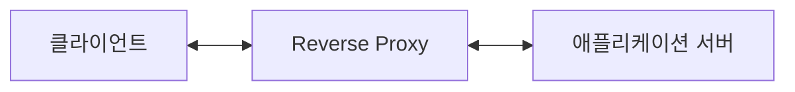
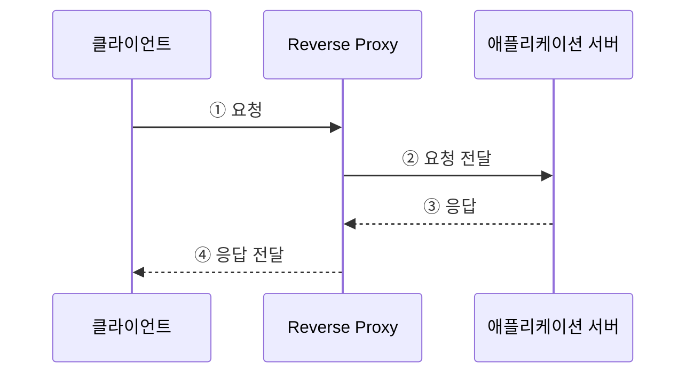
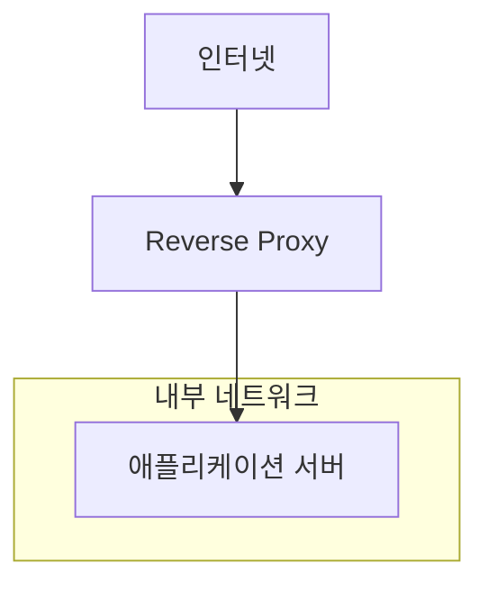
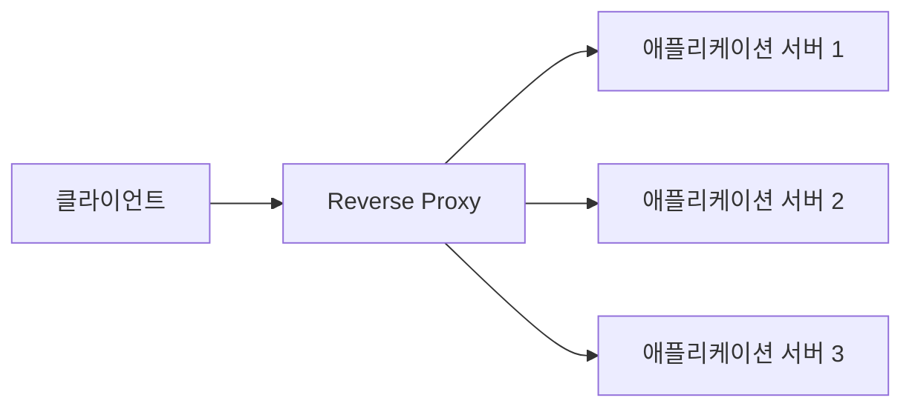
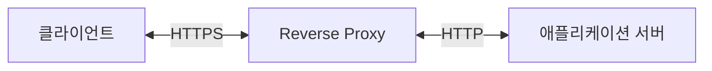
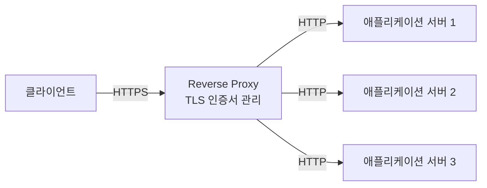
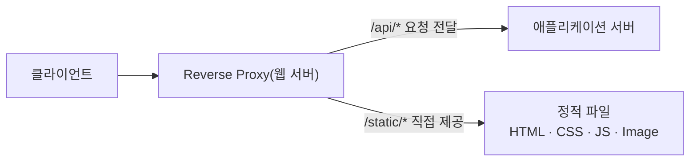
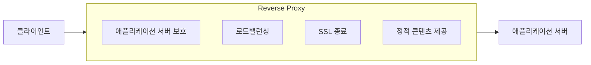

**소문난 명강의 크리핵티브의 한 권으로 끝내는 웹 해킹 바이블, 한빛미디어**

---

최근 구입한 **『소문난 명강의 크리핵티브의 한 권으로 끝내는 웹 해킹 바이블』**을 읽으며 웹 보안을 공부하고 있습니다. 

웹 보안에 대해서 공부하기 전에는 주로 인증/인가, 암호화, 시큐어코딩처럼 애플리케이션 내부에서 구현하는 보안 기능에 관심이 많았습니다.

하지만 학습을 진행하면서 웹 서비스의 보안과 안정성을 위해서는 애플리케이션 코드뿐만 아니라 외부 요청을 어떤 경로로 받아들이는지, 애플리케이션 서버를 어떻게 외부와 분리하는지, HTTPS는 어디에서 처리하는지, 트래픽은 어떻게 여러 서버로 분산하는지​와 같은 인프라 구성 역시 중요하다는 것을 알게 되었습니다.

이러한 구조를 살펴보다 보면 자연스럽게 만나게 되는 구성 요소 중 하나가 `Reverse Proxy`입니다. 

실무에서도 자주 사용되는 기술이지만, 저 역시 그동안에는 `Reverse Proxy`를 단순히 애플리케이션 서버 앞에 위치하여 요청을 전달하는 서버 정도로만 이해하고 있었습니다.
 
이번 토이프로젝트에서는 `Reverse Proxy`를 직접 구성하고, 주요 기능이 실제로 어떻게 동작하는지 하나씩 확인해보려고 합니다.

---

## 1. Reverse Proxy란 무엇인가?

`Reverse Proxy`는 클라이언트와 애플리케이션 서버 사이에 위치하여 클라이언트의 요청을 대신 받아 내부 서버로 전달하는 서버입니다. 일반적인 서비스 운영 환경에서는 애플리케이션 서버를 외부에 직접 노출하지 않고, `Reverse Proxy`를 외부 접점으로 사용합니다.

클라이언트는 애플리케이션 서버에 직접 요청하지 않습니다.

먼저 `Reverse Proxy`로 요청을 보내면 `Reverse Proxy`가 요청을 내부 애플리케이션 서버로 전달합니다. 애플리케이션 서버에서 생성된 응답 역시 `Reverse Proxy`를 거쳐 다시 클라이언트에게 전달됩니다. 즉, 클라이언트 입장에서는 실제 요청을 처리하는 애플리케이션 서버의 주소나 내부 구성을 알 필요가 없습니다.

이처럼 클라이언트와 실제 애플리케이션 서버 사이에서 요청과 응답을 중계하는 것이 `Reverse Proxy`의 가장 기본적인 역할입니다.

이 구조를 이용하면 `Reverse Proxy`를 외부와 내부 애플리케이션 영역을 구분하는 하나의 경계 지점으로 활용할 수도 있습니다.

---

## 2. Reverse Proxy를 사용하는 이유

단순히 클라이언트의 요청을 다른 서버로 전달하기 위해 별도의 `Reverse Proxy`를 두는 것은 오히려 시스템을 복잡하게 만드는 것처럼 보일 수도 있습니다.

그럼에도 많은 웹 서비스에서 `Reverse Proxy`를 사용하는 이유는 요청 전달 이외에도 다양한 기능을 제공할 수 있기 때문입니다.

`Reverse Proxy`를 서비스의 단일 진입점으로 구성하면 이 지점에서 애플리케이션 서버 보호·SSL 종료·로드밸런싱·정적 콘텐츠 제공 등 여러 공통 기능을 처리할 수 있습니다.

---

### 2.1. 애플리케이션 서버 보호

애플리케이션 서버가 외부 네트워크에 직접 노출되어 있다면 클라이언트 역시 해당 서버에 직접 접근할 수 있습니다. 공격자가 공개된 서버를 대상으로 포트 스캔이나 취약점 탐색 등을 시도할 가능성도 있습니다.

반면 `Reverse Proxy`를 사용하면 외부에서는 `Reverse Proxy`만 접근할 수 있도록 구성하고, 실제 애플리케이션 서버는 내부 네트워크에 배치할 수 있습니다.

이렇게 구성하면 클라이언트가 애플리케이션 서버의 실제 주소나 포트에 직접 접근하지 못하도록 네트워크를 분리할 수 있습니다.

또한 `Reverse Proxy`를 공통 진입점으로 사용하면 다음과 같은 정책을 한 곳에서 적용하기도 편리합니다.

* 허용·차단 IP 관리
* 요청 크기 제한
* 특정 URL 접근 제한
* HTTP Header 제어
* TLS 설정
* Rate Limiting

`Reverse Proxy`를 사용한다고 이러한 공격 자체가 차단되는 것은 아니지만, 애플리케이션 서버를 외부에서 직접 접근할 수 없는 위치에 배치함으로써 외부 노출 범위를 줄일 수 있습니다.

---

### 2.2. 로드밸런싱

서비스 이용자가 증가하면 하나의 애플리케이션 서버만으로 모든 요청을 처리하기 어려워질 수 있습니다. 이 경우 여러 대의 애플리케이션 서버를 구성하고 요청을 적절하게 분산하여 처리할 수 있습니다.

이를 로드밸런싱(Load Balancing)이라고 합니다.

클라이언트는 여러 애플리케이션 서버의 주소를 알 필요가 없습니다. `Reverse Proxy` 하나로 요청을 보내면 `Reverse Proxy`가 설정된 정책에 따라 요청을 여러 서버에 분배합니다.

로드밸런싱을 이용하면 특정 서버에 요청이 집중되는 것을 줄일 수 있으며, 서버를 여러 대로 확장하는 `Scale-out` 구조도 구성하기 쉬워집니다. 또한 일부 서버에 장애가 발생했을 때 정상 서버로 요청을 전달하도록 구성하면 서비스 가용성을 높일 수 있습니다.

---

### 2.3. SSL 종료

오늘날 대부분의 웹 서비스는 HTTP가 아닌 HTTPS를 이용합니다. HTTPS에서는 클라이언트와 서버 사이에서 TLS를 이용해 통신 내용을 암호화합니다.

`Reverse Proxy`를 사용하면 TLS 연결을 애플리케이션 서버가 아닌 `Reverse Proxy`에서 처리하도록 구성할 수 있습니다.

이를 일반적으로 SSL 종료(SSL Termination)라고 부르지만, 정확하게는 TLS 종료(TLS Termination)라고 할 수 있습니다. 이 구조의 큰 장점 중 하나는 <mark>TLS와 인증서 관리를 Reverse Proxy에서 중앙화할 수 있다는 점</mark>입니다.

애플리케이션 서버가 여러 대 존재하더라도 각각의 서버에 인증서를 설치하고 갱신하기보다는 외부 진입점인 `Reverse Proxy`에서 인증서를 관리할 수 있기 때문입니다.

또한 애플리케이션 서버는 HTTPS 처리 방식과 관계없이 HTTP 기반으로 서비스를 제공하도록 단순화할 수도 있습니다. 

다만 `Reverse Proxy`와 애플리케이션 서버 사이의 통신을 HTTP로 구성할 수 있는지는 네트워크의 신뢰 수준과 보안 정책을 함께 고려해야 합니다. 내부 구간 역시 암호화가 필요한 환경이라면 `Reverse Proxy`에서 다시 HTTPS로 연결하는 방식도 사용할 수 있습니다.

**관련 포스팅**

> [[회고] API 게이트웨이를 DMZ에서 TrustZone으로 이전한 이유](https://sanghoon-lee.github.io/2025/11/29/rp/)

---

### 2.4. 정적 콘텐츠 처리

웹 서비스에서는 이미지, CSS, JavaScript와 같은 다양한 정적 콘텐츠가 사용됩니다.

물론 Spring Boot와 같은 애플리케이션 서버에서도 이러한 파일을 제공할 수 있습니다. 하지만 정적 콘텐츠 요청까지 애플리케이션 서버를 거치게 할 필요는 없습니다.

`Nginx`처럼 웹 서버 기능도 제공하는 `Reverse Proxy` 솔루션을 사용하면 정적 콘텐츠를 직접 처리하도록 구성할 수 있습니다.

예를 들어 `/api` 요청은 애플리케이션 서버로 전달하고, `/static` 경로의 이미지나 CSS와 같은 정적 파일은 `Reverse Proxy`(웹 서버)가 직접 제공하도록 구성할 수 있습니다.

이렇게 구성하면 애플리케이션 서버가 모든 요청을 처리하지 않아도 되므로 애플리케이션 서버는 API와 비즈니스 로직 처리에 집중할 수 있습니다.

또한 정적 파일 제공에 적합한 웹 서버 기능을 이용할 수 있다는 장점도 있습니다.

---

## 3. 대표적인 Reverse Proxy 솔루션

`Reverse Proxy`를 구성할 수 있는 솔루션은 다양합니다. 대표적으로 다음과 같은 제품들이 있습니다.

* `Nginx`
* `Apache HTTP Server`
* `HAProxy`

각각의 솔루션은 특징과 강점이 다르기 때문에 시스템의 목적과 환경에 따라 적절한 제품을 선택할 수 있습니다.

---

### 3.1. Nginx

`Nginx`는 웹 서버이면서 `Reverse Proxy`와 로드밸런서 역할을 수행할 수 있는 소프트웨어입니다.

`Nginx`가 많이 사용되는 이유 중 하나는 이벤트 기반 구조를 이용해 다수의 동시 연결을 효율적으로 처리할 수 있다는 점입니다.

또한 설정 방식이 비교적 단순하면서도 다음과 같은 기능들을 함께 제공할 수 있습니다.

* 웹 서버
* Reverse Proxy
* 로드밸런싱
* SSL 종료
* 정적 콘텐츠 제공

이번 토이프로젝트에서는 이러한 기능을 하나씩 직접 확인해보기 위해 `Nginx`를 사용합니다.

---

### 3.2. Apache HTTP Server

`Apache HTTP Server`는 오랜 기간 사용되어 온 대표적인 웹 서버입니다.

다양한 모듈을 이용해 기능을 확장할 수 있으며 `mod_proxy`와 같은 모듈을 통해 `Reverse Proxy` 기능도 제공합니다.

오랜 기간 사용되어 온 만큼 관련 문서와 운영 사례가 풍부하다는 장점이 있습니다.

---

### 3.3. HAProxy

`HAProxy`는 고성능 프록시(Proxy)와 로드밸런싱 용도로 널리 사용되는 소프트웨어입니다.

특히 여러 백엔드 서버로 트래픽을 분산하고 서버 상태를 확인하는 기능이 강력하기 때문에 대규모 트래픽을 처리하는 환경에서도 많이 활용됩니다.

`Nginx`가 웹 서버 기능까지 함께 제공하는 범용적인 구성에 강점이 있다면, `HAProxy`는 Proxy와 로드밸런싱 자체에 보다 집중된 제품이라고 이해할 수 있습니다.

---

## 4. 다음 포스팅

이번 포스팅에서는 `Reverse Proxy`의 개념과 역할에 대해서 알아봤습니다.

그동안에는 `Reverse Proxy`를 단순히 **애플리케이션 서버 앞에서 요청을 전달하는 서버** 정도로 생각했습니다. 

하지만 조금 더 살펴보니 `Reverse Proxy`는 요청을 전달하는 것뿐만 아니라, 서비스의 외부 진입점에서 여러 공통 기능을 처리할 수 있는 중요한 구성 요소였습니다.

특히 이번에 살펴본 기능들은 각각 독립적인 기능처럼 보이지만 실제 서비스 구조에서는 서로 밀접하게 연결되어 있습니다.

`Reverse Proxy`를 중심으로 이러한 기능을 배치하면 애플리케이션 서버와 외부 네트워크의 역할을 조금 더 명확하게 분리할 수 있습니다.

하지만 개념을 이해하는 것과 실제 환경을 직접 구성해보는 것 사이에는 차이가 있습니다.

다음 포스팅에서는 `Reverse Proxy`를 구축하기 전에 먼저 `Reverse Proxy` 뒤에서 요청을 처리할 Spring Boot 기반 애플리케이션 서버를 직접 구현해보겠습니다.
