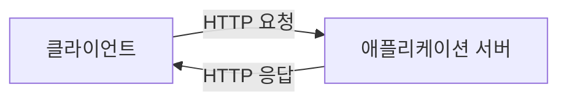
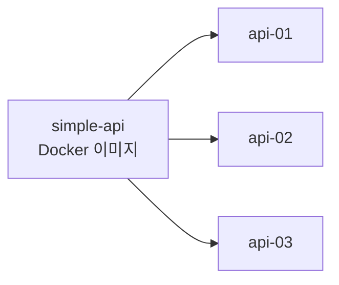
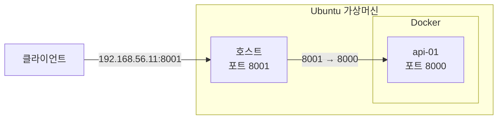
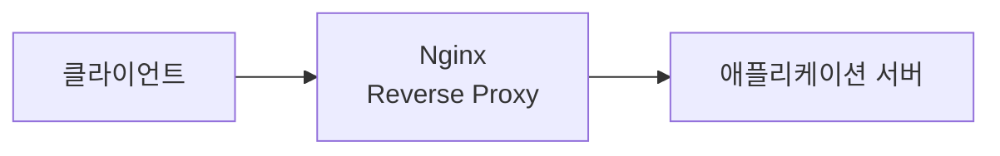

지난 포스팅에서는 `Reverse Proxy`의 개념과 애플리케이션 서버 보호·로드밸런싱·SSL 종료·정적 콘텐츠 처리와 같은 주요 기능을 살펴봤습니다.

이제 실제 환경을 구성해보려고 합니다. `Reverse Proxy`의 동작을 확인하려면 먼저 요청을 전달받아 처리할 애플리케이션 서버가 필요합니다.

이번 포스팅에서는 간단한 애플리케이션 서버를 구현하고 `Docker` 이미지로 만든 뒤 컨테이너로 실행해보겠습니다.

---

## 1. 애플리케이션 서버 개발

`Reverse Proxy`가 요청을 어떻게 전달하는지 확인하는 목적이기 때문에 애플리케이션 서버는 요청을 수신하고 자신이 어떤 서버인지 확인할 수 있는 정보만 반환하도록 최대한 단순하게 구현했습니다.



---

### 1.1. 프로젝트 생성

프로젝트(`simple-api`)는 다음과 같은 구성으로 생성했습니다.

* Project: Gradle-Groovy
* Language: Java
* Spring Boot: 3.5.14
* Group: sanghoon.study
* Artifact: simple-api
* Packaging: Jar
* Java: 17

REST API 구현만 필요하기 때문에 `Spring Web` 의존성을 추가했습니다.

---

### 1.2. API 정의

애플리케이션 서버가 정상적으로 요청을 처리하는지 확인하기 위해 `/api/server` API를 정의했습니다. 이 API는 현재 요청을 처리한 서버 이름과 현재 시간을 반환합니다.

**요청**
```http
GET /api/server HTTP/1.1
```

**응답 예시**
```json
{
    "serverName":"api-01",
    "time":"2026-06-05T20:50:34.578004200"
}
```

서버 이름을 응답에 포함한 이유는 이후 여러 개의 애플리케이션 서버를 구성했을 때 어떤 서버가 실제 요청을 처리했는지 확인하기 위해서입니다.

---

### 1.3. 프로젝트 구조

프로젝트는 다음과 같이 단순하게 구성했습니다.

```nohighlight
src 
 └─ main 
     ├─ java 
     │   └─ sanghoon.study.simpleapi 
     │      ├─ SimpleApiApplication.java 
     │      └─ controller
     │          └─ ApiController.java  
     └─ resources 
         └─ application.yaml
```

별도의 Service나 Repository 계층은 만들지 않았습니다. 대신 API 요청을 처리하는 `ApiController`와 서버 포트를 설정하는 `application.yaml`만 추가했습니다.

---

### 1.4. ApiController 클래스

`ApiController`에서는 `/api/server`로 요청이 수신되면 서버 이름과 현재 시간을 응답으로 반환합니다. 서버 이름을 코드에 고정하지 않고, `SERVER_NAME` 환경변수에서 가져오도록 구현했습니다.

**ApiController.java**
```java
package sanghoon.study.simpleapi.controller;

import org.springframework.beans.factory.annotation.Value;
import org.springframework.web.bind.annotation.GetMapping;
import org.springframework.web.bind.annotation.RequestMapping;
import org.springframework.web.bind.annotation.RestController;

import java.time.LocalDateTime;
import java.util.Map;

@RestController
@RequestMapping("/api")
public class ApiController {
    @Value("${SERVER_NAME:unknown}")
    private String serverName;

    @GetMapping("/server")
    public Map<String, String> server() {
        return Map.of(
                "serverName", serverName,
                "time", LocalDateTime.now().toString()
        );
    }
}
```

`${SERVER_NAME:unknown}` 설정은 `SERVER_NAME` 환경변수가 존재하면 해당 값을 사용하고, 설정되어 있지 않으면 `unknown`을 기본값으로 사용한다는 의미입니다.

환경변수를 이용하면 동일한 애플리케이션 이미지를 여러 컨테이너에서 실행하면서 각각 다른 서버 이름을 부여할 수 있습니다. 애플리케이션 코드를 변경하지 않고 실행 환경만 다르게 설정할 수 있기 때문에 이후 로드밸런싱 실습에도 적합합니다.

---

### 1.5. 설정 파일

애플리케이션 서버의 포트는 `8000`을 사용하도록 설정했습니다.

**application.yaml**
```yaml
server:
  port: 8000
```

애플리케이션이 실행되면 내장 `Tomcat`이 `8000` 포트에서 HTTP 요청을 수신합니다.

---

### 1.6. 로컬 실행 확인

애플리케이션 구현을 완료한 뒤 먼저 IDE에서 실행해봤습니다. 실행 로그에서 내장 `Tomcat`이 8000 포트로 정상적으로 시작된 것을 확인할 수 있었습니다.

**실행 로그**
```text

  .   ____          _            __ _ _
 /\\ / ___'_ __ _ _(_)_ __  __ _ \ \ \ \
( ( )\___ | '_ | '_| | '_ \/ _` | \ \ \ \
 \\/  ___)| |_)| | | | | || (_| |  ) ) ) )
  '  |____| .__|_| |_|_| |_\__, | / / / /
 =========|_|==============|___/=/_/_/_/

 :: Spring Boot ::               (v3.5.14)

2026-06-05T21:52:18.148+09:00  INFO 32448 --- [           main] s.study.simpleapi.SimpleApiApplication   : Starting SimpleApiApplication using Java 17.0.2 with PID 32448 (C:\git\simple-api\build\classes\java\main started by sangh in C:\git\simple-api)
2026-06-05T21:52:18.152+09:00  INFO 32448 --- [           main] s.study.simpleapi.SimpleApiApplication   : No active profile set, falling back to 1 default profile: "default"
2026-06-05T21:52:19.408+09:00  INFO 32448 --- [           main] o.s.b.w.embedded.tomcat.TomcatWebServer  : Tomcat initialized with port 8000 (http)
2026-06-05T21:52:19.421+09:00  INFO 32448 --- [           main] o.apache.catalina.core.StandardService   : Starting service [Tomcat]
2026-06-05T21:52:19.422+09:00  INFO 32448 --- [           main] o.apache.catalina.core.StandardEngine    : Starting Servlet engine: [Apache Tomcat/10.1.54]
2026-06-05T21:52:19.494+09:00  INFO 32448 --- [           main] o.a.c.c.C.[Tomcat].[localhost].[/]       : Initializing Spring embedded WebApplicationContext
2026-06-05T21:52:19.495+09:00  INFO 32448 --- [           main] w.s.c.ServletWebServerApplicationContext : Root WebApplicationContext: initialization completed in 1281 ms
2026-06-05T21:52:19.941+09:00  INFO 32448 --- [           main] o.s.b.w.embedded.tomcat.TomcatWebServer  : Tomcat started on port 8000 (http) with context path '/'
2026-06-05T21:52:19.950+09:00  INFO 32448 --- [           main] s.study.simpleapi.SimpleApiApplication   : Started SimpleApiApplication in 2.418 seconds (process running for 2.774)
```

이어서 `/api/server` API를 호출했습니다.

**요청**
```http
curl http://127.0.0.1:8000/api/server
```

**응답**
```json
{
    "time":"2026-06-05T21:56:06.688416900",
    "serverName":"unknown"
}
```

현재는 `SERVER_NAME` 환경변수를 설정하지 않았기 때문에 기본값인 `unknown`이 반환됩니다. 이후 `Docker` 컨테이너를 실행할 때 환경변수를 전달하여 서버를 구분해보겠습니다.

---

## 2. Docker 이미지 생성

애플리케이션은 준비되었습니다. 이제 애플리케이션을 `Docker` 컨테이너로 실행할 수 있도록 이미지를 만들어보겠습니다.



하나의 `Docker` 이미지만 만들어두면 컨테이너 이름, 환경변수, 포트 등을 다르게 지정하면서 여러 서버를 쉽게 실행할 수 있습니다.

---

### 2.1. 소스코드 Clone

애플리케이션 개발은 `Windows` 환경에서 진행했지만 실제 서버 실행 환경은 `Ubuntu`가 설치된 가상머신으로 구성했습니다.

**관련 소스코드**

* [`simple-api` GitHub 저장소](https://github.com/sanghoon-lee/simple-api.git)

먼저 GitHub 저장소에 등록한 소스코드를 `Ubuntu` 가상머신으로 가져왔습니다. 이어서 프로젝트 루트 디렉터리로 이동했습니다.

```bash
$ git clone https://github.com/sanghoon-lee/simple-api.git
$ cd simple-api
```

---

### 2.2. Dockerfile 작성

프로젝트 루트 디렉터리에 다음과 같이 `Dockerfile`을 작성했습니다.

**Dockerfile**

```dockerfile
FROM eclipse-temurin:17-jre

WORKDIR /app

COPY build/libs/simple-api-0.0.1-SNAPSHOT.jar simple-api.jar

ENTRYPOINT ["java", "-jar", "simple-api.jar"]
```

`Dockerfile`에 정의된 작업 내용은 다음과 같습니다.

* eclipse-temurin:17-jre 이미지를 기반으로 컨테이너를 생성합니다.
* 애플리케이션이 실행될 작업 디렉터리는 `/app`으로 지정합니다.
* 빌드된 JAR 파일을 컨테이너 내부로 복사합니다.
* 컨테이너 시작 시 애플리케이션을 실행합니다.

> eclipse-temurin:17-jre는 Java 17 JRE가 포함된 Docker 이미지입니다. 이 이미지를 사용하면 별도의 Java 설치 과정 없이 Spring Boot 애플리케이션을 실행할 수 있습니다.

---

### 2.3. 애플리케이션 빌드

현재 `Dockerfile`은 이미 빌드된 JAR 파일을 이미지 내부로 복사하는 방식입니다. 따라서 `Docker` 이미지를 생성하기 전에 먼저 애플리케이션을 빌드해야 합니다.

```bash
$ ./gradlew clean build
```

빌드가 완료되면 `build/libs` 디렉터리에 JAR 파일이 생성됩니다.

```nohighlight
build
 └─ libs
     └─ simple-api-0.0.1-SNAPSHOT.jar
```

> **트러블슈팅: gradlew 실행 권한 오류**
>
> 가상머신에서 애플리케이션 빌드를 위해 `./gradlew clean build` 명령을 실행했지만 오류가 발생했습니다. 확인해보니 `gradlew` 파일에 실행 권한이 부여되어 있지 않았습니다.
>
> Linux에서는 스크립트를 직접 실행하려면 실행 권한이 필요하기 때문에 다음 명령으로 권한을 추가했습니다.
>
> ```bash
> chmod +x gradlew
> ```
>
> 이후 `./gradlew clean build` 명령이 정상적으로 동작했습니다.

---

### 2.4. Docker 이미지 빌드

JAR 파일이 준비되었으므로 `Docker` 이미지를 빌드했습니다.

```bash
$ docker build -t simple-api .
```

각 옵션의 의미는 다음과 같습니다.

* `docker build` : `Dockerfile`과 빌드 컨텍스트(Build Context)를 이용해 `Docker` 이미지를 빌드합니다.
* `-t simple-api` : 생성할 이미지의 이름을 지정합니다.
* `.` : 현재 디렉터리의 `Dockerfile`을 사용합니다.

이미지가 정상적으로 생성되어 있는 것을 확인할 수 있었습니다.

```bash
$ docker images
```

```nohighlight
IMAGE               ID             DISK USAGE   CONTENT SIZE   EXTRA
simple-api:latest   50ac61d202ac        465MB          128MB
```

이제 `simple-api` 이미지를 이용해 필요한 만큼 애플리케이션 서버를 실행할 수 있습니다.

---

## 3. Docker 컨테이너 실행

우선 첫 번째 애플리케이션 서버를 `api-01`이라는 이름으로 실행했습니다.

```bash
$ docker run -d \
  --name api-01 \
  -e SERVER_NAME=api-01 \
  -p 8001:8000 \
  simple-api
```

각 옵션의 의미는 다음과 같습니다.

* `-d` : 컨테이너를 백그라운드에서 실행합니다.
* `--name api-01` : 컨테이너 이름을 `api-01`로 지정합니다.
* `-e SERVER_NAME=api-01` : 컨테이너에 `SERVER_NAME` 환경변수를 전달합니다.
* `-p 8001:8000` : 호스트의 8001 포트를 컨테이너의 8000 포트와 연결합니다.
* `simple-api` : 실행할 `Docker` 이미지입니다.

컨테이너의 실행 상태도 확인해봤습니다.

```bash
$ docker ps
```

`api-01` 컨테이너가 정상적으로 실행되고 있으며 호스트의 `8001` 포트가 컨테이너 내부의 `8000` 포트와 연결된 것을 확인할 수 있었습니다.


```nohighlight
CONTAINER ID   IMAGE        COMMAND                  CREATED          STATUS          PORTS                                         NAMES
85b2de399fc1   simple-api   "java -jar simple-ap…"   19 seconds ago   Up 18 seconds   0.0.0.0:8001->8000/tcp, [::]:8001->8000/tcp   api-01
```

---

## 4. 애플리케이션 서버 동작 확인

가상머신 외부에서도 애플리케이션 서버에 정상적으로 접근할 수 있는지 확인했습니다.

현재 구조는 다음과 같습니다.



가상머신의 IP 주소와 `Docker`의 포트 매핑 정보를 이용해 `/api/server` API를 호출했습니다.

**요청**

```http
curl http://192.168.56.11:8001/api/server
```

**응답**

```json
{
    "time":"2026-06-06T05:59:55.374174811",
    "serverName":"api-01"
}
```

이번에는 `unknown`이 아닌 `SERVER_NAME` 환경변수에 설정된 `api-01`이 정상적으로 반환되는 것을 확인할 수 있었습니다.


---

## 5. 다음 포스팅

지금까지 애플리케이션 서버를 구현하고 `Docker` 이미지로 생성해서 컨테이너로 실행하는 과정까지 살펴봤습니다. 현재 구성에서는 클라이언트가 애플리케이션 서버에 직접 요청을 보내고 응답을 받을 수 있습니다. 

다음 포스팅에서는 `Nginx`를 이용해 `Reverse Proxy`를 구성하고, 클라이언트의 요청이 `Nginx`를 거쳐 애플리케이션 서버로 전달되는 과정을 직접 확인해보겠습니다.




