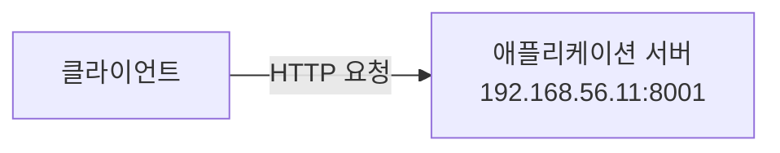
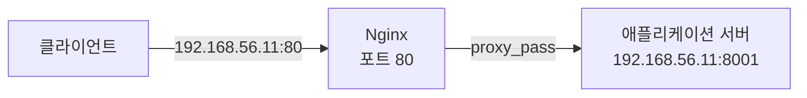
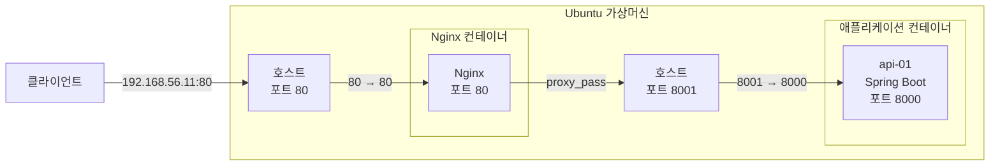
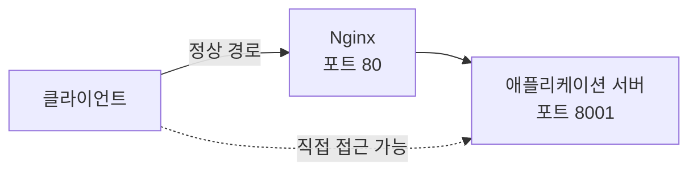

지난 포스팅에서 애플리케이션 서버를 구현하고, Docker 컨테이너로 실행시켰습니다. 현재는 클라이언트가 애플리케이션 서버의 IP 주소와 포트를 이용해 직접 요청하는 구조입니다.



이번 포스팅에서는 이 구조에 `Nginx`를 추가하고, `Reverse Proxy` 역할을 수행하도록 구성해보겠습니다. 그렇게 되면 클라이언트는 더 이상 애플리케이션 서버로 직접 요청하지 않고, `Nginx`로 요청을 전달하는 구조가 됩니다.


--- 

## 1. Nginx 도커 이미지 준비

애플리케이션 서버와 마찬가지로 `Nginx`도 `Docker` 컨테이너로 실행했습니다. `Docker`를 이용하면 `Nginx`를 호스트에 직접 설치하지 않아도 되고, 컨테이너 단위로 실행·중지·삭제할 수 있어 테스트 환경을 구성하기 편리하기 때문입니다.

먼저 Docker Hub에서 Nginx 이미지를 내려받았습니다.

```bash
$ docker pull nginx
```

다운로드가 완료된 뒤 Docker 이미지 목록을 조회했습니다. 

```bash
$ docker images
```

```nohighlight
IMAGE               ID             DISK USAGE   CONTENT SIZE   EXTRA
nginx:latest        5aca99593157        241MB           66MB
simple-api:latest   50ac61d202ac        465MB          128MB    U
```

이전에 생성한 애플리케이션 서버용 `simple-api` 이미지와 새로 내려받은 `nginx` 이미지가 모두 준비된 것을 확인할 수 있었습니다.

**참고**

> 테스트 환경 구성은 편의를 위해 `nginx:latest` 이미지를 사용했습니다. 하지만 실제 운영 환경에서는 이미지가 변경되어도 동일한 환경을 재현할 수 있도록 특정 버전의 태그를 명시하는 것이 좋습니다.

---

## 2. Nginx의 Reverse Proxy 설정 

`Nginx` 설정 파일을 별도로 관리하기 위해 디렉터리를 생성했습니다.

```bash
$ mkdir nginx
$ cd nginx
```

이어서 `nginx.conf` 파일을 생성했습니다. 이번 단계에서는 복잡한 설정을 적용하기 보다는 클라이언트로부터 받은 요청을 애플리케이션 서버로 전달하는 가장 기본적인 `Reverse Proxy` 구조를 확인하기 위해 최소한의 설정만 적용했습니다.

**nginx.conf**

```nohighlight
events {
}

http {
    server {

        listen 80;

        location / {
            proxy_pass http://192.168.56.11:8001;
        }
    }
}
```

적용된 설정은 다음과 같습니다.

* `listen 80` : `Nginx`가 `80` 포트에서 클라이언트의 HTTP 요청을 수신합니다.
* `location /` : `/` 하위로 들어오는 모든 요청에 해당 설정을 적용합니다.
* `proxy_pass` : `Nginx`가 수신한 요청을 `http://192.168.56.11:8001`로 전달합니다.



애플리케이션 서버는 `Docker` 내부에서 `8000` 포트를 사용하고 있지만, 호스트의 `8001` 포트와 매핑되어 있습니다. 따라서 `Nginx`가 가상머신의 `192.168.56.11:8001` 주소를 통해 애플리케이션 서버에 요청을 전달하도록 구성했습니다.

---

## 3. Nginx 컨테이너 실행

작성한 `nginx.conf`를 이용해 `Nginx` 컨테이너를 실행했습니다.

```bash
$ docker run -d \
  --name nginx-rp \
  -p 80:80 \
  -v /home/sanghoon/nginx/nginx.conf:/etc/nginx/nginx.conf:ro \
  nginx
```

실행 환경에 따라 컨테이너와 마운트할 `/home/sanghoon/nginx/nginx.conf` 경로는 변경해서 사용하면 됩니다.

각 옵션의 의미는 다음과 같습니다.

* `-d` : 컨테이너를 백그라운드에서 실행합니다.
* `--name nginx-rp` : 컨테이너 이름을 `nginx-rp`로 지정합니다.
* `-p 80:80` : 가상머신의 80 포트와 `Nginx` 컨테이너의 `80` 포트를 연결합니다.
* `-v` : 호스트의 `nginx.conf` 파일을 컨테이너 내부의 `Nginx` 설정 경로에 연결합니다.
* `:ro` : 설정 파일을 읽기 전용(Read Only)으로 마운트합니다.
* `nginx` : 실행할 Docker 이미지입니다.

구조를 조금 더 자세히 표현하면 다음과 같습니다.



이번 구성에서는 두 컨테이너를 직접 연결한 것이 아니라, `Nginx`가 가상머신의 `8001` 포트를 통해 애플리케이션 컨테이너에 접근합니다.

---

## 4. Reverse Proxy 동작 확인

`Nginx` 컨테이너가 정상적으로 실행되었는지 확인했습니다.

```bash
$ docker ps
```

```nohighlight
CONTAINER ID   IMAGE        COMMAND                  CREATED         STATUS         PORTS                                         NAMES
2bd57b3e33a6   nginx        "/docker-entrypoint.…"   5 minutes ago   Up 5 minutes   0.0.0.0:80->80/tcp, [::]:80->80/tcp           nginx-rp
85b2de399fc1   simple-api   "java -jar simple-ap…"   24 hours ago    Up 2 seconds   0.0.0.0:8001->8000/tcp, [::]:8001->8000/tcp   api-01
```

`nginx-rp`와 `api-01` 컨테이너가 모두 실행되고 있습니다. 포트 매핑 정보도 다음과 같이 확인할 수 있습니다.

* `nginx-rp`  : 호스트 `80`   → 컨테이너 `80`
* `api-01`    : 호스트 `8001` → 컨테이너 `8000`

이제 클라이언트에서는 애플리케이션 서버의 `8001` 포트가 아니라 `Nginx`가 수신하고 있는 `80` 포트로 요청할 수 있습니다. 

실제로 클라이언트의 요청이 `Nginx`를 거쳐 애플리케이션 서버까지 정상적으로 전달되는지 확인해봤습니다.

```bash
$ curl http://192.168.56.11/api/server
```

```json
{
    "serverName":"api-01",
    "time":"2026-06-07T05:54:34.329420535"
}
```

클라이언트는 `http://192.168.56.11/api/server`로 요청했지만 `Nginx`의 `proxy_pass` 설정에 따라 요청이 `192.168.56.11:8001`의 애플리케이션 서버로 전달되었습니다. 애플리케이션 서버가 생성한 응답 역시 `Nginx`를 거쳐 다시 클라이언트에게 전달되었습니다.

이를 통해 `Nginx`가 클라이언트와 애플리케이션 서버 사이에서 `Reverse Proxy` 역할을 정상적으로 수행하고 있음을 확인할 수 있었습니다.

---

## 5. 다음 포스팅

하지만 아직 한 가지 문제가 남아 있습니다.

애플리케이션 서버의 `8001` 포트가 가상머신 외부에 그대로 공개되어 있기 때문에 클라이언트가 원한다면 여전히 `Nginx`를 거치지 않고 애플리케이션 서버에 직접 접근할 수 있습니다.



즉, `Reverse Proxy`를 구성했다고 해서 애플리케이션 서버가 자동으로 외부에서 숨겨지는 것은 아닙니다. 현재 구조에서는 `api-01` 컨테이너를 실행할 때 `-p 8001:8000`으로 호스트 포트를 외부에 공개했기 때문에 이러한 직접 접근이 가능합니다.

다음 포스팅에서는 이 문제를 해결하기 위해 애플리케이션 서버에 대한 직접 접근을 제한하고, 클라이언트가 반드시 `Nginx`를 통해서만 접근하도록 구조를 변경해보겠습니다.


