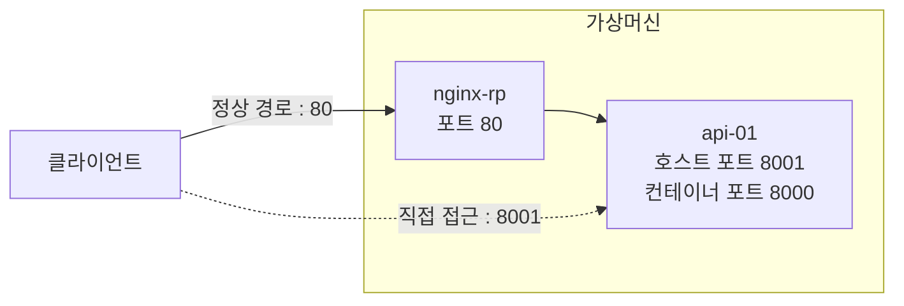
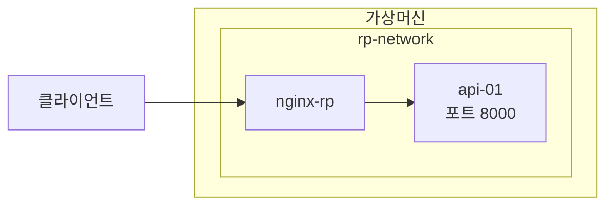
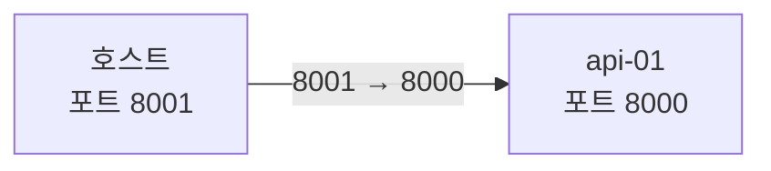
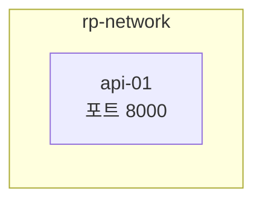
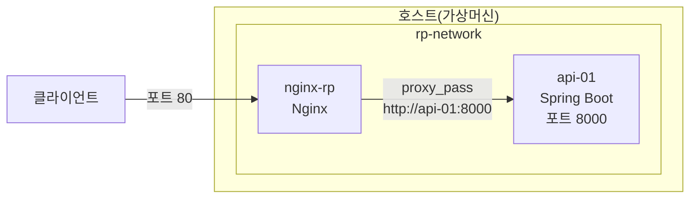
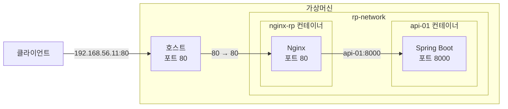
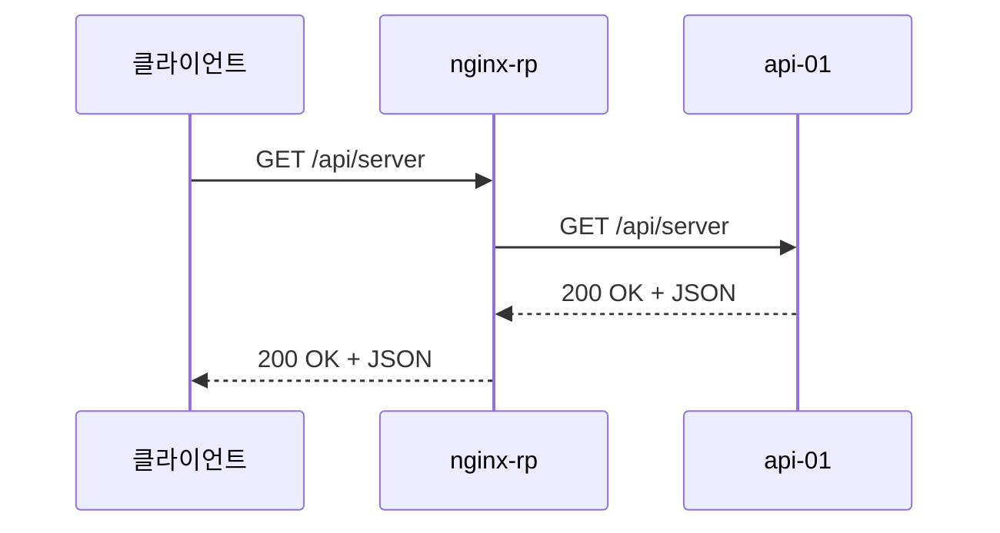

지난 포스팅에서 `Nginx`가 `Reverse Proxy`로 동작할 수 있도록 최소한의 구성을 적용해봤습니다. 

클라이언트가 `Nginx`의 `80` 포트로 요청하면 `Nginx`가 해당 요청을 애플리케이션 서버로 전달할 수 있습니다. 하지만 아직 문제가 하나 남아 있습니다.

현재 실행 중인 컨테이너를 확인해보면 애플리케이션 서버인 `api-01`의 `8000` 포트가 호스트의 `8001` 포트와 매핑되어 있습니다.

```bash
$ docker ps

CONTAINER ID   IMAGE        COMMAND                  CREATED      STATUS      PORTS                                         NAMES
2bd57b3e33a6   nginx        "/docker-entrypoint.…"   4 days ago   Up 4 days   0.0.0.0:80->80/tcp, [::]:80->80/tcp           nginx-rp
85b2de399fc1   simple-api   "java -jar simple-ap…"   5 days ago   Up 4 days   0.0.0.0:8001->8000/tcp, [::]:8001->8000/tcp   api-01
```

따라서 클라이언트는 `Nginx`를 통해 정상적으로 접근할 수도 있지만, 호스트의 `8001` 포트로 요청하여 애플리케이션 서버에 직접 접근하는 것도 가능합니다.



`Reverse Proxy`는 구성했지만, 애플리케이션 서버로 직접 접근할 수 있는 경로가 여전히 남아 있는 상태인 것입니다. 

그래서 이번 포스팅에서 `Reverse Proxy`로 구성된 `Nginx`를 통해서만 접근할 수 있도록 구조를 변경해서 이 문제를 해결해보도록 하겠습니다.

---

## 1. 구조 변경

먼저 외부에 있는 클라이언트가 애플리케이션 서버에 직접 접근할 수 있는 경로를 제거해야 합니다. 

하지만 `Reverse Proxy` 역할을 하는 `Nginx`는 애플리케이션 서버와 통신할 수 있어야 합니다. 

이를 위해 별도의 `Docker Network`를 구성했습니다. 동일한 사용자 정의 `Docker Network`에 연결된 컨테이너끼리는 `Docker`가 제공하는 `DNS`를 이용해 컨테이너 이름으로 서로를 찾을 수 있습니다.

**예시**
* http://api-01:8000

구성하려는 구조는 다음과 같습니다.



외부에는 `Nginx`의 포트만 공개하고, 애플리케이션 서버의 포트는 호스트에 공개하지 않는 방식입니다.

---

## 2. Docker Network 구성

**rp-network**라는 이름으로 `Docker Network`를 생성했습니다.

```bash
$ docker network create rp-network
```

이어서 호스트의 `Docker Network`의 목록에 **rp-network**가 추가되어 있는 것을 확인할 수 있었습니다.

```bash
$ docker network ls
```

```nohighlight
NETWORK ID     NAME         DRIVER    SCOPE
4347c31fdfbe   bridge       bridge    local
278e34f32899   host         host      local
1efc34a92de3   none         null      local
65dbef218e5a   rp-network   bridge    local
```

---

## 3. 애플리케이션 컨테이너 재구성

애플리케이션 서버를 재구성하기 위해 기존에 구성된 컨테이너(`api-01`)를 제거했습니다.

```bash
$ docker rm -f api-01
```

그리고 기존 컨테이너 구성에서 `-p 8001:8000`를 삭제하고, `--network rp-network` 옵션을 추가했습니다. 

```bash
$ docker run -d \
  --name api-01 \
  --network rp-network \
  -e SERVER_NAME=api-01 \
  simple-api
```

* `-p 8001:8000` 삭제 : 이제는 더 이상 애플리케이션 서버의 포트를 외부에 공개하지 않습니다.
* `--network rp-network` 추가 : `api-01` 컨테이너를 `rp-network`에 연결합니다.

컨테이너를 다시 실행하면 이제 호스트의 `8001` 포트는 더 이상 `api-01` 컨테이너와 연결되지 않습니다. 외부의 클라이언트가 이전처럼 `192.168.56.11:8001`로 요청해도 애플리케이션 서버까지 전달되지 않습니다. 

반면 동일한 `rp-network`에 연결된 컨테이너에서는 `Docker DNS`를 이용해 `api-01:8000`으로 애플리케이션 서버에 접근할 수 있습니다. 따라서 `Nginx` 역시 `rp-network`에 연결해야 합니다.

**변경 전**



**변경 후**




---

## 4. Nginx의 Reverse Proxy 설정 변경

`nginx.conf` 파일에서 `proxy_pass` 설정의 변경도 필요합니다. 

**수정된 nginx.conf**
```nohighlight
events {
}

http {
    server {

        listen 80;

        location / {
            proxy_pass http://api-01:8000;
        }
    }
}
```

* 기존 : http://192.168.56.11:8001
* 변경 : http://api-01:8000

> `api-01` 컨테이너의 Spring Boot 애플리케이션은 `8000` 포트에서 동작하고 있으므로, `Nginx`는 `api-01:8000`으로 요청을 전달하도록 설정합니다.

요청 경로는 다음과 같이 변경됩니다.



이제 `Nginx`는 호스트의 `8001` 포트를 거치지 않고 `Docker Network`를 통해 `api-01` 컨테이너에 직접 요청을 전달합니다.

---

## 5. Nginx 컨테이너 재구성

`Reverse Proxy` 구성 변경을 위해 기존에 구성된 `Nginx` 컨테이너를 제거했습니다.

```bash
$ docker rm -f nginx-rp
```

그리고 `--network rp-network` 옵션을 추가하여 컨테이너를 다시 실행했습니다.

```bash
$ docker run -d \
  --name nginx-rp \
  --network rp-network \
  -p 80:80 \
  -v /home/sanghoon/nginx/nginx.conf:/etc/nginx/nginx.conf:ro \
  nginx
```

* `--network rp-network` 추가 : `Nginx`를 `api-01`과 동일한 `Docker Network`에 연결합니다.

전체 구조는 다음과 같습니다.



애플리케이션 서버의 호스트 포트 매핑을 제거했기 때문에 외부 클라이언트는 애플리케이션 서버에 직접 접근할 수 없습니다. 반면 동일한 `rp-network`에 연결된 `Nginx` 컨테이너는 `Docker DNS`를 이용해 `api-01:8000`으로 요청을 전달할 수 있습니다.

---

## 6. 애플리케이션 서버의 보호 기능 검증

검증해야 할 내용은 두 가지입니다.

1. 외부 클라이언트에서 애플리케이션 서버로 직접 접근할 수 없는가?
2. `Nginx`를 통한 요청은 정상적으로 처리되는가?

---

### 6.1. 애플리케이션 서버 직접 접근 확인

구조 변경 전에 사용했던 `8001` 포트로 애플리케이션 서버에 직접 접근해봤습니다.

```bash
$ curl http://192.168.56.11:8001/api/server
```

결과는 연결 실패였습니다. 

```nohighlight
curl: (7) Failed to connect to 192.168.56.11 port 8001 after 0 ms: Couldn't connect to server

```

컨테이너를 재구성하면서 해당 포트 매핑을 삭제했기 때문에 애플리케이션 컨테이너로 전달할 경로가 더 이상 존재하지 않습니다. 이를 통해 외부 클라이언트가 이전처럼 애플리케이션 서버로 직접 접근할 수 없게 된 것을 확인했습니다.

---

### 6.2. Reverse Proxy를 통한 접근 확인

반면 `Nginx`를 통해 요청을 보내면 정상적으로 응답이 반환되는 것은 확인할 수 있었습니다.

```bash
$ curl http://192.168.56.11/api/server
```

```json
{
    "time":"2026-06-11T14:08:35.498203914",
    "serverName":"api-01"
}
```

실제 요청 흐름은 다음과 같습니다.



외부 클라이언트는 `Nginx`의 주소만 이용하지만, `Nginx`는 `Docker Network` 내부에서 `api-01:8000`으로 애플리케이션 서버를 찾아 요청을 전달합니다.

결과적으로 다음 두 가지를 모두 확인할 수 있었습니다.

* `192.168.56.11:8001`을 이용한 애플리케이션 서버 직접 접근은 실패
* `192.168.56.11:80`을 이용한 Reverse Proxy 경유 접근은 성공

---

## 7. 다음 포스팅

애플리케이션 서버에 대한 외부의 직접 접근 경로를 제거하고, 외부 진입점을 `Reverse Proxy` 역할을 하도록 구성된 `Nginx`로 한정하도록 구조를 변경해봤습니다.

다만 이것만으로 애플리케이션의 모든 보안 문제가 해결되는 것은 아닙니다. `Reverse Proxy`는 외부 진입점을 통제하고 백엔드 서버의 직접 노출을 줄이는 데 도움을 주지만, 애플리케이션 자체의 인증·인가, 취약점 관리, 네트워크 접근 제어 등의 보안 대책은 별도로 필요합니다.

다음 포스팅에서는 애플리케이션 서버를 여러 개로 확장하고, `Nginx`가 요청을 여러 서버에 분산하는 로드밸런싱 기능을 직접 검증해보겠습니다.
