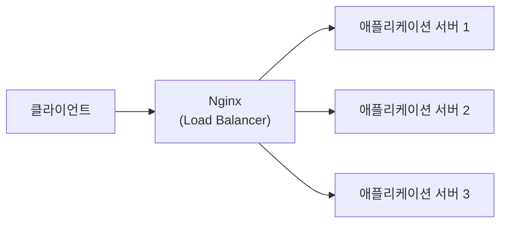
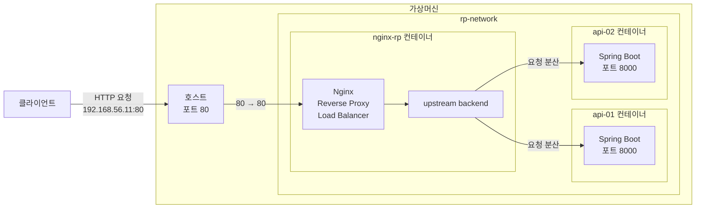

지난 포스팅에서는 애플리케이션 서버의 외부 포트 노출을 제거하고, 클라이언트가 `Nginx`로 구성한 `Reverse Proxy`를 통해서만 접근하도록 구조를 변경했습니다. 이를 통해 애플리케이션 서버에 대한 외부의 직접 접근 경로를 제거하고, 서비스의 외부 진입점을 `Nginx`로 한정할 수 있었습니다.

하지만 `Reverse Proxy`의 역할은 요청을 중계하고, 애플리케이션 서버에 대한 직접 접근을 제한하는 것에만 그치지 않습니다. 여러 대의 애플리케이션 서버로 요청을 분산하는 **로드밸런싱(Load Balancing)** 역시 대표적인 기능 중 하나입니다.

이번 포스팅에서는 애플리케이션 서버를 여러 대로 확장하고, `Nginx`가 클라이언트의 요청을 여러 서버에 분산하도록 로드밸런싱 기능을 구성한 뒤 실제 동작을 확인해보겠습니다.

---

## 1. 로드밸런싱 기능의 필요성

하나의 애플리케이션 서버로 서비스를 운영하면 모든 요청이 해당 서버에 집중됩니다. 트래픽이 증가할수록 애플리케이션 서버의 부하도 함께 증가하게 됩니다.

또한 애플리케이션 서버에 장애가 발생하면 요청을 처리할 수 없기 때문에 서비스 전체가 중단될 위험도 있습니다.

이러한 문제를 완화하기 위해 여러 대의 애플리케이션 서버를 구성하고, 클라이언트의 요청을 적절하게 분산하여 처리하는 방식을 **로드밸런싱(Load Balancing)**이라고 합니다.



로드밸런싱을 적용하면 특정 서버에 요청이 집중되는 것을 방지하고, 서버를 추가하여 처리 용량을 확장하기도 쉬워집니다. 또한 일부 서버에 장애가 발생하더라도 정상 상태의 다른 서버로 요청을 전달할 수 있도록 구성하면 서비스의 가용성을 높이는 데도 도움이 됩니다.

---

## 2. 애플리케이션 서버 확장

로드밸런싱 기능의 동작 확인을 위해 애플리케이션 컨테이너를 추가로 구성했습니다.

```bash
$ docker run -d \
  --name api-02 \
  --network rp-network \
  -e SERVER_NAME=api-02 \
  simple-api
```

현재 실행되고 있는 애플리케이션 서버(`api-01`)와 구분할 수 있도록 컨테이너 이름은 `--name api-02`로 지정하고, 애플리케이션이 반환하는 서버 이름도 `SERVER_NAME=api-02`로 설정했습니다. 

---

## 3. Nginx 로드밸런싱 설정

이제 `api-01`과 `api-02` 두 개의 애플리케이션 서버가 실행되고 있지만, 기존 `Nginx` 설저에서는 여전히 `api-01`으로만 요청을 전달합니다.

로드밸런싱을 적용하려면 `nginx.conf`의 `upstream` 설정을 이용해 여러 서버를 하나의 그룹으로 묶고, `proxy_pass`가 개별 서버가 아닌 해당 그룹을 바라보도록 변경해야 합니다. 

**수정된 nginx.conf**

```nohighlight
events {
}

http {

    upstream backend {
        server api-01:8000;
        server api-02:8000;
    }

    server {

        listen 80;

        location / {
            proxy_pass http://backend;
        }
    }
}
```

새롭게 추가된 `upstream` 설정을 통해 `api-01`과 `api-02`가 `backend`라는 하나의 서버 그룹으로 구성되었습니다.

```nohighlight
upstream backend {
    server api-01:8000;
    server api-02:8000;
}
```

그리고 `proxy_pass`의 대상을 개별 서버가 아닌 `backend` 서버 그룹으로 변경했습니다. 이제 `Nginx`는 `backend` 그룹에 포함된 `api-01`과 `api-02`로 요청을 분산하여 전달할 수 있습니다.

```nohighlight
proxy_pass http://backend;
```

> 별도의 로드밸런싱 방식을 지정하지 않으면 Nginx는 기본적으로 Round Robin 방식을 사용하여 서버에 요청을 순차적으로 분산합니다.

---

## 4. Nginx 컨테이너 재구성

변경한 로드밸런싱 설정을 적용하기 위해 기존 `Nginx` 컨테이너를 제거하고 다시 구성했습니다.

```bash
$ docker rm -f nginx-rp
```

그리고 컨테이너를 다시 실행했습니다.

```bash
$ docker run -d \
  --name nginx-rp \
  --network rp-network \
  -p 80:80 \
  -v /home/sanghoon/nginx/nginx.conf:/etc/nginx/nginx.conf:ro \
  nginx
```

전체 구조는 다음과 같습니다.



`upstream backend`는 별도의 서버가 아니라 Nginx 내부에서 여러 애플리케이션 서버를 하나의 그룹으로 관리하기 위한 논리적인 설정입니다.

---

## 5. 로드밸런싱 기능 검증

로드밸런싱 기능의 동작을 확인하기 위해 동일한 API를 반복적으로 호출했습니다.

```bash
$ curl http://192.168.56.11/api/server
```

`serverName` 값이 `api-01`과 `api-02`로 번갈아가며 응답되었습니다. 이를 통해 클라이언트는 동일한 `Nginx` 주소로 요청하고 있지만, 실제 요청은 서로 다른 애플리케이션 서버에서 처리되고 있음을 확인할 수 있었습니다.

앞에서 설명한 것처럼 별도의 로드밸런싱 방식을 지정하지 않았기 때문에 `Nginx`는 기본 방식인 `Round Robin`을 사용합니다. 따라서 `backend` 그룹에 등록된 `api-01`과 `api-02`로 요청이 순차적으로 분산됩니다.

```json
{
    "time":"2026-06-14T02:13:12.679279473",
    "serverName":"api-01"
}
```

```json
{
    "time":"2026-06-14T02:13:14.290094732",
    "serverName":"api-02"
}
```

```json
{
    "time":"2026-06-14T02:13:15.112594293",
    "serverName":"api-01"
}
```

앞에서도 언급했지만 `Nginx`의 기본 로드밸런싱 방식은 `Round Robin`입니다. 로드밸런싱 방식을 별도로 지정하지 않았기 때문에 `Round Robin` 방식에 의해 순차적으로 요청이 각 애플리케이션 서버에 전달되는 것입니다.

---

## 7. 다음 포스팅

로드밸런싱 기능을 활용하면 서버 부하를 분산하고 서비스의 가용성을 높일 수 있습니다.

`Reverse Proxy`가 애플리케이션 서버의 직접 노출을 제한하는 역할뿐만 아니라, 여러 서버로 요청을 분산하여 서비스의 확장성과 가용성을 높이는 데에도 활용될 수 있다는 점을 확인할 수 있었습니다.

다음 포스팅에서는 HTTPS 통신에 필요한 TLS 연결 처리와 암호화·복호화 작업을 `Reverse Proxy`가 대신 수행하는 `SSL 종료` 기능을 직접 검증해보겠습니다.

