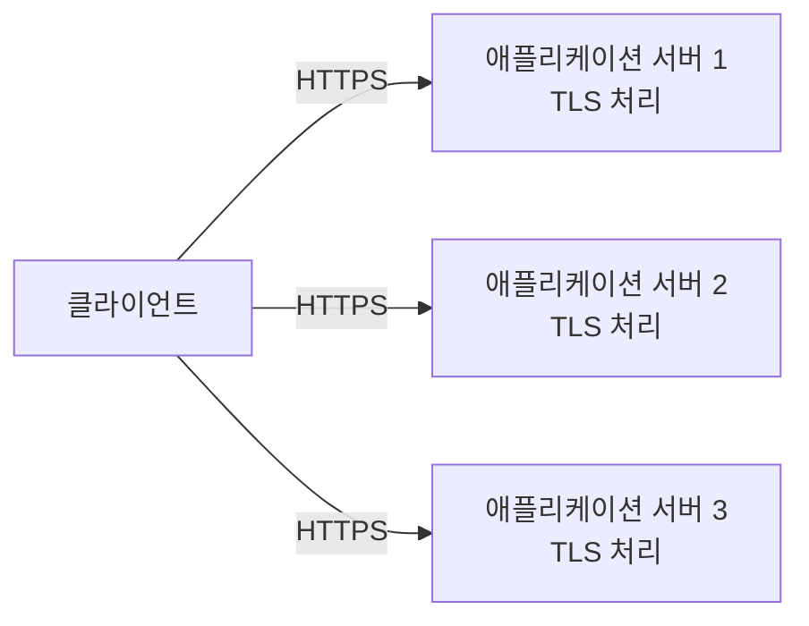
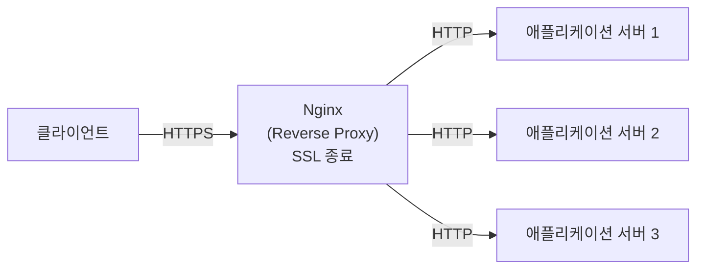
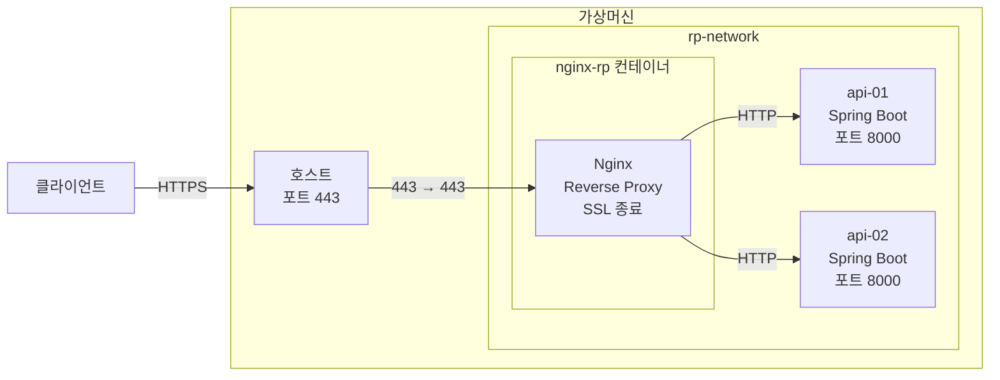

지난 포스팅에서 `Nginx`에 로드밸런싱 설정을 적용해 클라이언트의 요청을 여러 서버로 분산하는 과정을 확인했습니다.

이번에는 클라이언트와의 `HTTPS` 통신에 필요한 `TLS` 연결과 암호화 처리를 `Nginx`가 담당하도록 구성해보겠습니다. 일반적으로 이러한 구조를 **SSL 종료(SSL Termination)**라고 부르지만, `HTTPS` 통신에서는 `TLS`가 사용되므로 정확하게는 **TLS 종료(TLS Termination)**라고 표현하는 것이 적절합니다.

이번 포스팅에서는 인증서를 `Nginx`에 적용하고, 클라이언트와 `Nginx` 구간은 `HTTPS`, `Nginx`와 애플리케이션 서버 구간은 `HTTP`로 통신하도록 구성한 뒤 실제 동작을 확인해보겠습니다.

---

## 1. SSL 종료 기능의 필요성

`HTTPS`를 사용하면 클라이언트와 서버 사이에 `TLS` 연결이 구성되고, 해당 연결을 통해 주고받는 데이터가 암호화됩니다. 애플리케이션 서버가 직접 `HTTPS` 요청을 처리하는 구조에서는 각 서버에서 인증서와 개인키를 관리하고 `TLS` 연결을 처리해야 합니다.



반면 `Reverse Proxy`에서 `TLS` 연결을 종료하도록 구성하면 클라이언트와의 `HTTPS` 통신은 `Nginx`가 담당하고, 내부의 애플리케이션 서버에는 `HTTP` 요청으로 전달할 수 있습니다.

이러한 구성을 **SSL 종료(SSL Termination)** 또는 **TLS 종료(TLS Termination)**라고 합니다.



`TLS` 연결과 인증서·개인키 관리를 `Nginx`에서 담당하기 때문에 애플리케이션 서버마다 이를 개별적으로 구성할 필요가 없으며, 인증서의 적용과 갱신에 필요한 관리 지점도 `Reverse Proxy`에서 일원화할 수 있습니다.

또한 외부 클라이언트와의 TLS 연결 처리를 `Nginx`가 담당하므로 애플리케이션 서버는 `TLS` 처리 대신 애플리케이션 요청과 비즈니스 로직 처리에 집중할 수 있습니다. 

다만 `Nginx`와 애플리케이션 서버 사이를 반드시 `HTTP`로 구성해야 하는 것은 아닙니다. 내부 네트워크의 신뢰 수준이나 보안 정책에 따라 해당 구간을 `HTTPS`로 구성해야 할 수도 있습니다.

---

## 2. 인증서 생성

SSL 종료 기능의 동작을 확인하려면 `Nginx`가 `TLS` 연결에 사용할 인증서와 개인키가 필요합니다. 

실제 운영 환경에서는 서비스 환경에 따라 공인 인증기관(CA) 또는 조직 내부의 신뢰할 수 있는 인증기관이 발급한 인증서를 사용합니다. 하지만 이번에는 SSL 종료 기능의 동작을 확인하는 것이 목적이므로 `OpenSSL`을 이용해 자체 서명(Self-Signed) 인증서를 생성했습니다.

먼저 인증서를 저장할 디렉터리를 생성하고, 이어서 인증서와 개인키를 생성했습니다.

```bash
$ mkdir certs

$ openssl req -x509 \
  -nodes \
  -days 365 \
  -newkey rsa:2048 \
  -keyout certs/nginx.key \
  -out certs/nginx.crt
```

주요 옵션의 의미는 다음과 같습니다.

* `-x509` : 인증서 서명 요청(CSR)을 별도로 생성하지 않고 자체 서명 인증서를 생성합니다.
* `-nodes` : 개인키에 암호를 설정하지 않습니다. 실제 운영 환경에서는 개인키 파일이 외부에 노출되지 않도록 접근 권한을 관리해야 합니다.
* `-days 365` : 인증서의 유효기간을 365일로 설정합니다.
* `-newkey rsa:2048` : 2048비트 RSA 개인키를 새로 생성합니다.
* `-keyout` : 생성할 개인키의 경로를 지정합니다.
* `-out` : 생성할 인증서의 경로를 지정합니다.

위 명령어를 실행하면 인증서의 국가, 조직, Common Name 등의 정보를 입력하는 과정이 진행됩니다. 테스트 환경에 맞는 값을 입력하여 자체 서명 인증서를 생성하면 됩니다.

다음과 같이 인증서와 개인키는 두 개의 파일에 생성됩니다.

```nohighlight
certs
 ├─ nginx.crt
 └─ nginx.key
```

* `nginx.crt` : `Nginx`에서 사용할 서버 인증서
* `nginx.key` : 인증서에 대응하는 개인키

> 자체 서명 인증서를 사용하기 때문에 브라우저에서는 신뢰할 수 없는 인증서 경고가 표시될 수 있습니다. 이후 `curl`로 `HTTPS` 요청을 테스트할 때도 인증서 검증 오류가 발생할 수 있으므로 `-k` 옵션을 사용했습니다.

---

## 3. Nginx SSL 종료 설정

`Nginx`가 클라이언트의 요청을 `HTTPS`로 수신할 수 있도록 `nginx.conf`를 다음과 같이 수정했습니다.

**수정된 nginx.conf**

```nohighlight
events {
}

http {
    upstream backend {
        server api-01:8000;
        server api-02:8000;
    }

    server {

        listen 443 ssl;

        ssl_certificate     /etc/nginx/certs/nginx.crt;
        ssl_certificate_key /etc/nginx/certs/nginx.key;

        location / {
            proxy_pass http://backend;
        }
    }
}
```

`HTTPS`는 일반적으로 `443` 포트를 사용합니다. 그래서 클라이언트의 `HTTPS` 요청을 `443` 포트에서 수신하도록 `listen` 설정을 변경했습니다. `listen` 설정에 `ssl` 옵션을 함께 지정하면 해당 포트에서 `TLS` 연결을 처리하게 됩니다.

```nohighlight
listen 443 ssl;
```

또한 앞에서 생성한 인증서와 개인키를 사용할 수 있도록 `ssl_certificate`와 `ssl_certificate_key` 설정을 추가했습니다.

```nohighlight
ssl_certificate     /etc/nginx/certs/nginx.crt;
ssl_certificate_key /etc/nginx/certs/nginx.key;
```

클라이언트와의 `TLS` 연결은 `Nginx`에서 종료되기 때문에 애플리케이션 서버는 별도의 `HTTPS` 설정 없이 기존과 동일하게 `HTTP`로 동작합니다.

---

## 4. Nginx 컨테이너 재구성

변경한 SSL 종료 설정을 적용하기 위해 기존 `Nginx` 컨테이너를 제거했습니다.

```bash
$ docker rm -f nginx-rp
```

이어서 `HTTPS` 요청을 수신할 수 있도록 `443` 포트를 호스트에 공개하고, 앞에서 생성한 인증서와 개인키가 저장된 디렉터리를 컨테이너의 `/etc/nginx/certs` 경로에 마운트하여 다시 실행했습니다.

```bash
$ docker run -d \
  --name nginx-rp \
  --network rp-network \
  -p 443:443 \
  -v /home/sanghoon/nginx/nginx.conf:/etc/nginx/nginx.conf:ro \
  -v /home/sanghoon/nginx/certs:/etc/nginx/certs:ro \
  nginx
```

전체 구조는 다음과 같습니다.



---

## 5. SSL 종료 기능 검증

이제 더 이상 `80` 포트를 사용하는 `HTTP` 통신으로는 요청을 보낼 수 없습니다. `Nginx`가 `443` 포트만 노출하고 있기 때문입니다.

```bash
$ curl http://192.168.56.11/api/server

curl: (7) Failed to connect to 192.168.56.11 port 80 after 0 ms: Couldn't connect to server
```

`443` 포트를 사용하는 `HTTPS`로 요청을 보내더라도 자체 서명 인증서를 사용하고 있기 때문에 `curl` 명령에 `-k` 옵션을 추가해야 합니다.

```bash
$ curl -k https://192.168.56.11/api/server
```

위와 같이 요청을 보내면 정상적인 응답이 반환되었습니다.

```json
{
    "time":"2026-06-14T11:59:21.023254620",
    "serverName":"api-02"
}
```

현재 `api-01`과 `api-02` 애플리케이션 서버에는 별도의 `HTTPS` 설정을 적용하지 않았으며, 기존과 동일하게 `8000` 포트에서 `HTTP`로 동작하고 있습니다.

반면 클라이언트는 `HTTPS`를 이용해 `Nginx`의 `443` 포트로 요청하고 정상적인 응답을 받을 수 있습니다.

`Nginx`의 `proxy_pass`는 `http://backend`로 설정되어 있으므로 클라이언트와의 `TLS` 연결은 `Nginx`에서 종료되고, 이후 요청은 `HTTP`로 애플리케이션 서버에 전달됩니다. 

이를 통해 SSL 종료가 의도한 구조로 동작하고 있음을 확인할 수 있었습니다.

---

## 6. HTTP → HTTPS 강제 리다이렉트

`HTTP` 요청을 `HTTPS`로 전환하기 위해 `Nginx`에서 리다이렉트를 설정할 수 있습니다.

클라이언트가 `HTTP`로 요청하면 `Nginx`는 `301 Moved Permanently` 상태코드와 함께 이동할 `HTTPS` 주소를 `Location` 헤더에 담아 응답합니다. 브라우저와 같은 클라이언트는 이 정보를 이용해 해당 `HTTPS` 주소로 다시 요청하게 됩니다.

이를 위해 `nginx.conf`를 아래와 같이 수정했습니다. 

**수정된 nginx.conf**

```nohighlight
events {
}

http {

    upstream backend {
        server api-01:8000;
        server api-02:8000;
    }

    server {
        listen 80;
        return 301 https://$host$request_uri;
    }

    server {

        listen 443 ssl;

        ssl_certificate     /etc/nginx/certs/nginx.crt;
        ssl_certificate_key /etc/nginx/certs/nginx.key;

        location / {
            proxy_pass http://backend;
        }
    }
}
```

새로운 `server` 설정을 추가해서 `80` 포트로 `HTTP` 요청이 들어오면, 상태코드 `301`과 `Location` 헤더를 통해 리다이렉트될 `HTTPS` 주소가 반환되도록 설정을 변경했습니다.

```nohighlight
server {
  listen 80;
  return 301 https://$host$request_uri;
}
```

---

## 7. Nginx 컨테이너 재구성(HTTP 포트 추가)

변경한 `HTTP → HTTPS 강제 리다이렉트` 설정을 적용하기 위해 기존 `Nginx` 컨테이너를 제거했습니다.

```bash
$ docker rm -f nginx-rp
```

그리고 `HTTP` 요청도 수신할 수 있도록 호스트의 `80` 포트를 추가로 공개하여 컨테이너를 다시 실행했습니다.

```bash
$ docker run -d \
  --name nginx-rp \
  --network rp-network \
  -p 443:443 \
  -p 80:80 \
  -v /home/sanghoon/nginx/nginx.conf:/etc/nginx/nginx.conf:ro \
  -v /home/sanghoon/nginx/certs:/etc/nginx/certs:ro \
  nginx
```

---

## 8. 강제 리다이렉션 확인

`HTTP`로 요청을 보내고 `HTTPS`로 강제 리다이렉션되는지 확인하기 위해 이번에는 `-I` 옵션을 사용해서 `curl` 명령을 실행했습니다.

```bash
$ curl -I http://192.168.56.11/api/server
```

http://192.168.56.11/api/server 요청에 301 상태코드와 리다이렉션될 주소가 반환되었습니다.

```http
HTTP/1.1 301 Moved Permanently
Server: nginx/1.31.1
Date: Sun, 14 Jun 2026 12:32:37 GMT
Content-Type: text/html
Content-Length: 169
Connection: keep-alive
Location: https://192.168.56.11/api/server
```

실제 리다이렉션이 되는지 `-L` 옵션을 사용해서 `curl` 명령을 다시 실행해봤습니다. 

```bash
$ curl -k -L http://192.168.56.11/api/server
```

`HTTP` 요청이 `HTTPS`로 리다이렉션 되면서 정상적으로 응답이 반환되었습니다. 

```json
{
    "time":"2026-06-14T12:36:46.311165528",
    "serverName":"api-01"
}
```

`Nginx`가 SSL 종료뿐만 아니라, `HTTPS` 사용을 강제하는 역할도 수행할 수 있다는 점을 확인할 수 있었습니다. 실제 운영 환경에서도 `HTTP`로 들어온 요청을 `HTTPS`로 전환하여 사용자가 암호화된 통신을 사용하도록 유도하는 구성이 널리 사용됩니다.

---

## 9. 다음 포스팅

지금까지 클라이언트와 `Nginx` 사이에는 `HTTPS`를 적용하고, 내부 애플리케이션 서버와의 통신은 `HTTP`로 유지하는 SSL 종료 구조를 구성해봤습니다.

또한 `HTTP`로 들어온 요청을 `HTTPS`로 리다이렉트하여 외부 통신을 `HTTPS`로 유도하는 방법도 확인했습니다.

다음 포스팅에서는 `Nginx`가 `Reverse Proxy`뿐만 아니라, 웹 서버의 역할도 수행할 수 있다는 점을 확인하기 위해 정적 콘텐츠를 직접 제공하는 기능을 검증해보겠습니다.

