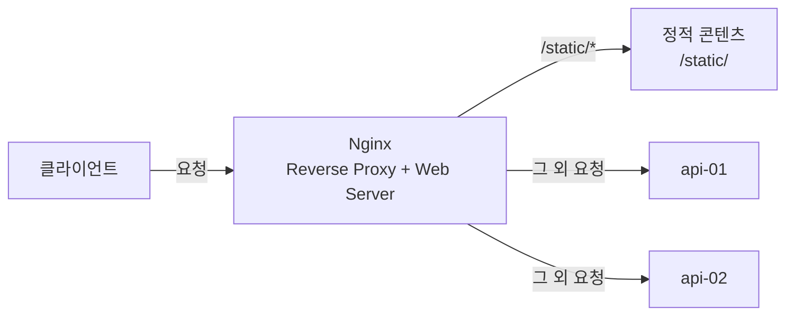

`Reverse Proxy`의 핵심 역할은 클라이언트의 요청을 적절한 애플리케이션 서버로 전달하는 것입니다. 반면 이미지, CSS, JavaScript, HTML과 같은 정적 콘텐츠를 직접 제공하는 것은 일반적으로 **웹 서버(Web Server)**의 역할입니다.

`Nginx`는 `Reverse Proxy`뿐만 아니라 웹 서버의 기능도 제공하기 때문에, 요청의 종류에 따라 애플리케이션 서버로 전달하거나 정적 콘텐츠를 직접 응답할 수 있습니다.

이번 포스팅에서는 기존의 `Reverse Proxy` 환경에 `Nginx`의 웹 서버 기능을 함께 적용하고, 정적 콘텐츠 요청을 애플리케이션 서버를 거치지 않고 `Nginx`가 직접 처리하도록 구성해보겠습니다.

---

## 1. 정적 콘텐츠 생성

정적 콘텐츠 제공 기능을 확인하기 위해 호스트의 `/home/sanghoon/nginx/static` 경로에 `index.html` 파일을 생성했습니다.

**index.html**

```html
<!DOCTYPE html>
<html lang="ko">
<head>
    <meta charset="UTF-8">
    <title>Nginx로 Reverse Proxy 구성하기</title>
</head>
<body>
    <h1>정적 콘텐츠 처리 기능 검증</h1>
</body>
</html>
```

---

## 2. Nginx 웹 서버 설정

`/static/` 경로로 들어오는 정적 콘텐츠 요청을 `Nginx`가 직접 처리할 수 있도록 `nginx.conf`를 다음과 같이 수정했습니다.

**수정된 nginx.conf**

```nohighlight
events {
}

http {

    upstream backend {
        server api-01:8000;
        server api-02:8000;
    }

    server {
        listen 80;
        return 301 https://$host$request_uri;
    }

    server {

        listen 443 ssl;

        ssl_certificate     /etc/nginx/certs/nginx.crt;
        ssl_certificate_key /etc/nginx/certs/nginx.key;

        location /static/ {
            root /usr/share/nginx;
        }

        location / {
            proxy_pass http://backend;
        }
    }
}
```

정적 콘텐츠 요청은 다음 설정에서 처리됩니다.

```nohighlight
location /static/ {
    root /usr/share/nginx;
}
```

클라이언트는 `index.html`파일을 아래와 같이 요청할 수 있습니다.

```http
GET /static/index.html HTTP/1.1
```

`/static/index.html`이 요청되면 `Nginx`는 `root`로 지정된 `/usr/share/nginx` 경로에 요청 URI를 결합하여 다음 파일을 찾아 응답하게 됩니다.

```http
/usr/share/nginx/static/index.html
```

즉, 정적 콘텐츠를 `/static/` 경로를 통해 제공하도록 구성했습니다. 반면 `/static/`으로 시작하지 않는 요청은 기존과 동일하게 `proxy_pass`를 통해 애플리케이션 서버로 전달됩니다.

---

## 3. Nginx 컨테이너 재구성

변경한 웹 서버 설정을 적용하기 위해 기존 `Nginx` 컨테이너를 제거했습니다.

```bash
$ docker rm -f nginx-rp
```

이어서 `Nginx`가 `index.html` 파일에 접근할 수 있도록 호스트의 `/home/sanghoon/nginx/static` 경로를 컨테이너의 `/usr/share/nginx/static` 경로에 마운트하여 다시 실행했습니다.

```bash
$ docker run -d \
  --name nginx-rp \
  --network rp-network \
  -p 80:80 \
  -p 443:443 \
  -v /home/sanghoon/nginx/nginx.conf:/etc/nginx/nginx.conf:ro \
  -v /home/sanghoon/nginx/certs:/etc/nginx/certs:ro \
  -v /home/sanghoon/nginx/static:/usr/share/nginx/static:ro \
  nginx
```

이제 호스트에서 생성한 `index.html` 파일을 `Nginx` 컨테이너 내부에서는 다음 경로에서 확인할 수 있습니다.

```text
/usr/share/nginx/static/index.html
```

따라서 앞에서 설정한 `location /static/` 설정을 통해 해당 파일을 정적 콘텐츠로 제공할 수 있습니다.

전체 구조는 다음과 같습니다.



전체 구조를 보면 `Nginx`는 요청 경로에 따라 서로 다른 역할을 수행합니다. `/static/`으로 시작하는 요청은 웹 서버 기능을 이용해 정적 콘텐츠를 직접 응답하고, 그 외의 요청은 `Reverse Proxy`와 로드밸런싱 기능을 통해 애플리케이션 서버로 전달합니다.

---

## 4. 정적 콘텐츠 처리 기능 검증

웹 브라우저에서 아래 주소로 접속해보면 `index.html` 파일의 내용이 정상적으로 출력되었습니다.

```http
https://192.168.56.11/static/index.html
```

**참고**

> 현재 `http(80 포트)`로 요청을 하더라도 `https(443 포트)`로 리다이렉션 되도록 구성되어 있습니다. 다만 `OpenSSL`로 생성한 자체 서명 인증서를 사용하고 있기 때문에 브라우저에서는 신뢰할 수 없는 인증서로 경고가 표시될 수 있습니다.


`api-01`과 `api-02` 컨테이너의 애플리케이션 로그도 확인해봤습니다.

```bash
$ docker logs api-01

$ docker logs api-02
```

두 애플리케이션 서버의 로그에서는 `index.html` 요청과 관련된 기록을 발견할 수 없었습니다. 이를 통해 `/static/` 경로의 요청은 애플리케이션 서버까지 전달되지 않고 Nginx에서 직접 처리되고 있음을 확인할 수 있었습니다.

정적 콘텐츠는 일반적으로 변경 빈도는 낮지만 요청 빈도는 높기 때문에, 웹 서버가 직접 처리하는 것이 효율적입니다.

또한 웹 서버가 정적 콘텐츠를 직접 제공하면 애플리케이션 서버는 API 처리와 같은 동적 요청에 집중할 수 있습니다. 이를 통해 애플리케이션 서버의 불필요한 부하를 줄이고 전체 서비스의 응답 성능을 향상시킬 수 있습니다.

---

## 5. 마무리

`Nginx`를 이용해 `Reverse Proxy`를 구성하고, 애플리케이션 서버 보호 → 로드밸런싱 → SSL 종료 → 정적 콘텐츠 처리 기능까지 단계적으로 검증해봤습니다.

이번 시리즈를 통해 `Nginx`가 단순히 요청을 전달하는 `Reverse Proxy` 역할에만 그치지 않고, 외부 진입점 제어, 부하 분산, TLS 처리, 정적 콘텐츠 제공까지 담당할 수 있는 중요한 인프라 구성 요소라는 점을 확인할 수 있었습니다.

이것으로 **`Nginx로 Reverse Proxy 구성하기`** 포스팅 시리즈를 마무리하겠습니다.


