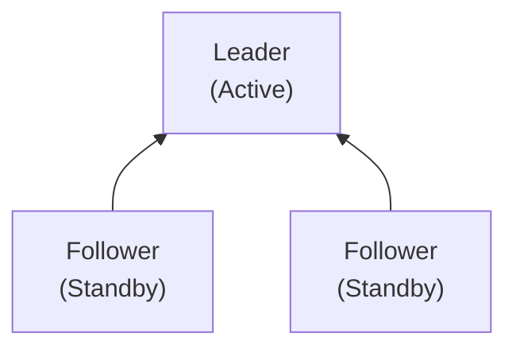
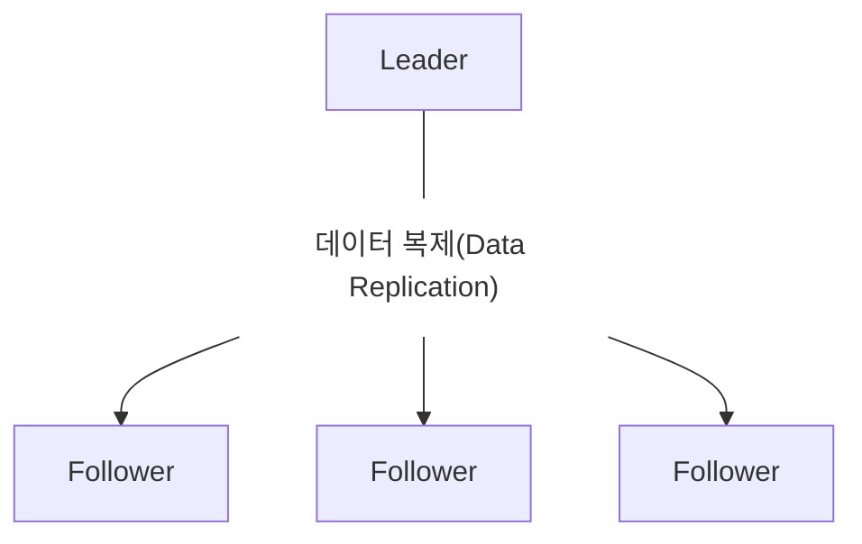
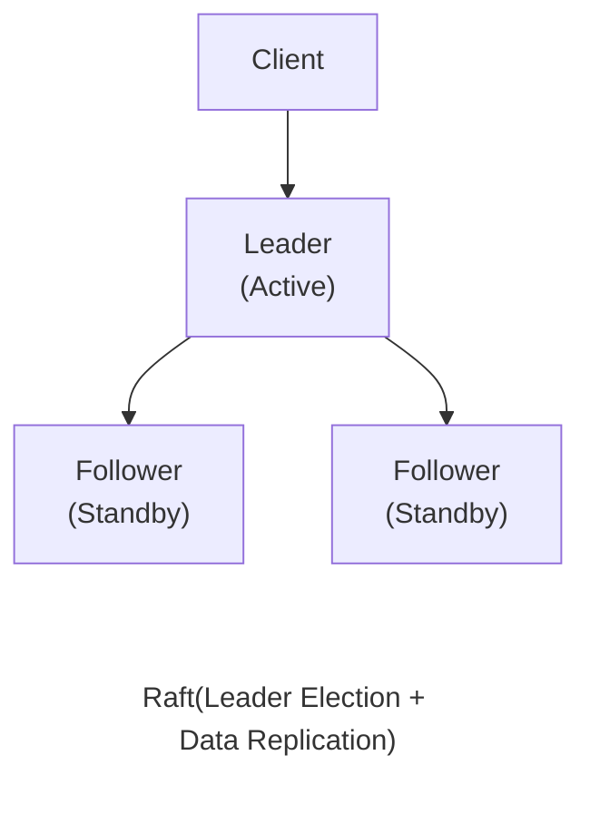

Vault는 데이터베이스 계정 정보, API Key, 인증서와 같은 시크릿을 안전하게 관리하고, 암호화 기능까지 제공하는 통합 보안 플랫폼입니다. 최근 보안의 중요성이 더욱 커지면서 Vault를 도입해 서비스의 보안성을 강화할 수 있는 방안을 검토하고 있습니다.

이미 학습을 통해 기술적인 측면에서는 Vault를 충분히 활용할 수 있다는 결론을 얻을 수 있었지만, 운영 안정성에 대한 충분한 고려도 필요했습니다. 

고가용성(High Availability, HA)은 시스템에 장애가 발생하더라도 서비스 중단을 최소화하고 지속적으로 서비스를 제공할 수 있는 특성을 의미합니다.

운영 안정성을 판단하기 위해서는 먼저 고가용성이 무엇인지 이해해야 합니다. 또한 Vault가 어떤 방식으로 고가용성을 제공하는지도 확인해야 합니다.

---

## 1. 고가용성(High Availability, HA)

고가용성은 주로 서버 이중화(Redundancy) 구성과 장애 조치(Failover)를 통해 제공됩니다.
 
서버 이중화는 서비스 중단 시간을 최소화할 수 있기 때문에 24시간 안정적인 서비스 제공이 필요한 환경에서 일반적으로 사용되는 구성 방식입니다. 한 대의 서버에서 장애가 발생하더라도 정상적으로 동작하는 다른 서버에서 서비스를 이어받아 계속 제공할 수 있기 때문입니다.

Vault 역시 Active-Standby 구조를 기반으로 구현된 서버 이중화 구성과 장애 조치를 통해 고가용성을 제공합니다.

---

## 2. Active-Standby 구조

서버 이중화와 장애 조치의 대표적인 구현 방식 중 하나가 `Active-Standby` 구조입니다.

이 구조에서는 하나의 서버가 Active 역할을 수행하며 실제 서비스를 처리합니다. 나머지 서버는 Standby 상태로 대기하면서 Active 서버의 상태를 지속적으로 확인합니다.

평소에는 Active 역할을 하는 서버에서만 클라이언트의 요청을 처리합니다. 하지만 Active 역할을 하는 서버에 장애가 발생하면 정상적으로 동작할 수 있는 Standby 상태로 대기하던 서버가 Active 역할을 이어받아 서비스를 계속 제공할 수 있습니다.

`Active-Standby` 구조는 구현이 비교적 단순하고 데이터의 일관성을 유지하기 쉽기 때문에 널리 사용됩니다.

Vault 역시 이러한 `Active-Standby` 구조를 기반으로 고가용성을 제공합니다. 하지만 어떤 서버가 Active 역할을 수행해야 하는지 자동으로 결정할 수 없습니다. 

장애 발생 시 새로운 Active 서버를 선택하는 과정도 필요합니다. 이를 위해 **Leader Election** 메커니즘이 사용됩니다.

---

## 3. Leader Election

이제부터는 `Active-Standby` 구조를 구성하는 각각의 서버를 하나의 노드(Node)로 표현하겠습니다.

Leader Election은 여러 노드로 구성된 클러스터에서 하나의 노드를 **Leader(Active)** 로 선출하는 과정을 의미합니다. 만약 여러 노드가 동시에 Leader 역할을 수행한다면 데이터의 일관성이 깨지거나 예상하지 못한 문제가 발생할 수 있습니다.

따라서 클러스터에서는 항상 하나의 노드만 Leader가 되고, 나머지 노드는 Follower 역할을 수행합니다.

Leader에 장애가 발생하면 클러스터는 Leader Election을 다시 수행하여 새로운 Leader를 선출합니다. 

Vault에서는 Leader가 Active 역할을 수행하고, Follower는 Standby 상태로 동작합니다. 따라서 Leader Election을 통해 Active 노드가 자동으로 결정됩니다.

그렇다면 여러 노드는 어떤 방식으로 Leader를 선출하고 동일한 데이터를 유지할 수 있을까요? 이를 위해 Vault는 **Raft**라는 분산 합의(Consensus) 알고리즘을 사용합니다.

---

## 4. Raft

여러 노드가 하나의 클러스터로 동작하려면 Leader를 결정하고, 모든 노드가 동일한 데이터를 유지해야 합니다. Raft는 이러한 문제를 해결하기 위해 설계된 **분산 합의(Consensus) 알고리즘**입니다.

주요 역할은 다음과 같습니다.

* Leader Election을 통해 하나의 Leader를 선출
* Leader에 장애가 발생하면 새로운 Leader를 자동으로 선출
* Leader의 변경 내용을 모든 Follower에 복제하여 데이터의 일관성을 유지

Leader가 데이터를 변경하면 모든 Follower에도 동일한 내용이 복제됩니다. 또한 Leader에 장애가 발생하면 클러스터는 Leader Election을 다시 수행하여 새로운 Leader를 선출하고 서비스를 계속 제공합니다.

Vault는 데이터를 저장하기 위한 저장소(Storage Backend)가 필요합니다. 과거에는 Consul과 같은 외부 스토리지를 사용하는 경우가 많았지만, 현재는 Vault 자체에 내장된 **Integrated Storage**를 사용하는 것이 일반적입니다. 

**Integrated Storage**는 Raft 알고리즘을 기반으로 데이터를 여러 노드에 복제하고 Leader Election을 수행합니다. 따라서 Leader가 변경되더라도 데이터는 그대로 유지되며, Vault는 별도의 외부 스토리지 없이도 고가용성을 구현할 수 있습니다.

---

## 5. Vault HA 아키텍처

지금까지 살펴본 고가용성, Active-Standby 구조, Leader Election, 그리고 Raft는 모두 Vault HA를 구성하는 핵심 요소입니다.

Vault 클러스터에서는 하나의 노드만 Leader(Active) 역할을 수행하며 클라이언트의 요청을 처리합니다. 나머지 노드는 Follower(Standby) 상태로 대기하면서 Leader의 변경 내용을 지속적으로 동기화합니다. 이를 통해 모든 노드가 동일한 데이터를 유지할 수 있습니다.

Leader에 장애가 발생하면 Raft 알고리즘이 Leader Election을 수행하여 새로운 Leader를 자동으로 선출합니다. 새로운 Leader가 선출되면 해당 노드가 Active 역할을 이어받고, 나머지 노드는 다시 Standby 상태로 전환됩니다.

이러한 구조를 통해 Vault는 데이터의 일관성을 유지하면서도 서비스 중단을 최소화하는 고가용성을 제공합니다.

지금까지 Vault HA를 이해하기 위해 필요한 핵심 개념과 동작 원리를 살펴봤습니다. 다음 포스팅에서는 Vault HA 클러스터를 직접 구축하고, Leader Election과 Failover가 실제로 어떻게 동작하는지 확인해보겠습니다.

---

## 6. 포스팅 목록

* [토이프로젝트] Vault 이중화(High Availability, HA): (1) 개념과 동작 원리
* [[토이프로젝트] Vault 이중화(High Availability, HA): (2) HA 클러스터 구축](https://sanghoon-lee.github.io/2026/06/26/vault-ha2/)

---

## 7. 참고

* [[토이프로젝트] Vault를 이용한 KMS 대체 검토: (1) 개념정리와 설치과정](https://sanghoon-lee.github.io/2026/04/09/vault/)
* [[토이프로젝트] Vault를 이용한 KMS 대체 검토: (2) KV Engine을 이용한 암호화 키 저장과 조회 실습](https://sanghoon-lee.github.io/2026/04/10/vault1-1-rewriting/)
* [[토이프로젝트] Vault를 이용한 KMS 대체 검토: (3) Transit Engine을 이용한 암·복호화 실습](https://sanghoon-lee.github.io/2026/04/11/vault2/)
* [[토이프로젝트] Vault를 이용한 KMS 대체 검토: (4) Java 애플리케이션에서 Vault Transit Engine 연동하기](https://sanghoon-lee.github.io/2026/04/18/vault3/)

