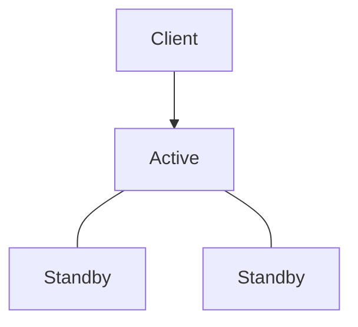
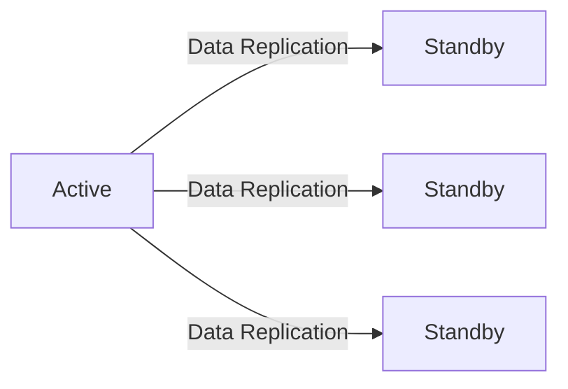

현재 사용 중인 KMS의 EOS 시점이 다가오면서 대체 방안을 검토하던 중 HashiCorp Vault를 처음 접하게 되었습니다.

Vault는 시크릿 관리와 암호화 기능을 비롯한 여러 보안 기능을 제공하는 플랫폼으로 KMS 대체 외에도 서비스의 보안성을 강화하기 위한 다양한 용도로 활용할 수 있을 것으로 생각했습니다.

하지만 실제 운영 환경에 적용하기 위해서는 기능뿐만 아니라, 안정적으로 운영할 수 있는지도 함께 확인할 필요가 있었습니다. 그래서 Vault를 어떻게 이중화할 수 있는지, 클러스터 구축이 가능한지 살펴보게 되었습니다.

---

## 1. 고가용성(High Availability, HA)

고가용성(High Availability, HA)은 시스템에 장애가 발생하더라도 지속적으로 서비스를 제공할 수 있는 특성을 의미합니다. 주로 서버 이중화(Redundancy) 구성과 장애 조치(Failover)를 통해 제공됩니다.
 
특히, 서버 이중화는 서비스 중단 시간을 최소화할 수 있기 때문에, 24시간 안정적인 서비스 제공이 필요한 환경에서 일반적으로 사용되는 구성 방식입니다. 한 대의 서버에서 장애가 발생하더라도 정상적으로 동작하는 다른 서버에서 서비스를 이어받아 계속 제공할 수 있기 때문입니다.

Vault 역시 서버 이중화와 장애 조치를 구현하여 고가용성을 제공합니다.

---

## 2. Active-Standby 구조

`Active-Standby`는 서버 이중화를 구현하는 대표적인 방식 중 하나입니다. Active 노드는 실제 요청을 처리하고, Standby 노드는 장애 발생 시를 대비해 대기하는 역할을 합니다.

이 구조에서는 여러 노드가 단일 클러스터를 구성하며 하나의 Active 노드가 클라이언트의 요청을 처리합니다. 나머지는 Standby 노드로 대기합니다.

`Active-Standby` 구조는 구현이 비교적 단순하고 데이터의 일관성을 유지하기 쉽기 때문에 널리 사용됩니다.

Vault는 `Active-Standby` 구조를 기반으로 클러스터를 구성하여 고가용성을 제공합니다. Active 노드에 장애가 발생하면 서비스를 지속적으로 제공하기 위해 새로운 Active 노드를 선출해야 합니다. 이를 위해 Leader Election 메커니즘을 사용합니다.

---

## 3. Leader Election

Leader Election은 여러 노드로 구성된 클러스터에서 하나의 노드를 Active 노드로 선출하는 과정을 의미합니다. 

만약 여러 노드가 동시에 Active 노드로 선출된다면 서로 다른 데이터를 저장하거나 동일한 요청을 중복 처리하여 데이터의 일관성이 깨질 수 있습니다. 따라서 클러스터에서는 항상 하나의 Active 노드만 선출되고, 나머지는 Standby 노드가 되어야 합니다. 대신 Active 노드에 장애가 발생하면 클러스터는 Leader Election을 다시 수행하여 새로운 Active 노드를 선출합니다. 

그렇다면 어떤 방식으로 Active 노드를 선출하고, 다수의 노드가 동일한 데이터를 유지할 수 있을까요? 

---

## 4. Raft 알고리즘

클러스터가 정상적으로 동작하려면 모든 노드가 동일한 데이터를 유지해야 합니다. Leader Election을 통해 새로운 Active 노드가 선출되더라도 모든 노드가 동일한 데이터를 가지고 있지 않으면 장애 이후 서비스를 계속 제공할 수 없습니다. 

이를 위해 Vault는 **Raft**라는 분산 합의(Consensus) 알고리즘을 사용합니다. **Raft** 알고리즘에 의해 여러 노드가 어떤 데이터를 어떤 순서로 저장할지에 대해 모든 노드가 동일하게 합의하게 됩니다.

Active 노드에서 발생한 변경 내용은 모든 Standby 노드에 동일한 순서로 복제되며, 클러스터 전체가 동일한 상태를 유지하게 됩니다.

---

## 5. Integrated Storage

지금까지는 클러스터가 어떻게 동일한 데이터를 유지하는지 살펴봤습니다. 그렇다면 실제로 그 데이터는 어디에 저장될까요?

Vault는 데이터를 저장하기 위한 저장소(Storage Backend)가 필요합니다. Vault에서 관리하는 시크릿과 메타데이터는 이러한 저장소에 저장됩니다.

과거에는 Consul과 같은 외부 스토리지를 사용하는 경우가 많았습니다. 하지만 현재는 Vault 자체에 내장된 **Integrated Storage**를 사용하는 것이 일반적입니다.

**Integrated Storage**는 Raft 알고리즘을 기반으로 동작하며, 클러스터를 구성하고 있는 모든 노드의 데이터를 동일하게 유지할 수 있습니다.

따라서 **Integrated Storage**를 사용하면 별도의 Consul 없이도 고가용성 클러스터를 구성할 수 있습니다.

---

## 6. 다음 포스팅

지금까지 Vault의 고가용성을 이해하기 위해 필요한 핵심 개념들을 살펴봤습니다.

다음 포스팅에서는 Oracle VM 환경을 구성하고, 3개의 노드로 Vault 클러스터를 직접 구축해보겠습니다.

