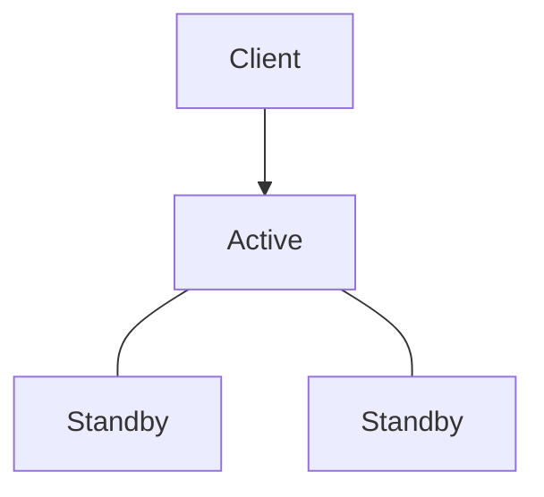
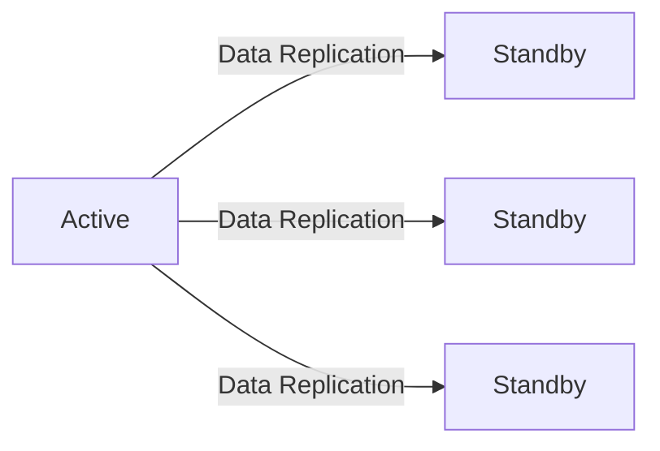

Vault는 데이터베이스 계정 정보, API Key, 인증서와 같은 시크릿을 안전하게 관리하고, 암호화 기능까지 제공하는 통합 보안 플랫폼입니다. 

최근 보안의 중요성이 더욱 커지면서 Vault를 도입해 서비스의 보안성을 강화할 수 있는 방안을 검토하고 있습니다.

이미 기능적인 측면에서는 Vault를 충분히 활용할 수 있다는 결론을 얻었지만, 실제 운영 환경에서도 안정적으로 사용할 수 있는지 함께 확인해보고 싶었습니다.

이를 위해 가장 먼저 살펴본 것이 고가용성(High Availability, HA)입니다.

---

## 1. 고가용성(High Availability, HA)

고가용성(High Availability, HA)은 시스템에 장애가 발생하더라도 서비스 중단을 최소화하고 지속적으로 서비스를 제공할 수 있는 특성을 의미합니다. 주로 서버 이중화(Redundancy) 구성과 장애 조치(Failover)를 통해 제공됩니다.
 
서버 이중화는 서비스 중단 시간을 최소화할 수 있기 때문에 24시간 안정적인 서비스 제공이 필요한 환경에서 일반적으로 사용되는 구성 방식입니다. 한 대의 서버에서 장애가 발생하더라도 정상적으로 동작하는 다른 서버에서 서비스를 이어받아 계속 제공할 수 있기 때문입니다.

Vault 역시 서버 이중화와 장애 조치를 구현하여 고가용성을 제공합니다.

---

## 2. Active-Standby 구조

`Active-Standby`는 서버 이중화를 구현하는 대표적인 방식 중 하나입니다.

이 구조에서는 여러 노드가 하나의 클러스터를 구성하며, 하나의 Active 노드만 클라이언트의 요청을 처리합니다. 나머지 노드는 Standby 상태를 유지하며 대기합니다.

`Active-Standby` 구조는 구현이 비교적 단순하고 데이터의 일관성을 유지하기 쉽기 때문에 널리 사용됩니다.

Vault는 `Active-Standby` 구조를 기반으로 클러스터를 구성하여 고가용성을 제공합니다. Active 노드에 장애가 발생하면 서비스를 지속적으로 제공하기 위해 새로운 Active 노드를 자동으로 선출해야 합니다. 이를 위해 Leader Election 메커니즘을 사용합니다.

---

## 3. Leader Election

Leader Election은 여러 노드로 구성된 클러스터에서 하나의 노드를 Active 노드로 선출하는 과정을 의미합니다. 

만약 여러 노드가 동시에 Active 노드로 선출된다면 데이터의 일관성이 깨지거나 예상하지 못한 문제가 발생할 수 있습니다. 클라이언트 요청을 처리하는 Active 노드가 여러 개 존재하면 서로 다른 데이터를 저장하거나 동일한 데이터를 중복 처리할 수 있습니다.

따라서 클러스터에서는 항상 하나의 Active 노드만 선출되고, 나머지는 Standby 노드가 되어야 합니다. 대신 Active 노드에 장애가 발생하면 클러스터는 Leader Election을 다시 수행하여 새로운 Active 노드를 선출합니다. 

그렇다면 여러 노드는 어떤 방식으로 Active 노드를 선출하고 동일한 데이터를 유지할 수 있을까요? 이를 위해 Vault는 **Raft**라는 분산 합의(Consensus) 알고리즘을 사용합니다.

---

## 4. Raft 알고리즘

클러스터가 정상적으로 동작하려면 모든 노드가 동일한 데이터를 유지해야 합니다. Leader Election을 통해 새로운 Active 노드가 선출되더라도 모든 노드가 동일한 데이터를 가지고 있지 않으면 장애 이후 서비스를 계속 제공할 수 없습니다. 

이를 위해 Vault는 Raft 알고리즘을 사용합니다. Raft는 여러 노드가 어떤 데이터를 어떤 순서로 저장할지에 대해 모든 노드가 동일하게 합의하도록 하는 분산 합의(Consensus) 알고리즘입니다. 

Active 노드에서 발생한 변경 내용은 모든 Standby 노드에 동일한 순서로 복제되며, 이를 통해 클러스터 전체가 동일한 상태를 유지합니다.

---

## 5. Integrated Storage

지금까지는 클러스터가 어떻게 동일한 데이터를 유지하는지 살펴봤습니다. 그렇다면 실제로 그 데이터는 어디에 저장될까요?

Vault는 데이터를 저장하기 위한 저장소(Storage Backend)가 필요합니다. Vault에서 관리하는 시크릿과 메타데이터는 이러한 저장소에 저장됩니다.

과거에는 Consul과 같은 외부 스토리지를 사용하는 경우가 많았습니다. 하지만 현재는 Vault 자체에 내장된 **Integrated Storage**를 사용하는 것이 일반적입니다.

**Integrated Storage**는 Raft 알고리즘을 기반으로 동작합니다. 따라서 클러스터를 구성하고 있는 모든 노드의 데이터를 동일하게 유지할 수 있습니다.

---

## 6. 마무리

지금까지 Vault의 고가용성을 이해하기 위해 필요한 핵심 개념들을 살펴봤습니다.

Active-Standby 구조는 장애 상황에서도 서비스를 지속하기 위한 기본 구조이며, Leader Election은 새로운 Active 노드를 자동으로 선출하는 역할을 합니다. 또한 Raft 알고리즘은 모든 노드가 동일한 데이터를 유지하도록 하여 장애 이후에도 정상적으로 서비스를 이어갈 수 있도록 지원합니다.

이러한 개념을 이해하면 Vault가 단순히 여러 대의 서버를 실행하는 것이 아니라, 클러스터 전체가 하나의 시스템처럼 동작하도록 설계되어 있다는 점을 이해할 수 있습니다.

다음 포스팅에서는 3개의 Vault 노드로 클러스터를 직접 구축하고, Leader Election과 Failover가 실제 장애 상황에서 어떻게 동작하는지 단계별로 확인해보겠습니다.

---

## 7. 포스팅 목록

* [토이프로젝트] Vault 이중화(High Availability, HA): (1) 개념과 동작 원리
* [[토이프로젝트] Vault 이중화(High Availability, HA): (2) 클러스터 구축](https://sanghoon-lee.github.io/2026/06/26/vault-ha2/)
* [[토이프로젝트] Vault 이중화(High Availability, HA): (3) Leader Election과 Failover 검증](https://sanghoon-lee.github.io/2026/06/28/vault-ha3/)

---

## 8. 참고

* [[토이프로젝트] Vault를 이용한 KMS 대체 검토: (1) 개념정리와 설치과정](https://sanghoon-lee.github.io/2026/04/09/vault/)
* [[토이프로젝트] Vault를 이용한 KMS 대체 검토: (2) KV Engine을 이용한 암호화 키 저장과 조회 실습](https://sanghoon-lee.github.io/2026/04/10/vault1-1-rewriting/)
* [[토이프로젝트] Vault를 이용한 KMS 대체 검토: (3) Transit Engine을 이용한 암·복호화 실습](https://sanghoon-lee.github.io/2026/04/11/vault2/)
* [[토이프로젝트] Vault를 이용한 KMS 대체 검토: (4) Java 애플리케이션에서 Vault Transit Engine 연동하기](https://sanghoon-lee.github.io/2026/04/18/vault3/)

