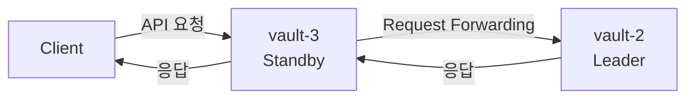

지금까지 3개의 노드로 구성된 Vault 클러스터를 직접 구축해봤습니다. 하지만 클러스터를 구축했다고 해서 곧바로 고가용성이 검증되었다고 보기는 어렵습니다. 

Active 노드에 장애가 발생하더라도 서비스가 중단 없이 계속 제공될 수 있어야 합니다. 이를 위해서 장애 상황에서 Leader Election, Failover 기능이 정상적으로 동작해야 합니다.

그래서 이번 포스팅에서는 지난 포스팅에서 구축한 클러스터에 장애 상황을 재현하고, 어떻게 동작하는지 알아보도록 하겠습니다.

---

## 1. 사전 준비

먼저 시크릿 관리 기능을 사용하기 위해 Vault의 KV Engine을 활성화했습니다. 

클러스터가 정상적으로 구축되어 있다면 KV Engine의 활성화는 Active 노드에서만 수행하면 됩니다. Active 노드에서 생성한 설정과 데이터는 Raft를 통해 다른 노드에도 복제되기 때문입니다.

지난 포스팅에서 Active 노드가 `vault-1`인 것은 이미 확인했습니다. 따라서 KV Engine 활성화를 위해 `vault-1` 컨테이너에 접속했습니다.  

```bash
$ docker exec -it vault-1 sh
```

이때 주의할 점이 있습니다. 컨테이너에 다시 접속하면 이전에 설정했던 환경변수는 유지되지 않습니다. 따라서 `VAULT_ADDR`과 `VAULT_TOKEN` 환경변수를 다시 설정해야 합니다. 이 과정을 반복하기 번거롭다면 컨테이너 실행 시 환경변수로 함께 설정해두는 것도 좋은 방법입니다. 

`vault-1` 컨테이너에서 KV Engine은 정상적으로 활성화되었습니다.

```bash
/ # vault secrets enable -path=secret kv-v2
```

KV Engine이 활성화되면 아래와 같은 메시지가 출력됩니다.

```nohighlight
Success! Enabled the kv-v2 secrets engine at: secret/
```

**참고**
> KV Engine 활성화하고 시크릿 관리 기능을 사용하는 방법은 [토이프로젝트] Vault를 이용한 KMS 대체 검토: (2) KV Engine을 이용한 암호화 키 저장과 조회 실습](https://sanghoon-lee.github.io/2026/04/10/vault1-1-rewriting/)에서 다룬 적이 있습니다. Vault 사용 방법이 익숙하지 않다면 참고하시면 좋을 것 같습니다.


Secret Engine의 목록을 조회해서 KV Engine이 활성화 명령에 인수로 지정했던 `secret/` 경로에 추가되어 있는지 확인해봤습니다.

```bash
/ # vault secrets list
```

조회 결과 `secret/` 경로에 추가되어 있는 것을 확인할 수 있었습니다.

```nohighlight
Path          Type         Accessor              Description
----          ----         --------              -----------
cubbyhole/    cubbyhole    cubbyhole_69774e67    per-token private secret storage
identity/     identity     identity_98fb821e     identity store
secret/       kv           kv_c9d26563           n/a
sys/          system       system_b2098bcd       system endpoints used for control, policy and debugging
```

---

## 2. 시크릿 저장과 조회

시크릿은 하나 이상의 Key-Value 데이터로 구성됩니다. KV Engine이 활성화되었기 때문에, 이제는 Vault에 시크릿을 저장하고 조회할 수 있습니다.

---

### 2.1. 시크릿 저장

KV Engine이 추가된 `secret/` 경로 하위에 `vault-test`를 추가하고, 두 쌍의 Key-Value 데이터를 저장했습니다. 

```bash
/ # vault kv put secret/vault-test name=sanghoon blog=https://sanghoon-lee.github.io
```

명령이 정상적으로 실행되고, 시크릿의 저장 경로와 메타데이터가 출력되었습니다.

```nohighlight
===== Secret Path =====
secret/data/vault-test

======= Metadata =======
Key                Value
---                -----
created_time       2026-06-29T11:52:28.836931496Z
custom_metadata    <nil>
deletion_time      n/a
destroyed          false
version            1
```

분명 시크릿을 저장한 경로는 `secret/vault-test`입니다. 하지만, 출력 결과에는 경로가 `secret/data/vault-test`로 표시됩니다.

이는 KV Engine v2의 동작 방식 때문입니다. KV Engine v2는 내부 API에서 시크릿이 추가된 경로에 `data/`를 붙여서 사용합니다. 현재 시크릿이 추가된 경로는 `secret`입니다. 따라서 CLI에서 `secret/vault-test`를 입력하더라도 내부적으로는 `secret/data/vault-test`로 API를 호출하도록 요청이 변환됩니다.

---

### 2.2. 시크릿 조회

이어서 저장된 시크릿을 조회해봤습니다.

```bash
/ # vault kv get secret/vault-test
```

조회 결과에는 데이터 뿐만 아니라, 저장 경로와 메타데이터까지 포함되어 있었습니다.

```nohighlight
===== Secret Path =====
secret/data/vault-test

======= Metadata =======
Key                Value
---                -----
created_time       2026-06-29T11:52:28.836931496Z
custom_metadata    <nil>
deletion_time      n/a
destroyed          false
version            1

==== Data ====
Key     Value
---     -----
blog    https://sanghoon-lee.github.io
name    sanghoon
```

이를 통해 Active 노드인 `vault-1`에서 시크릿 저장과 조회가 모두 정상적으로 동작하는 것을 확인할 수 있었습니다.

---

## 3. 데이터 복제 확인

`vault-1`에서 생성한 설정과 데이터가 다른 노드에도 정상적으로 복제되었다면, 다른 노드에서도 동일한 시크릿이 조회되어야 합니다. 

그래서 이번에는 Standby 노드인 `vault-2` 컨테이너에 접속했습니다. 

```bash
$ docker exec -it vault-2 sh
```

`vault-1`에서와 동일하게 `vault-2` 컨테이너에서 시크릿을 조회해봤습니다. 

```bash
/ # vault kv get secret/vault-test
```

KV Engine을 활성화하거나 시크릿을 저장하지 않았지만, `vault-2`에서도 name과 blog가 포함된 시크릿을 조회할 수 있었습니다.

```nohighlight
===== Secret Path =====
secret/data/vault-test

======= Metadata =======
Key                Value
---                -----
created_time       2026-06-29T11:52:28.836931496Z
custom_metadata    <nil>
deletion_time      n/a
destroyed          false
version            1

==== Data ====
Key     Value
---     -----
blog    https://sanghoon-lee.github.io
name    sanghoon
```

또한, `vault-3`에서도 동일하게 name과 blog가 포함된 시크릿이 조회되었습니다.

결과적으로 `vault-1`, `vault-2`, `vault-3`의 설정과 데이터가 동일하게 유지되고 있음이 증명되었습니다.
 
---

## 4. 장애 상황 재현

그렇다면 Active 노드에서 장애가 발생하면 다른 노드들의 상태는 어떻게 변경될까요?

`vault-1`노드를 종료해서 Active 노드에 장애가 발생한 상황을 재현했습니다.

```bash
$ docker kill vault-1
```

이후 `vault-2` 컨테이너에서 현재 클러스터의 상태를 조회해봤습니다.

```bash
/ # vault operator raft list-peers
```

출력 결과를 통해 `vault-1`이 follower 상태로 전환되고, `vault-2`가 새로운 leader로 선출된 것이 확인되었습니다.

```nohighlight
Node       Address         State       Voter
----       -------         -----       -----
vault-1    vault-1:8201    follower    true
vault-2    vault-2:8201    leader      true
vault-3    vault-3:8201    follower    true
```

즉, `vault-1`이 종료되면서 `vault-2`가 새로운 Active 노드의 역할을 이어받은 것입니다.

---

## 5. 실습: 장애 상황에서 시크릿 조회 검증

지금까지는 컨테이너에 접속한 상태에서 Vault CLI를 통해 시크릿을 조회했습니다. 하지만, 지금부터는 컨테이너 밖에서 Vault API를 호출하는 방식으로 시크릿을 조회해야 합니다. Vault CLI는 컨테이너 내부에서만 사용할 수 있기 때문입니다.

API를 호출하려면 Token이 반드시 필요합니다. 매 요청마다 Token을 입력하는 것은 번거롭기 때문에, API를 호출할 가상머신의 환경변수에 미리 저장했습니다.

```bash
$ export VAULT_TOKEN={실제 발급받았던 Initial Root Token 값}
```

---

### 5.1. 종료된 노드: vault-1

8200 포트를 사용하는 `vault-1`에 API를 통해 시크릿 조회를 요청해봤습니다. 

```bash
$ curl \
  --header "X-Vault-Token: $VAULT_TOKEN" \
  http://127.0.0.1:8200/v1/secret/data/vault-test
```

`vault-1` 노드는 종료된 상태이기 때문에, 더 이상 요청을 처리할 수 없습니다. 따라서 아래와 같이 연결할 수 없다는 내용의 오류가 발생했습니다.

```nohighlight
curl: (7) Failed to connect to 127.0.0.1 port 8200 after 0 ms: Couldn't connect to server
```

---

### 5.2. Active 노드: vault-2

반면 현재 Active 노드인 `vault-2`에 시크릿 조회를 요청하면 응답을 받을 수 있었습니다. 

```bash
$ curl \
  --header "X-Vault-Token: $VAULT_TOKEN" \
  http://127.0.0.1:8202/v1/secret/data/vault-test
```

```json
{
  "request_id":"50c3fa67-3503-fcae-f84d-93c96c5e626f","lease_id":"",
  "renewable":false,
  "lease_duration":0,
  "data":
  {
    "data":
    {
      "blog":"https://sanghoon-lee.github.io",
      "name":"sanghoon"
    },
    "metadata":
    {
      "created_time":"2026-06-29T11:52:28.836931496Z","custom_metadata":null,
      "deletion_time":"",
      "destroyed":false,
      "version":1
    }
  },
  "wrap_info":null,
  "warnings":null,
  "auth":null,
  "mount_type":"kv"
}
```

Active 노드에서 장애가 발생했지만, 새로운 Active 노드로 선출된 `vault-2`에서는 시크릿을 정상적으로 조회할 수 있었습니다.

---

### 5.3. Standby 노드: vault-3

그런데 문득 한 가지 궁금증이 생겼습니다.

<mark>**"Standby 노드인 vault-3에 시크릿 조회를 요청하면 어떻게 될까?"**</mark>

지금까지 공부한 내용을 바탕으로 생각해보면 요청을 처리하지 못하는 것이 당연해보였습니다. 그래도 직접 동작을 확인해보고 싶었습니다.

```bash
$ curl \
  --header "X-Vault-Token: $VAULT_TOKEN" \
  http://127.0.0.1:8204/v1/secret/data/vault-test
```

```json
{
  "request_id":"1b2649bb-b94d-7606-f11e-35c1d114f623","lease_id":"",
  "renewable":false,
  "lease_duration":0,
  "data":
  {
    "data":
    {
      "blog":"https://sanghoon-lee.github.io",
      "name":"sanghoon"
    },
    "metadata":
    {
      "created_time":"2026-06-29T11:52:28.836931496Z","custom_metadata":null,
      "deletion_time":"",
      "destroyed":false,
      "version":1
    }
  },
  "wrap_info":null,
  "warnings":null,
  "auth":null,
  "mount_type":"kv"
}
```

Standby 노드인 `vault-3`에 요청을 보냈지만, 예상과 다르게 정상적인 응답이 반환되었습니다.

---

## 6. Vault의 Request Forwarding 기능

이유를 찾아보니 Vault의 Request Forwarding이라는 기능 때문이었습니다.

Request Forwarding은 Standby 노드로 들어온 요청을 Active 노드에 전달하고, 처리 결과를 다시 클라이언트에게 반환하는 기능입니다.



Vault의 Raft 기반 클러스터에서는 Request Forwarding이 기본적으로 활성화됩니다. 이로 인해 Standby 노드에서도 클라이언트 요청에 응답할 수 있었던 것입니다. 만약 Request Forwarding이 제공되지 않는다면 클라이언트가 매번 Active 노드를 찾는 과정을 반복해야 할 수도 있습니다.

다음 포스팅에서는 Load Balancer를 배치하여 단일 진입점을 구성하는 방법에 대해서 설명해보도록 하겠습니다. 단일 진입점이 구성되면 지금처럼 클라이언트가 노드의 주소를 직접 지정하지 않고, Load Balancer의 주소로만 요청을 보내면 됩니다.

---

## 7. 참고

* [[토이프로젝트] Vault를 이용한 KMS 대체 검토: (1) 개념정리와 설치과정](https://sanghoon-lee.github.io/2026/04/09/vault/)
* [[토이프로젝트] Vault를 이용한 KMS 대체 검토: (2) KV Engine을 이용한 암호화 키 저장과 조회 실습](https://sanghoon-lee.github.io/2026/04/10/vault1-1-rewriting/)
* [[토이프로젝트] Vault를 이용한 KMS 대체 검토: (3) Transit Engine을 이용한 암·복호화 실습](https://sanghoon-lee.github.io/2026/04/11/vault2/)
* [[토이프로젝트] Vault를 이용한 KMS 대체 검토: (4) Java 애플리케이션에서 Vault Transit Engine 연동하기](https://sanghoon-lee.github.io/2026/04/18/vault3/)
