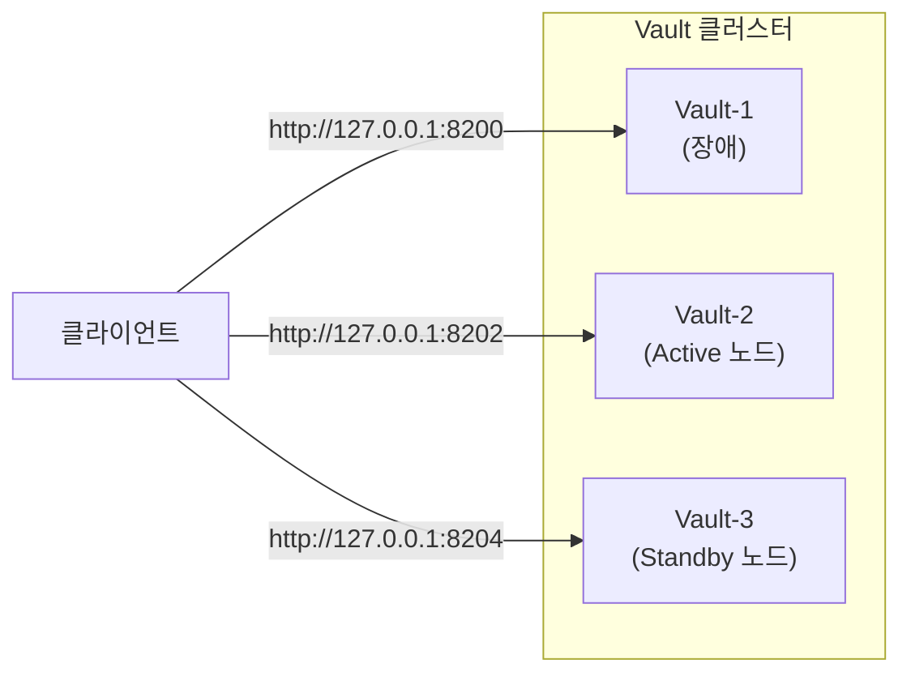
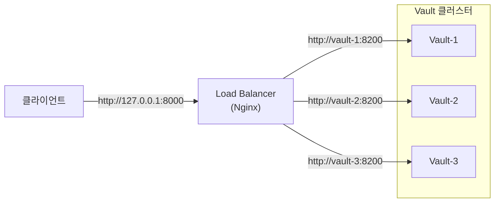

지금까지 구축한 Vault 클러스터의 구조는 다음과 같습니다.



이 구조에서는 클라이언트가 요청을 보낼 노드의 주소를 직접 지정해야 합니다. Standby 노드로 요청을 보내더라도 Request Forwarding 기능을 통해 Active 노드로 전달되므로 정상적인 응답을 받을 수 있습니다. 반면, 앞선 실습에서 확인했던 것처럼 장애가 발생한 노드의 주소로 요청을 보내면 연결 자체가 실패하게 됩니다.

즉, 클라이언트가 노드의 상태를 고려해 요청 대상을 직접 선택해야 하므로 실제 운영 환경에는 적합하지 않습니다. 일반적으로는 클라이언트와 Vault 클러스터 사이에 Load Balancer를 배치하는 구조를 사용합니다.

---

## 1. 구조 변경

Load Balancer를 배치하면 클라이언트는 더 이상 특정 노드가 아닌 Load Balancer의 주소로만 요청을 보내면 됩니다. 요청을 어떤 노드로 전달할지는 Load Balancer가 결정하므로 클라이언트는 어떤 노드가 Active인지, 각 노드의 주소가 무엇인지 신경 쓸 필요가 없습니다.

이번 포스팅에서는 Load Balancer를 추가하여 Vault 클러스터를 아래와 같은 구조로 변경해보겠습니다.



---

## 2. Load Balancer 구성

이번 실습에서 Load Balancer는 Nginx를 이용해 구성했습니다.

Nginx를 처음 사용하는 경우라면 이전에 포스팅했던 [[토이프로젝트] Nginx로 Reverse Proxy 구성하기: (5) 로드밸런싱 기능 검증](https://sanghoon-lee.github.io/2026/06/14/nginx-rp5/)을 먼저 참고하시면 도움이 됩니다.

---

### 2.1. Nginx 설정

`nginx.conf` 파일을 저장할 `/home/sanghoon/nginx` 디렉토리를 생성했습니다.

```bash
$ cd /home/sanghoon
$ mkdir nginx
$ cd nginx
```

이어서 Nginx가 Load Balancer 역할을 수행하도록 `nginx.conf`를 아래와 같이 작성했습니다.

```nohighlight
events {}

http {
    upstream vault_cluster {
        server vault-1:8200;
        server vault-2:8200;
        server vault-3:8200;
    }

    server {
        listen 8000;

        location / {
            proxy_pass http://vault_cluster;
            proxy_http_version 1.1;
        }
    }
}
```

* `upstream` : 요청을 전달할 Vault 노드들을 하나의 그룹(`vault_cluster`)으로 정의합니다.
* `listen 8000` : Nginx가 8000 포트에서 클라이언트의 요청을 수신합니다.
* `location /` : 모든 요청을 이 설정으로 처리합니다.
* `proxy_pass` : 수신한 요청을 `vault_cluster`에 등록된 Vault 노드 중 하나로 전달합니다.

여기서 주의할 점이 있습니다. Nginx도 Vault 컨테이너와 동일한 Docker 네트워크에 연결되므로 upstream에는 호스트 포트가 아니라 컨테이너 내부 포트를 지정해야 합니다. 

예를 들어 호스트에서는 `vault-2`에 `8202` 포트로 접근하지만 Docker 네트워크 내부에서는 `vault-2:8200`으로 접근합니다. `vault-3`도 동일하게 `vault-3:8200`을 사용합니다. 

이는 각 노드가 컨테이너 내부에서 모두 8200 포트를 사용하도록 구성되어 있으며, `vault-1.hcl`, `vault-2.hcl`, `vault-3.hcl`의 api_addr 설정도 이를 기준으로 되어 있기 때문입니다.

---

### 2.2. Nginx 컨테이너 실행

Nginx 컨테이너를 실행하려면 Docker 이미지를 먼저 준비해야 합니다.

```bash
$ docker pull nginx
```

컨테이너는 앞선 실습에서 Vault 클러스터 노드 간 통신을 위해 생성했던 Docker 네트워크(`vault-network`)에 연결했습니다. 또한 클라이언트가 8000 포트로 접근할 수 있도록 포트를 매핑하고, nginx.conf 파일을 컨테이너 내부의 설정 파일로 마운트했습니다.

```bash
$ docker run -d \
  --name nginx \
  --network vault-network \
  -p 8000:8000 \
  -v /home/sanghoon/nginx/nginx.conf:/etc/nginx/nginx.conf:ro \
  nginx
```

하지만 컨테이너가 정상적으로 실행되지 못하고 즉시 종료되었습니다. 원인을 찾기 위해 컨테이너의 로그를 확인했습니다.

```bash
$ docker logs nginx
```

로그에는 아래와 같은 오류 메시지가 출력되어 있었습니다.

```nohighlight
/docker-entrypoint.sh: /docker-entrypoint.d/ is not empty, will attempt to perform configuration
/docker-entrypoint.sh: Looking for shell scripts in /docker-entrypoint.d/
/docker-entrypoint.sh: Launching /docker-entrypoint.d/10-listen-on-ipv6-by-default.sh
10-listen-on-ipv6-by-default.sh: info: Getting the checksum of /etc/nginx/conf.d/default.conf
10-listen-on-ipv6-by-default.sh: info: Enabled listen on IPv6 in /etc/nginx/conf.d/default.conf
/docker-entrypoint.sh: Sourcing /docker-entrypoint.d/15-local-resolvers.envsh
/docker-entrypoint.sh: Launching /docker-entrypoint.d/20-envsubst-on-templates.sh
/docker-entrypoint.sh: Launching /docker-entrypoint.d/30-tune-worker-processes.sh
/docker-entrypoint.sh: Configuration complete; ready for start up
2026/07/07 12:58:16 [emerg] 1#1: host not found in upstream "vault-1:8200" in /etc/nginx/nginx.conf:5
nginx: [emerg] host not found in upstream "vault-1:8200" in /etc/nginx/nginx.conf:5
```

---

### 2.3. 트러블슈팅

Docker 네트워크에서는 실행 중인 컨테이너의 이름을 DNS 호스트명처럼 사용할 수 있습니다. 하지만 앞선 실습에서 장애 재현을 위해 `vault-1` 노드가 종료된 상태였기 때문에 Nginx가 upstream에 등록된 `vault-1`을 해석하지 못했습니다. 그 결과 Nginx가 기동에 실패한 것이었습니다.

문제 해결을 위해 `vault-1` 노드를 다시 실행하고, Unseal을 완료했습니다. 이 상태에서 Nginx 컨테이너를 다시 실행했습니다. 

```bash
$ docker ps
```

이번에는 Vault 클러스터를 구성하는 3개의 노드(`vault-1`, `vault-2`, `vault-3`)와 Nginx 컨테이너가 모두 정상적으로 실행 중인 것을 확인할 수 있었습니다.

```nohighlight
CONTAINER ID   IMAGE             COMMAND                  CREATED         STATUS          PORTS                                                 NAMES
af2497e50465   nginx             "/docker-entrypoint.…"   3 seconds ago   Up 3 seconds    80/tcp, 0.0.0.0:8000->8000/tcp, [::]:8000->8000/tcp   nginx
fb474c8aa7ba   hashicorp/vault   "docker-entrypoint.s…"   10 days ago     Up 4 days       0.0.0.0:8204->8200/tcp, [::]:8204->8200/tcp           vault-3
3b545cd35883   hashicorp/vault   "docker-entrypoint.s…"   10 days ago     Up 4 days       0.0.0.0:8202->8200/tcp, [::]:8202->8200/tcp           vault-2
246772fc7a1c   hashicorp/vault   "docker-entrypoint.s…"   10 days ago     Up 15 seconds   0.0.0.0:8200->8200/tcp, [::]:8200->8200/tcp           vault-1
```

---

## 3. 실습: LoadBalancer를 통한 시크릿 조회 검증

Vault 클러스터의 노드(포트번호: 8200, 8202, 8204)가 아닌 LoadBalancer(포트번호: 8000)에 시크릿 조회를 요청해봤습니다.

```bash
$ curl \
 --header "X-Vault-Token: $VAULT_TOKEN" \
 http://127.0.0.1:8000/v1/secret/data/vault-test
```

아래와 같이 정상적으로 시크릿이 조회되었습니다.

```json
{
    "request_id":"d9bdea74-44f1-0aad-f68d-d02e0149199b",
    "lease_id":"",
    "renewable":false,
    "lease_duration":0,"data":
    {
        "data":
        {
            "blog":"https://sanghoon-lee.github.io",
            "name":"sanghoon"
        },
        "metadata":
        {
            "created_time":"2026-06-29T11:52:28.836931496Z",
            "custom_metadata":null,
            "deletion_time":"",
            "destroyed":false,
            "version":1
        }
    },
    "wrap_info":null,
    "warnings":null,
    "auth":null,
    "mount_type":"kv"
}
```

장애 재현을 위해 `vault-2` 노드를 종료시켰습니다.

```bash
$ docker kill vault-2
```

`vault-3` 노드도 종료시켰습니다. 

```bash
$ docker kill vault-3
```

그리고 다시 LoadBalance에 시크릿 조회를 요청해봤습니다. 

```bash
$ curl \
 --header "X-Vault-Token: $VAULT_TOKEN" \
 http://127.0.0.1:8000/v1/secret/data/vault-test
```

하지만 이번에는 아무런 응답도 반환되지 않았습니다. 