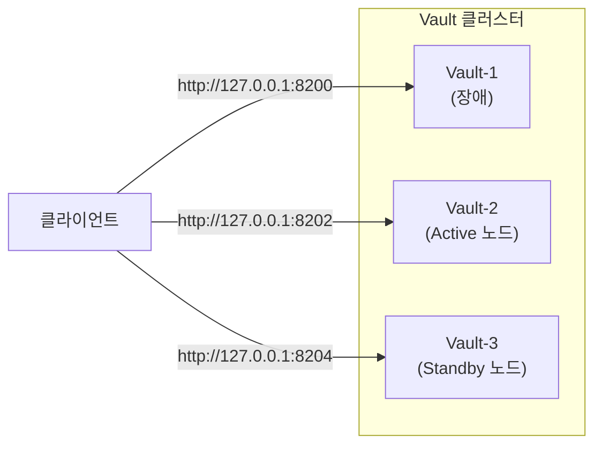
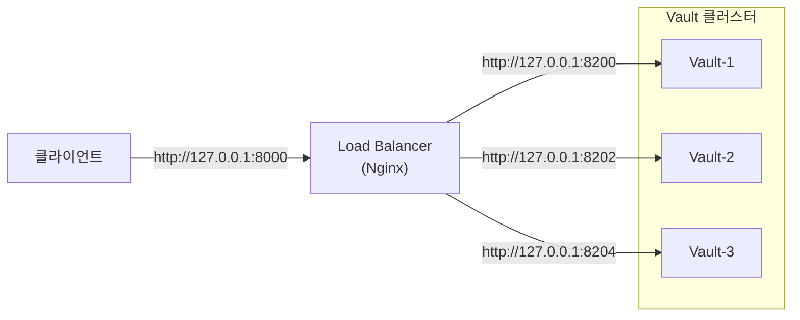

지금까지 구축한 Vault 클러스터의 구조는 다음과 같습니다. 현재 구조에서는 클라이언트가 요청을 보낼 노드의 주소를 직접 지정해야 합니다. 

물론 Request Forwarding 기능 덕분에 Standby 노드로 요청을 보내더라도 Active 노드로 전달되어 정상적인 응답을 받을 수 있습니다. 하지만 앞선 실습에서 확인했던 것처럼 장애가 발생한 노드의 주소로 요청을 보내면 연결 자체가 실패합니다.

따라서 클라이언트가 노드의 주소를 직접 지정해서 요청을 보내는 방식은 실제 운영 환경에서는 적합하지 않습니다. 

---

## 1. 구조 변경

실제 운영 환경에서는 클라이언트가 Load Balancer를 통해 클러스터와 연동하도록 구성하는 것이 일반적입니다. 이렇게 구성하면 클라이언트는 어떤 노드가 Active인지, 노드의 주소가 무엇인지 신경 쓸 필요 없이 Load Balancer의 주소로만 요청을 보내면 됩니다.

Load Balancer를 추가하면 클러스터의 구조는 다음과 같이 변경됩니다.

구조를 변경한 후에는 클라이언트가 Load Balancer의 주소인 http://127.0.0.1:8000으로만 요청을 보내면 됩니다. 이후의 요청을 전달할 대상 노드의 선택은 Load Balancer가 결정합니다.

---

## 2. Load Balancer 구성

이전에 포스팅했던 [[토이프로젝트] Nginx로 Reverse Proxy 구성하기: (5) 로드밸런싱 기능 검증](https://sanghoon-lee.github.io/2026/06/14/nginx-rp5/)에서 Nginx를 Load Balancer로 구성하는 방법을 다룬 적이 있습니다.

이번에는 그 내용을 바탕으로 Vault 클러스터 앞단에 배치할 Load Balancer를 구성해보겠습니다.

작성중........

