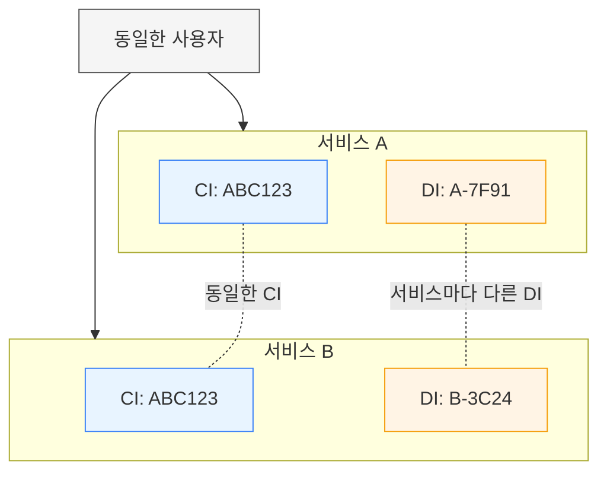
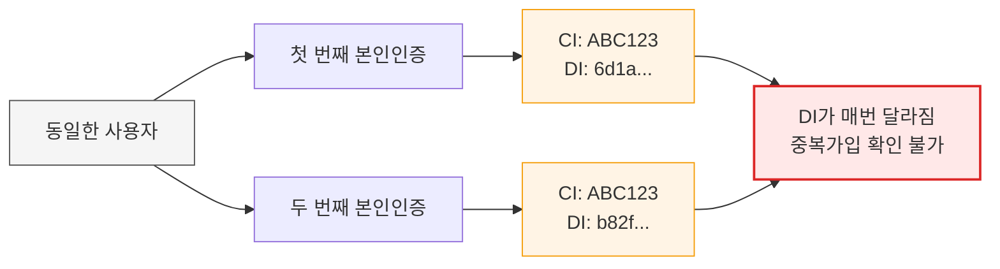
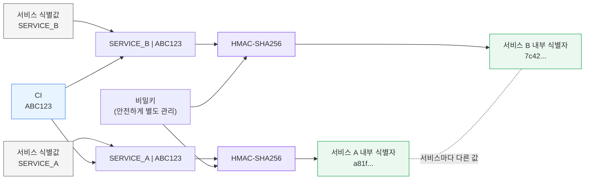
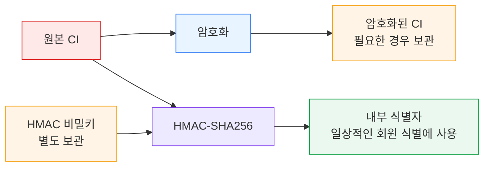

현재 회사로 이직하기 전까지 약 20년 동안 임베디드 소프트웨어와 소규모 기업용 시스템을 개발해왔습니다.

대부분 10명 이내의 제한된 사용자만 사용하는 시스템이었고, 사용자 계정도 직접 관리하다 보니 회원가입이나 본인인증 기능 자체가 없었습니다. 자연스럽게 개인정보를 다룰 기회도 거의 없었습니다.

그러다가 본인인증과 개인정보를 다루는 서비스를 운영하게 되면서 개인정보 식별자로 사용되는 `CI`와 `DI`라는 용어를 자주 접하게 되었습니다.

`CI`는 본인인증에 사용되는 식별자 정도로만 알고 있었고, `DI`는 서비스에서 자체적으로 정의한 값이라고만 생각했습니다. 제가 담당한 서비스에서는 `DI`라는 이름으로 `UUID`를 생성해 사용하고 있었기 때문입니다.

그러던 중 최근 주민등록번호와 `CI`의 분리 보관 시행일이 앞당겨진다는 소식을 계기로, 이에 대한 대응을 위해 정보보안팀과 관련 내용을 검토하면서 막연하게 알고 있었던 부분이 많다는 것을 깨달았습니다.

그래서 `CI`와 `DI`의 개념과 역할, 개인정보 식별자를 안전하게 관리하는 방법에 대해 공부하게 되었습니다.

---

## 1. CI(연계정보)와 DI(중복가입확인정보)의 차이

`CI`는 우리말로 연계정보(Connecting Information)라고 합니다. 여러 서비스나 시스템에서 동일인을 식별하기 위해 사용하는 정보입니다. 동일인이라면 서비스가 달라도 동일한 `CI` 값이 발급됩니다.

반면, `DI`는 중복가입확인정보(Duplication Information)로 하나의 서비스에서 동일인의 중복 가입 여부를 확인하기 위해 사용하는 정보입니다. 동일인이더라도 서비스마다 다른 값으로 발급됩니다. 

| 구분 | CI           | DI               |
| -- | ------------ | ---------------- |
| 의미 | 연계정보         | 중복가입확인정보         |
| 생성 | 본인확인기관       | 본인확인기관           |
| 목적 | 동일인 연계       | 중복가입 확인          |
| 활용 | 서비스 간 동일인 식별 | 동일 서비스 내 중복가입 확인 |



---

## 2. 단순 식별자를 DI로 사용하면 생기는 문제

제가 운영을 맡았던 어떤 서비스에서는 본인확인기관에서 발급받은 `DI`가 아니라 아래와 같이 `UUID`를 생성해 `DI` 컬럼에 저장하고 있었습니다.

```java
String di = UUID.randomUUID().toString();
```

본래 의미대로라면 중복가입확인정보로서 역할을 해야 했습니다. 하지만 이렇게 만들어 낸 `DI`는 사실상 서비스에서 자체적으로 정의한 식별자에 불과했습니다. 



동일인이더라도 매번 `DI`가 달라지기 때문에 본래 목적인 중복가입확인정보로 사용할 수 없었습니다. 이로 인해 많은 결함이 서비스에 존재했고, 데이터의 정합성을 맞추기도 어려웠습니다.

또한, 결국 동일 회원 여부를 확인해야 하는 모든 기능은 `CI`를 이용해야 했습니다.

`DI`의 역할이 충분히 고려되지 않은 채 설계된 것으로 보였습니다. 결과적으로 `DI`를 단순 식별자로 사용하면서 이러한 문제가 발생했습니다.

이 경험을 통해 식별자는 값의 형태보다 어떤 역할을 수행해야 하는지가 더 중요하다는 점을 알게 되었습니다. 

---

## 3. DI를 대신할 식별자 생성하기

`CI`는 여러 서비스에서 동일인을 식별하기 위한 정보이므로 모든 서비스에서 동일한 값이 보장되어야 합니다. 따라서 서비스가 자체적으로 생성할 수 없으며 본인확인기관에서 발급받아야 합니다.

하지만 `DI`는 하나의 서비스에서 동일인의 중복 가입 여부를 확인하기 위한 정보입니다. 직접 생성하는 것이 아니라 발급받아 사용하는 것이 원칙이지만, 서비스 내부에서 공식적인 `DI`를 대신할 식별자가 필요한 경우도 있습니다. 이때는 `UUID`처럼 매번 달라지는 값을 사용하는 것이 아니라, 동일한 사용자라면 항상 동일한 값이 생성되는 방식으로 식별자를 만드는 것이 중요합니다.

이러한 경우에는 서비스를 식별할 수 있는 값(예: 서비스ID, 애플리케이션 ID, 고객사 코드 등)과 `CI`를 이용해 동일한 입력에 대해서는 항상 동일한 결과가 생성되도록 식별자를 만드는 것이 좋습니다.

따라서 별도로 안전하게 관리하는 비밀키를 이용해 `서비스 식별값 + CI`를 `HMAC`으로 처리하면, 동일한 사용자에 대해서는 항상 동일한 식별자가 생성되면서도 서비스마다 서로 다른 식별자를 사용할 수 있습니다. 또한 여러 서비스 간에 내부 식별자를 비교해 동일인을 추적하는 것을 방지할 수 있으며, 애플리케이션에서 원본 `CI`를 직접 사용하는 범위를 줄일 수 있다는 장점도 있습니다.



---

## 4. CI 보관 방법

`CI`는 개인을 식별할 수 있는 중요한 정보입니다. 따라서 관련 법령과 내부 보안 정책에 따라 안전하게 보호되어야 하며, 일반적으로 암호화하여 저장하는 것이 권장됩니다.

만약 서비스에서 `CI`를 동일인 식별 용도로만 사용하고, 원본 `CI`를 다시 조회하거나 다른 시스템에 제공할 필요가 없다면 `HMAC`을 이용해서 생성한 내부 식별자만 저장하는 방법도 고려할 수 있습니다.



* 원본 `CI` 대신 내부 식별자 활용
* 회원 식별 및 중복 확인 가능
* 내부 식별자만으로는 원본 `CI`를 직접 복원 불가

이러한 방식은 원본 `CI`를 직접 사용할 필요가 없는 서비스라면 개인정보 보호 측면에서 효과적인 대안이 될 수 있습니다. 물론 원본 `CI`를 외부 기관에 전달하거나 다시 조회해야 하는 업무가 있다면, 암호화된 `CI`를 함께 보관하는 방식이 더 적합할 수 있습니다.

---

## 5. 마무리

개인정보를 다루는 시스템을 설계할 때는 `CI`와 `DI`가 각각 어떤 역할을 수행하기 위해 존재하는지 이해하는 것이 중요합니다.

또한 원본 `CI`를 직접 사용할 필요가 없다면 내부 식별자를 활용하는 것이 개인정보 보호 측면에서 효과적인 선택이 될 수 있습니다.

