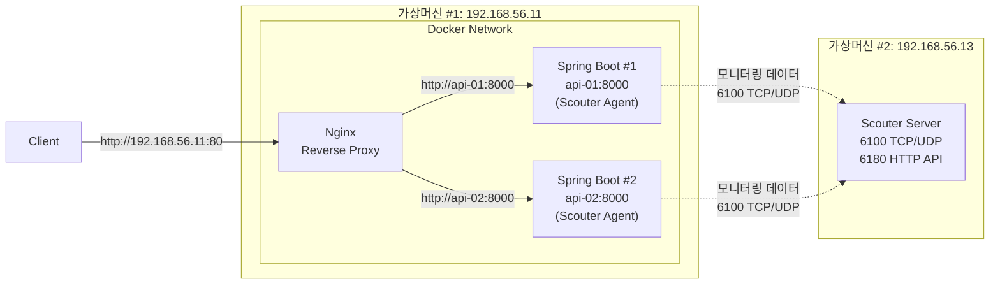

2024년 11월, 잦은 장애가 발생하던 서비스를 담당하는 개발팀의 팀장으로 발령받았습니다. 당시에는 장애 대응 체계도 아직 충분히 자리 잡지 못한 상태였습니다.

초반에는 장애 대응으로 고생을 많이 했습니다. 임원에게 주간업무 보고를 하다가 장애 대응부터 하고 오라며 회의실에서 쫓겨난 적도 있었습니다.

저는 현재 회사에 입사하기 전까지는 임베디드 소프트웨어와 소규모 기업용 시스템만 개발했습니다. 그래서 APM(Application Performance Monitoring)을 실무에서 사용할 기회는 거의 없었습니다.

담당하던 서비스는 APM으로 오픈소스인 `Scouter`라는 프로그램을 사용하고 있었습니다. 처음에는 사용법도 잘 몰랐습니다. 하지만 장애에 대응하면서 하나씩 익혀갔고, 서비스 상태를 실시간으로 확인하고 원인을 분석하는 데 큰 도움을 받았습니다.

최근 인프라팀장님께서 장애 발생 시 문자 메시지나 슬랙 알림을 통해 담당 개발자에게 연락하는 방식을 고민하고 있는 것을 알게 되었습니다. 하지만 새벽 시간대의 긴급 장애까지 대응하기에는 한계가 있다고 생각했습니다. 새벽 시간대에 잠든 개발자를 깨우기에는 문자 메시지도 슬랙 알림도 그리 믿음직스럽지 않아 보였기 때문입니다. 

24시간 3교대로 운영하는 IDC의 운영 비용을 줄이기 위한 고민이라는 점은 충분히 이해했습니다. 다만 새벽 시간대의 긴급 장애라면 담당 개발자에게 전화로 알리는 방식이 가장 현실적이라고 생각했습니다.

<mark>"장애를 자동으로 감지하고, 담당 개발자에게 전화까지 연결(On-call)하는 것도 가능하지 않을까?"</mark>라는 질문에서 이번 포스팅 시리즈를 시작하게 되었습니다.

---

## 1. 장애 분석을 도와주는 APM, Scouter

사용자가 "서비스가 느리다"고 이야기하면 가장 먼저 원인을 찾아야 합니다. 하지만 원인은 하나가 아닐 수 있습니다.

- CPU 사용률이 급격히 증가했을 수도 있고,
- 메모리가 부족해 GC(Garbage Collection)가 반복되고 있을 수도 있으며,
- 특정 API에 요청이 몰렸거나,
- 데이터베이스 응답이 느려졌을 수도 있습니다.

로그만으로는 이런 문제의 원인을 빠르게 파악하기 어렵습니다. 로그는 이미 발생한 일을 기록하는 데는 적합하지만, **애플리케이션이 현재 어떤 상태인지**를 실시간으로 보여주지는 못하기 때문입니다.

이런 문제를 해결하기 위해 사용하는 도구가 **APM(Application Performance Monitoring)** 입니다.

APM은 애플리케이션의 CPU, 메모리, 응답시간, Thread, SQL 수행 시간, 요청 수 등을 지속적으로 수집하고, 이를 대시보드로 시각화하여 제공합니다.

이번 포스팅 시리즈에서 사용할 `Scouter`는 Java 애플리케이션을 위한 오픈소스 APM입니다. CPU, Heap 메모리, Active Service, XLog 등 다양한 운영 정보를 실시간으로 확인할 수 있으며, Alert 기능도 제공합니다.

새로운 APM을 도입하기보다는 운영 경험이 있는 `Scouter`를 기반으로 장애 감지, Alert, On-call까지 하나의 흐름으로 자동화할 수 있는지 직접 검증해보고 싶었습니다.

---

## 2. Scouter Server 준비하기

우선 Docker를 이용해 `Scouter Server`를 실행하고, Scouter Agent를 연동할 모니터링 대상 애플리케이션을 준비했습니다. 

---

### 2.1. 이미지 다운로드

최신 버전을 사용하기 위해 일반적으로 사용하는 `latest` 태그로 이미지를 가져오려고 했습니다.

```bash
$ docker pull scouterapm/scouter-server:latest
```

하지만 `latest` 태그가 제공되지 않아 이미지를 내려받을 수 없었습니다. 

```text
Error response from daemon: failed to resolve reference "docker.io/scouterapm/scouter-server:latest": docker.io/scouterapm/scouter-server:latest: not found
```

확인해보니 Docker Hub에 공개된 공식 이미지는 최신 릴리스와 버전 차이가 있었고, `latest` 태그도 제공되지 않았습니다. 따라서 포스팅 작성 시점 기준으로 Docker Hub에서 사용할 수 있는 최신 태그인 `2.17.1`을 사용했습니다.

```bash
$ docker pull scouterapm/scouter-server:2.17.1
```

---

### 2.2. Docker Compose 구성

`docker-compose.yml` 파일은 아래와 같이 작성했습니다.

```yaml
services:
  scouter-server:
    image: scouterapm/scouter-server:2.17.1
    container_name: scouter-server
    restart: unless-stopped
    volumes:
      - /home/sanghoon/scouter-server/database:/home/scouter-server/database
      - /home/sanghoon/scouter-server/logs:/home/scouter-server/logs
    ports:
      - "6100:6100/tcp"
      - "6100:6100/udp"
      - "6180:6180"
```

구성을 살펴보면 다음과 같습니다.

- `/home/sanghoon/scouter-server/database`: XLog, 프로파일, 카운터 등 Scouter가 수집한 모니터링 데이터를 보관하는 로컬 디렉터리입니다.
- `/home/sanghoon/scouter-server/logs`: `Scouter Server`의 실행 로그를 보관하는 로컬 디렉터리입니다.
- `6100/tcp`, `6100/udp`: `Scouter Agent`, `Scouter Client`가 `Scouter Server`와 통신하는 포트입니다.
- `6180`: `Scouter Server`의 HTTP API를 제공하는 포트입니다.
- `restart: unless-stopped`: 서버 재부팅 시 자동으로 컨테이너가 실행되도록 설정했습니다.

`Scouter Server`가 수집한 데이터는 기본적으로 컨테이너 내부에 저장됩니다. 별도의 볼륨을 연결하지 않으면 컨테이너를 삭제하고 다시 생성할 때 기존 모니터링 데이터도 함께 사라질 수 있습니다.

---

### 2.3. Scouter Server 실행

이어서 `Scouter Server` 컨테이너를 실행했습니다.

```bash
$ docker compose up -d
```

컨테이너 실행 상태는 `docker compose ps` 또는 `docker compose logs -f scouter-server` 명령으로도 확인할 수 있습니다.

이번에는 컨테이너의 실행 여부뿐만 아니라 `Scouter Server`의 HTTP API가 정상적으로 동작하는지 확인하기 위해 서버 상태 조회 API를 호출해봤습니다. 참고로 현재 `Scouter Server`가 실행되는 가상머신의 IP는 `192.168.56.13`입니다.

```bash
$ curl http://192.168.56.13:6180/scouter/v1/info/server
```

```json
{
    "status":"200",
    "requestId":"#cg70",
    "resultCode":"0",
    "message":"success",
    "result":[
        {
            "id":"-1082951330",
            "name":"SCCOUTER-COLLECTOR",
            "connected":true,
            "serverTime":"1785048887135",
            "version":"2.17.1 2022-03-27 04:35 GMT"
        }
    ]
}
```

응답의 `status`가 200, `resultCode`가 0, `connected`가 true로 표시되는 것을 통해 `Scouter Server`가 정상적으로 실행되고 있음을 확인할 수 있었습니다.

6180 포트는 `Scouter`의 모니터링 화면이 아니라 HTTP API를 제공하는 포트입니다. 실제 모니터링 화면은 별도의 `Scouter Client`를 사용해 확인해야 합니다.

---

### 2.4. 모니터링 대상 애플리케이션 준비

`Scouter Agent`를 연동하려면 먼저 모니터링 대상 애플리케이션이 필요합니다.

새로운 애플리케이션을 별도로 만들지 않고, **Nginx로 Reverse Proxy 구성하기** 시리즈에서 사용했던 애플리케이션과 Nginx로 구성한 로드밸런싱 환경을 그대로 활용했습니다. 

클라이언트의 요청은 `192.168.56.11:80`에서 실행되는 Nginx를 통해 두 개의 Spring Boot 애플리케이션으로 전달됩니다. 이후 각 애플리케이션에 `Scouter Agent`를 연결하여 모니터링 데이터를 `192.168.56.13`에서 구동되고 있는 `Scouter Server`로 전송하도록 구성할 예정입니다.

최종적으로 구성할 실습 환경은 다음과 같습니다.



여기서 `api-01:8000`과 `api-02:8000`은 외부에 공개된 주소가 아니라, Nginx가 Docker 네트워크 내부에서 각 Spring Boot 컨테이너를 호출할 때 사용하는 컨테이너 이름과 포트입니다.

**참고: Nginx로 Reverse Proxy 구성하기 시리즈**
> [(1) 개념과 동작 원리](https://sanghoon-lee.github.io/2026/06/03/nginx-rp/)<br>
> [(2) 애플리케이션 서버 구현](https://sanghoon-lee.github.io/2026/06/04/nginx-rp2/)<br>
> [(3) Reverse Proxy 서버 구축 ](https://sanghoon-lee.github.io/2026/06/07/nginx-rp3/)<br>
> [(4) 애플리케이션 서버 보호 기능 검증](https://sanghoon-lee.github.io/2026/06/08/nginx-rp4/)<br>
> [(5) 로드밸런싱 기능 검증](https://sanghoon-lee.github.io/2026/06/14/nginx-rp5/)<br>
> [(6) SSL 종료 기능 검증](https://sanghoon-lee.github.io/2026/06/14/nginx-rp6/)<br>
> [(7) 정적 콘텐츠 처리 기능 검증](https://sanghoon-lee.github.io/2026/06/17/nginx-rp7/)<br><br>
> 실습환경 구성과 관련해서는 [(5) 로드밸런싱 기능 검증](https://sanghoon-lee.github.io/2026/06/14/nginx-rp5/)을 참고하면 됩니다.

---

## 3. 다음 포스팅

`Scouter Server`를 설치하고, 모니터링 대상 Spring Boot 애플리케이션이 준비되었습니다.

다음 포스팅에서는 Spring Boot 애플리케이션에 `Scouter Agent`를 연동하고, `Scouter Client`를 이용해 CPU, Heap 메모리, Active Service 등 다양한 운영 정보를 실시간으로 확인해보겠습니다.

