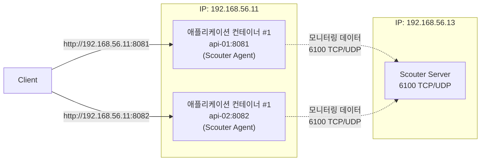

최근 인프라팀에서 장애 발생 시 문자 메시지나 슬랙 알림을 통해 담당 개발자에게 알리는 방안을 고민하고 있다는 것을 알게 되었습니다. 하지만 새벽 시간대의 긴급 장애까지 대응하기에는 한계가 있다고 생각했습니다. 새벽 시간대에 잠든 개발자를 깨우기에는 문자 메시지도 슬랙 알림도 그리 믿음직스럽지 않아 보였기 때문입니다. 

24시간 3교대로 운영하는 IDC의 운영 비용을 줄이기 위한 고민이라는 점은 충분히 이해했습니다. 다만 새벽 시간대의 긴급 장애라면 담당 개발자에게 전화로 알리는 방식이 가장 현실적이라고 생각했습니다.

그러면서 <mark>"장애를 자동으로 감지하고, 담당 개발자에게 전화까지 연결(On-call)하는 것도 가능하지 않을까?"</mark>라는 질문을 스스로에게 던지게 되었습니다. 

---

## 1. 장애 분석을 도와주는 APM, Scouter

사용자가 "서비스가 느리다"고 이야기하면 가장 먼저 원인을 찾아야 합니다. 하지만 원인은 하나가 아닐 수 있습니다.

- CPU 사용률이 급격히 증가했을 수도 있고,
- 메모리가 부족해 GC(Garbage Collection)가 반복되고 있을 수도 있으며,
- 특정 API에 요청이 몰렸거나,
- 데이터베이스 응답이 느려졌을 수도 있습니다.

로그만으로는 이런 문제의 원인을 빠르게 파악하기 어렵습니다. 로그는 이미 발생한 일을 기록하는 데는 적합하지만, **애플리케이션이 현재 어떤 상태인지**를 실시간으로 보여주지는 못하기 때문입니다.

이런 문제를 해결하기 위해 사용하는 도구가 **APM(Application Performance Monitoring)** 입니다.

APM은 CPU와 메모리 사용량, 응답 시간, Thread, SQL 수행 시간, 요청 처리 현황 등 애플리케이션 운영에 필요한 다양한 정보를 지속적으로 수집하고 이를 시각화하여 제공합니다.

`Scouter`는 Java 애플리케이션을 위한 오픈소스 APM입니다. CPU, Heap 메모리, Active Service, XLog 등 다양한 운영 정보를 실시간으로 확인할 수 있으며, Alert 기능도 제공합니다.

---

## 2. Scouter를 선택한 이유

2024년 11월, 잦은 장애가 발생하던 서비스를 담당하고 있던 어느 개발팀의 팀장으로 발령받았습니다. 장애 대응 체계도 아직 충분히 자리 잡지 못한 상태였기 때문에, 초반에는 장애 대응으로 고생을 많이 했습니다. 임원에게 주간업무 보고를 하다가 장애 대응부터 하고 오라며 회의실에서 쫓겨난 적도 있었습니다.

그때 팀에서는 오픈소스 기반 APM(Application Performance Monitoring)인 `Scouter`를 사용하고 있었습니다. 솔직히 처음에는 사용법도 잘 몰랐습니다. 하지만 장애에 대응하다보니 금방 익숙해질 수 있었습니다. 

이번 포스팅 시리즈에서는 새로운 APM을 도입하기보다는 운영 경험이 있는 `Scouter`를 기반으로 장애 감지, Alert, On-call까지 하나의 흐름으로 자동화할 수 있는지 직접 검증해보고 싶었습니다.

---

## 3. Scouter Server 이미지 준비

우선 `Scouter Server`를 구성하기 위해 가상머신(VM)을 다음과 같이 생성했습니다.

* IP : 192.168.56.13
* OS : Ubuntu Linux

그리고 `Scouter Server`의 실행 환경은 Docker로 구성했습니다.

---

### 3.1. Docker Hub 이미지 확인

최신 버전의 `Scouter Server`를 사용하기 위해 일반적으로 사용하는 `latest` 태그를 사용했지만, 이미지를 가져올 수 없었습니다.  

```bash
$ docker pull scouterapm/scouter-server:latest
```

```text
Error response from daemon: failed to resolve reference "docker.io/scouterapm/scouter-server:latest": docker.io/scouterapm/scouter-server:latest: not found
```

Docker Hub에 공개된 `Scouter Server`의 공식 이미지는 최신 릴리스와 버전 차이가 크게 있었고, `latest` 태그도 제공되지 않았기 때문입니다. 따라서 처음에는 포스팅 작성 시점에 Docker Hub에서 제공하는 가장 최신 태그인 2.17.1을 사용했습니다.

```bash
$ docker pull scouterapm/scouter-server:2.17.1
```

하지만 이후 Spring Boot 3 애플리케이션을 연동하는 과정에서 문제가 발생했습니다. `Scouter Agent` 2.17.1에서는 Jakarta Servlet 기반의 HTTP 요청을 정상적으로 추적하지 못해 `Active Service`와 `XLog`가 표시되지 않았습니다.

이후 이 문제를 해결하기 위해 `Scouter Agent`를 포함한 전체 환경을 2.20.0 버전으로 변경했습니다. 

**참고**

> [[트러블슈팅] Spring Boot 3 + Scouter 2.17.1에서 XLog가 표시되지 않는 문제 해결](https://sanghoon-lee.github.io/2026/08/13/scouter-trouble/)

---

### 3.2. Scouter 2.20.0 배포 파일 다운로드
{: #scouter-download }

Docker Hub에서는 `Scouter Server` 2.20.0 버전의 공식 이미지를 제공하지 않았기 때문에, 2.20.0 배포 파일을 이용해 Docker 이미지를 직접 생성하기로 했습니다. 

Scouter 공식 GitHub의 Releases 페이지에서 [v2.20.0](https://github.com/scouter-project/scouter/releases/tag/v2.20.0)를 선택하면 해당 버전의 Releases 페이지로 이동합니다. 

페이지 하단에 위치한 Assets에서 Docker 이미지 생성에 필요한 `scouter-all-2.20.0.tar.gz` 파일을 다운로드 받았습니다.

<div class="image-row">
  <figure>
    
    <figcaption>Scouter 2.20.0 Releases 페이지 상단</figcaption>
  </figure>

  <figure>
    
    <figcaption>Scouter 2.20.0 Releases 페이지 하단</figcaption>
  </figure>
</div>

---

### 3.3. Scouter 2.20.0 Docker 이미지 생성

다운로드한 `scouter-all-2.20.0.tar.gz` 파일의 압축을 해제하면 `scouter` 디렉터리 아래에 `agent.batch`, `agent.host`, `agent.java`, `server`, `webapp` 디렉터리가 생성됩니다.


가상머신에 `scouter-docker` 디렉터리를 생성하고, 그 하위에 `Scouter Server` 실행에 필요한 `server` 디렉터리를 복사했습니다. 


```nohighlight
scouter-docker/
├── Dockerfile
└── server/
    ├── scouter-server-boot.jar
    ├── lib/
    ├── conf/
    └── ...
```

이어서 `scouter-server-boot.jar`를 이용해 `Scouter Server`가 실행되도록 Dockerfile을 작성했습니다. 

Dockerfile은 `server` 디렉터리를 이미지 내부의 `/scouter/server`로 복사하고, `Scouter Server`가 사용하는 6100 포트를 TCP와 UDP 모두 열도록 구성했습니다. 

모니터링 대상 Spring Boot 애플리케이션은 Java 21을 사용하지만, `Scouter Server`는 별도의 JVM에서 실행되므로 동일한 Java 버전을 사용할 필요는 없습니다. Java 17 기반 JRE를 사용하면 Scouter Server 실행 과정에서 JAXB 관련 호환성 문제가 발생해서 Java 11 기반 JRE로 변경했습니다. 

```Dockerfile
FROM eclipse-temurin:11-jre

WORKDIR /scouter

COPY server/ /scouter/server/

WORKDIR /scouter/server

EXPOSE 6100/tcp
EXPOSE 6100/udp

CMD ["java", "-Xmx1024m", "-classpath", "./scouter-server-boot.jar", "scouter.boot.Boot", "./lib"]
```

Dockerfile 작성을 완료한 뒤 이미지를 빌드했습니다.

```bash
$ docker build -t scouter-server:2.20.0 .
```

정상적으로 이미지가 빌드되었고, 로컬에 존재하는 이미지 목록에 포함되어 있는 것도 확인했습니다.

```bash
$ docker image ls
```

```text
IMAGE                   ID             DISK USAGE   CONTENT SIZE   EXTRA
scouter-server:2.20.0   89a4f7784fc3        525MB          150MB
```

---

## 4. Scouter Server 실행

Docker Compose를 이용해 컨테이너를 구성하고, 위에서 빌드했던 `scouter-server:2.20.0` 이미지를 실행했습니다.

---

### 4.1. Docker Compose 구성

`docker-compose.yml` 파일은 아래와 같이 작성했습니다.

```yaml
services:
  scouter-server:
    image: scouter-server:2.20.0
    container_name: scouter-server
    restart: unless-stopped
    volumes:
      - /home/sanghoon/scouter-server/database:/scouter/server/database
      - /home/sanghoon/scouter-server/logs:/scouter/server/logs
    ports:
      - "6100:6100/tcp"
      - "6100:6100/udp"
```

구성을 살펴보면 다음과 같습니다.

- `/home/sanghoon/scouter-server/database`: XLog, 프로파일, 카운터 등 Scouter가 수집한 모니터링 데이터를 보관하는 로컬 디렉터리입니다.
- `/home/sanghoon/scouter-server/logs`: `Scouter Server`의 실행 로그를 보관하는 로컬 디렉터리입니다.
- `6100/tcp`, `6100/udp`: `Scouter Agent`, `Scouter Client`가 `Scouter Server`와 통신하는 포트입니다.
- `restart: unless-stopped`: 서버 재부팅 시 자동으로 컨테이너가 실행되도록 설정했습니다.

`Scouter Server`가 수집한 데이터는 기본적으로 컨테이너 내부에 저장됩니다. 별도의 볼륨을 연결하지 않으면 컨테이너를 삭제하고 다시 생성할 때 기존 모니터링 데이터도 함께 사라질 수 있습니다. 

모니터링 데이터를 보존하기 위해 호스트의 `/home/sanghoon/scouter-server/database`, `/home/sanghoon/scouter-server/logs` 디렉터리를 컨테이너 내부의 데이터 및 로그 저장 경로와 연결했습니다.

---

### 4.2. 컨테이너 실행

이어서 `docker-compose.yml` 파일로 컨테이너를 구성하고 실행했습니다.

```bash
$ docker compose up -d
```

`docker compose ps` 명령으로 컨테이너가 정상적으로 실행되고 있는 것을 확인할 수 있었습니다.

```bash
$ docker compose ps
```

```text
NAME             IMAGE                   COMMAND                  SERVICE          CREATED          STATUS          PORTS
scouter-server   scouter-server:2.20.0   "/__cacert_entrypoin…"   scouter-server   18 seconds ago   Up 17 seconds   0.0.0.0:6100->6100/tcp, 0.0.0.0:6100->6100/udp, [::]:6100->6100/tcp, [::]:6100->6100/udp
```

추가로 컨테이너 로그를 통해 실행 중인 `Scouter Server`의 버전도 확인했습니다.

```bash
$ docker compose logs scouter-server
```

```text
scouter-server  |   ____                  _
scouter-server  |  / ___|  ___ ___  _   _| |_ ___ _ __
scouter-server  |  \___ \ / __/   \| | | | __/ _ \ '__|
scouter-server  |   ___) | (_| (+) | |_| | ||  __/ |
scouter-server  |  |____/ \___\___/ \__,_|\__\___|_|
scouter-server  |  Open Source S/W Performance Monitoring
scouter-server  |  Scouter version 2.20.0
```

이를 통해 직접 생성한 Docker 이미지에서 `Scouter Server` 2.20.0이 정상적으로 실행되고 있음을 확인할 수 있었습니다.

---

### 4.3. 모니터링 환경 구성
{: #environment }

`Scouter Agent`를 연동하려면 먼저 모니터링 대상 애플리케이션이 필요합니다.

새로운 애플리케이션을 별도로 만들지 않고, **Nginx로 Reverse Proxy 구성하기** 시리즈에서 사용했던 애플리케이션(`simple-api`)을 그대로 활용할 계획입니다.

최종적으로 구성할 실습 환경은 다음과 같습니다.



여기서 `api-01:8000`과 `api-02:8000`은 외부에 공개된 주소가 아니라, Nginx가 Docker 네트워크 내부에서 각 Spring Boot 컨테이너를 호출할 때 사용하는 컨테이너 이름과 포트입니다.

**Nginx로 Reverse Proxy 구성하기 시리즈**

> [(1) 개념과 동작 원리](https://sanghoon-lee.github.io/2026/06/03/nginx-rp/)<br>
> [(2) 애플리케이션 서버 구현](https://sanghoon-lee.github.io/2026/06/04/nginx-rp2/)<br>
> [(3) Reverse Proxy 서버 구축 ](https://sanghoon-lee.github.io/2026/06/07/nginx-rp3/)<br>
> [(4) 애플리케이션 서버 보호 기능 검증](https://sanghoon-lee.github.io/2026/06/08/nginx-rp4/)<br>
> [(5) 로드밸런싱 기능 검증](https://sanghoon-lee.github.io/2026/06/14/nginx-rp5/)<br>
> [(6) SSL 종료 기능 검증](https://sanghoon-lee.github.io/2026/06/14/nginx-rp6/)<br>
> [(7) 정적 콘텐츠 처리 기능 검증](https://sanghoon-lee.github.io/2026/06/17/nginx-rp7/)<br><br>
> 실습환경 구성과 관련해서는 [(5) 로드밸런싱 기능 검증](https://sanghoon-lee.github.io/2026/06/14/nginx-rp5/)을 참고하면 됩니다.

**simple-api 애플리케이션 GitHub 저장소**

* [https://github.com/sanghoon-lee/simple-api](https://github.com/sanghoon-lee/simple-api)


---

## 5. 다음 포스팅

이번 포스팅에서 `Scouter Server` 2.20.0 버전의 Docker 이미지를 직접 생성하고, 컨테이너로 실행했습니다. 또한 모니터링 대상으로 사용할 Spring Boot 애플리케이션 환경을 준비했습니다.

다음 포스팅에서는 Spring Boot 애플리케이션에 `Scouter Agent`를 연동하고, 애플리케이션의 운영 정보가 `Scouter Server`로 정상적으로 전송되는지 확인해보겠습니다.

