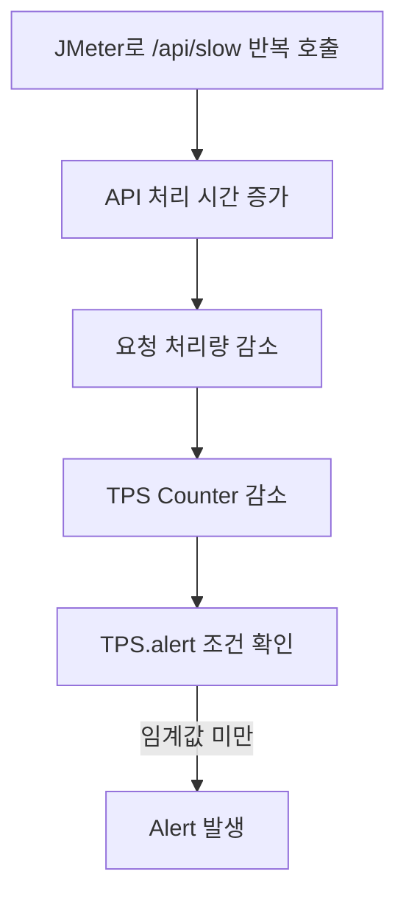
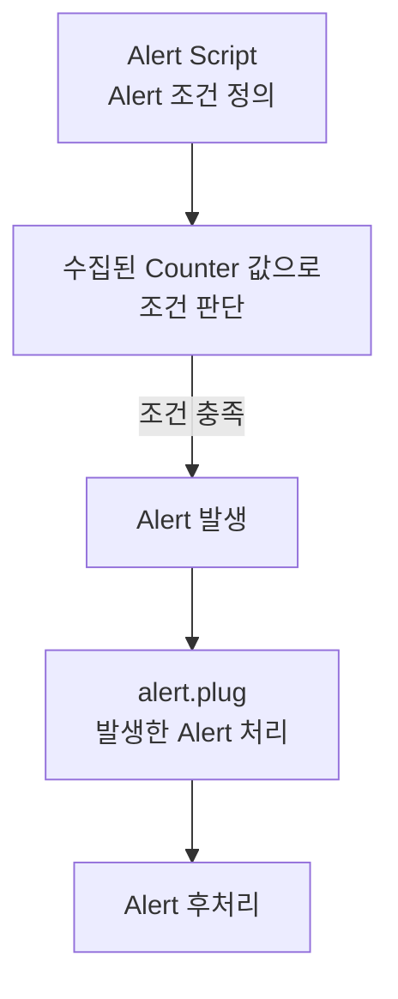

`Scouter Client`를 통해 서비스 상태를 실시간으로 확인하고 원인을 분석하는 데 큰 도움을 받을 수 있었습니다. 하지만 담당자가 운영 정보를 직접 확인해야 이상 상황을 발견할 수 있다는 한계가 있습니다.

새벽이나 휴일처럼 담당자가 운영 정보를 직접 확인하기 어려운 시간에도 장애는 얼마든지 발생할 수 있습니다. 따라서 운영 정보를 모니터링하는 것뿐만 아니라, 이상 상황을 자동으로 감지하고 담당자에게 알려주는 체계가 필요합니다.

---

## 1. 이상 상태 감지(Alert)와 알림(Notification)

이상 상황을 자동으로 감지하고 담당자에게 전달하는 과정을 이해하려면 먼저 `Alert`와 `Notification`의 차이를 구분할 필요가 있습니다.

`Alert`는 시스템에서 미리 정의한 조건에 해당하는 이상 상황이 발생했음을 감지하는 것이고, `Notification`은 발생한 Alert를 문자 메시지, 메신저, 전화 등의 수단으로 담당자에게 전달하는 것입니다.

예를 들어 애플리케이션의 CPU 사용률이 일정 수준 이상으로 올라가는 상황을 생각해볼 수 있습니다. CPU 사용률이 설정한 기준을 초과한 것을 감지하는 것이 `Alert`이고, 이를 담당자에게 문자 메시지나 전화로 알려주는 것이 `Notification`입니다.

---

## 2. 응답 지연 API 구현

이제부터 애플리케이션의 처리 속도를 의도적으로 늦추고, 이로 인해 요청 처리량이 감소하고 TPS가 낮아지는 상황을 만들어 Alert가 발생하는지 확인해보겠습니다.

이를 위해 모니터링 대상 애플리케이션인 `simple-api` 프로젝트에 응답을 일정 시간 지연시키는 `/slow` API를 추가했습니다. 

```java
@RequestMapping("/api")
public class ApiController {
    
    ...
    
    @GetMapping("/slow")
    public Map<String, String> slow() throws InterruptedException {
        Thread.sleep(10000);
        return Map.of(
                "serverName", serverName,
                "time", LocalDateTime.now().toString()
        );
    }
    
    ...

}
```

`slow` API가 호출되면 애플리케이션은 10초 지연 이후에 응답을 반환하게 됩니다. 현재 Object Tree에 등록되어 있는 `api-01`과 `api-02` 컨테이너에 해당 API는 다음과 같이 호출할 수 있습니다.

* `api-01` : `GET http://192.168.56.11:8081/api/slow` 
* `api-02` : `GET http://192.168.56.11:8082/api/slow`

`api-01`과 `api-02`에 `/api/slow` API를 호출해 의도적으로 응답을 지연시키고, 해당 요청이 `Scouter Client`의 XLog에 나타나는 것을 확인했습니다.

<div class="image-row">
  <figure>
    
    <figcaption>XLog에 표시된 API 응답 지연</figcaption>
  </figure>

  <figure>
    
    <figcaption>XLog List에 표시된 API 응답 지연</figcaption>
  </figure>
</div>

**참고**

> [simple-api의 소스코드 저장소](https://github.com/sanghoon-lee/simple-api)

---

## 3. 테스트 시나리오

이번 테스트에서는 `JMeter`를 이용해 `/api/slow`를 반복 호출하여 애플리케이션의 응답을 의도적으로 지연시키고, 요청 처리량이 감소하는 상황을 만들어보겠습니다. 이때 TPS가 설정한 임계값보다 낮아지면 `Alert Script`가 이를 감지하여 Alert를 발생시키는지 확인합니다.



`JMeter`에 구성한 테스트 시나리오는 다음과 같습니다.

| 구분 | 설정 | 값 |
| --- | --- | --- |
| Thread Group | Number of Threads | 50 |
| Thread Group | Ramp-up Period | 10초 |
| Thread Group | Loop Count | 500 |
| HTTP Request | Protocol | HTTP |
| HTTP Request | Server IP | 192.168.56.11 |
| HTTP Request | Port | 8081 |
| HTTP Request | Method | GET |
| HTTP Request | Path | /api/slow |

50개의 Thread가 각각 500번씩 `/api/slow`를 호출하므로 총 25,000회의 요청이 발생하도록 구성했습니다.

---

## 4. Scouter Alert 설정

`Scouter Agent`는 애플리케이션의 운영 정보를 수집하여 `Scouter Server`로 전달하고, `Scouter Server`는 전달받은 운영 정보를 저장합니다. Alert 역시 `Scouter Server`에 수집된 운영 정보를 기준으로 설정된 조건에 해당하는지를 판단하여 발생합니다.

`Scouter`는 일부 이상 상황에 대해 기본 Alert 기능을 제공하지만, `Customizable Alert` 기능을 사용하면 사용자가 직접 정의한 조건에 따라 Alert가 발생하도록 구성할 수도 있습니다.

---

### 4.1. Alert Script 저장 경로 구성

`Customizable Alert` 기능을 사용하려면 Alert 조건을 Script 형태로 작성해야 합니다. `Alert Script`는 `Scouter Server`가 실행되는 경로의 `plugin` 디렉터리에 배치하면 됩니다.

`Scouter Server`를 `Docker`로 실행하고 있는 경우, `Alert Script`를 컨테이너 내부에서 직접 관리하면 컨테이너를 다시 생성할 때 파일이 사라질 수 있습니다. 

그래서 호스트에 `plugin` 디렉터리를 생성하고, 컨테이너 내부의 `plugin` 디렉터리와 Volume으로 연결했습니다.

```bash
$ mkdir -p /home/sanghoon/scouter-server/plugin
```

`docker-compose.yml`에 호스트에 `plugin` 디렉터리를 Volume으로 연결하기 위한 설정을 추가했습니다. 

```yaml
services:
  scouter-server:
    image: scouter-server:2.20.0
    container_name: scouter-server
    restart: unless-stopped
    volumes:
      - /home/sanghoon/scouter-server/database:/scouter/server/database
      - /home/sanghoon/scouter-server/logs:/scouter/server/logs
      - /home/sanghoon/scouter-server/plugin:/scouter/server/plugin
    ports:
      - "6100:6100/tcp"
      - "6100:6100/udp"
```

컨테이너를 다시 생성하면 변경된 Volume 설정이 적용됩니다.

```bash
$ docker compose down
$ docker compose up -d
```

이렇게 해서 호스트의 `/home/sanghoon/scouter-server/plugin` 디렉터리와 컨테이너의 `/scouter/server/plugin` 디렉터리가 연결되었습니다. 이제 호스트의 `plugin` 디렉터리에서 `Alert Script`를 작성하면 컨테이너 내부에서도 동일한 Script를 사용할 수 있습니다.

---

### 4.2. Server Scripting Plugin과의 차이점

`Alert Script`를 작성하기 전에 `Scouter Server`에서 사용하는 일반적인 `Server Scripting Plugin`과의 차이를 먼저 구분해보겠습니다.

`Scouter Server`의 `plugin` 디렉터리에는 `xlog.plug`, `counter.plug`, `alert.plug` 등의 `Server Scripting Plugin`도 배치할 수 있습니다.

이 중 `alert.plug`는 이름 때문에 Alert 발생 조건을 정의하는 Script로 생각하기 쉽지만, 이미 발생한 Alert 데이터를 처리하기 위한 Plugin입니다. 따라서 사용자가 Alert 발생 조건을 정의하는 `Customizable Alert`의 `Alert Script`와는 역할이 다릅니다.



`Alert Script`가 언제 Alert를 발생시킬 것인지 판단한다면, `alert.plug`는 발생한 Alert를 어떻게 처리할 것인지 정의하게 됩니다.

---

### 4.3. Alert Script 작성

`Customizable Alert`는 `Scouter Server`가 수집하는 Counter 값을 기준으로 Alert 발생 조건을 정의합니다. 따라서 `Alert Script`를 작성하려면 먼저 어떤 Counter를 기준으로 이상 상태를 판단할 것인지 결정해야 합니다.

`Alert Script`는 기준이 되는 Counter 이름과 동일한 이름의 `.alert` 파일로 작성하고, Script 실행과 관련된 설정은 동일한 이름의 `.conf` 파일에 정의합니다.

`TPS` Counter를 대상으로 Alert를 정의한다면 다음과 같이 두 개의 파일이 필요합니다.

```text
plugin
├── TPS.alert
└── TPS.conf
```

`Scouter Server` 컨테이너의 `plugin` 디렉터리와 Volume으로 연결된 `/home/sanghoon/scouter-server/plugin` 디렉터리에 `TPS.alert`와 `TPS.conf`를 생성했습니다.

---

#### 4.3.1. TPS.alert 파일

`TPS.alert`에는 TPS가 0보다 크고 10보다 작은 경우, Warning Alert가 발생하도록 설정했습니다. 요청이 없는 상태에서 불필요한 Alert가 발생하지 않도록 TPS가 0인 경우는 Alert 대상에서 제외했습니다.

```java
int tps = $counter.intValue();

// 요청이 없는 경우에는 Alert를 발생시키지 않는다.
if (tps == 0) {
    return;
}

// 요청이 처리되고 있지만 TPS가 임계값보다 낮은 경우
if (tps < 10) {
    $counter.warn(
        "TPS Warning",
        "TPS is too low. current TPS: " + tps
    );
}
```

**참고**

> TPS가 0인 경우는 트래픽이 없는 정상 상태일 수도 있지만, 애플리케이션에서 요청을 처리하지 못하고 있는 장애 상태일 수도 있습니다. 하지만 이번 테스트에서는 TPS가 0이면 정상 상태로 가정했습니다.

---

#### 4.3.2. TPS.conf 파일

`TPS.conf`에는 10초마다 TPS 값을 확인하고, Alert가 발생한 이후에는 60초 동안 동일한 Alert가 반복해서 발생하지 않도록 설정했습니다.

```properties
history_size=150
silent_time=60
check_time=10
```

* `history_size` : `Alert Script`에서 참조할 수 있도록 보관하는 Counter 이력의 개수
* `silent_time` : Alert 발생 후 동일한 Alert가 다시 발생하지 않도록 제한하는 시간(초)
* `check_time` : `Alert Script`를 실행하여 조건을 확인하는 주기(초)

위에서 작성한 `TPS.alert`에서 현재 TPS 값만 사용하므로 Counter 이력을 직접 참조하지는 않습니다. `history_size`는 이후 과거 Counter 값을 이용해 조건을 판단할 경우 활용할 수 있습니다.

이제 `Scouter Server`는 10초마다 TPS Counter를 확인하고, TPS가 0보다 크고 10보다 작은 경우 Warning Alert를 발생시키게 됩니다.

---

## 5. 테스트 결과

`JMeter`에 구성한 테스트를 실행하여 `api-01`에 `/api/slow` API를 반복적으로 호출했습니다. 10초의 응답 지연으로 인해 요청 처리량이 감소했고, 이러한 변화를 `Scouter Client`의 TPS Counter를 통해 확인할 수 있었습니다.

TPS가 0보다 크고 10보다 작은 범위로 내려가자 `TPS.alert`에 정의한 조건에 따라 Warning Alert가 발생했습니다.`Scouter Client`의 Alert 창에서 이를 확인할 수 있었습니다.


**참고**

> 이번 테스트에서는 `Customizable Alert`의 동작을 확인하기 위해 TPS가 10 미만인 경우를 이상 상태로 정의했습니다. 실제 운영 환경에서는 서비스의 평상시 트래픽과 특성을 고려하여 임계값을 설정해야 하며, TPS뿐만 아니라 응답 시간이나 Active Service 등의 지표를 함께 고려할 필요가 있습니다.

---

## 6. 다음 포스팅

이번 포스팅에서는 Scouter의 `Customizable Alert` 기능을 이용해 TPS가 설정한 임계값보다 낮아지는 상황을 자동으로 감지하고, Warning Alert가 발생하는 것을 확인했습니다. 이를 통해 담당자가 `Scouter Client`를 계속 확인하지 않더라도 Scouter가 이상 상황을 자동으로 감지할 수 있다는 것을 확인할 수 있었습니다.

그런데 테스트를 진행하면서 한 가지 궁금증이 생겼습니다. 지금까지는 Counter 값을 기준으로 Alert를 발생시켰는데, XLog에 기록된 오류를 기준으로도 Alert를 발생시킬 수 있을까요?

다음 포스팅에서는 XLog에 기록된 오류를 기준으로 Alert를 발생시킬 수 있는지 확인하고, 이를 위해 Scouter의 `Server Scripting Plugin`을 어떻게 활용할 수 있는지 살펴보겠습니다.


