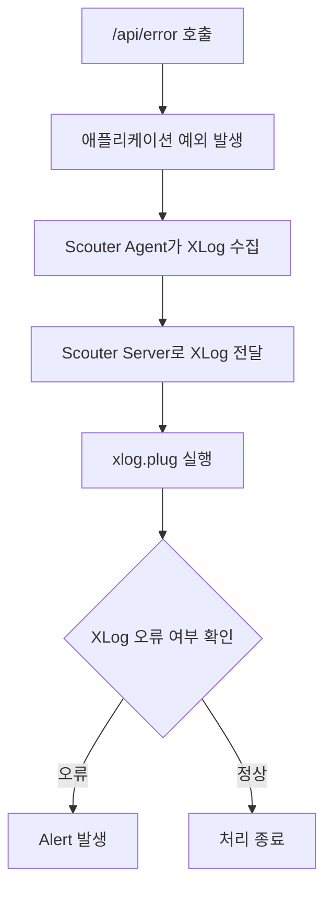
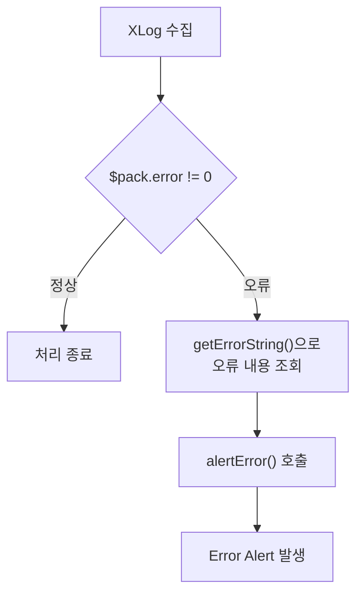

`Customizable Alert`를 이용하면 `Scouter Server`가 수집한 Counter 값을 기준으로 CPU 사용률, TPS, 응답 시간과 같은 운영 지표의 이상 상태를 감지할 수 있습니다. 이전 포스팅에서는 TPS가 설정한 임계값보다 낮아지는 상황을 자동으로 감지하고, Warning Alert를 발생시키는 과정을 직접 확인하기도 했습니다.

여기서 한 가지 궁금증이 생겼습니다. **XLog에 기록되는 오류를 감지해서 Alert를 발생시키는 것도 가능하지 않을까요?**

---

## 1. Server Scripting Plugin

`Customizable Alert`는 `Scouter Server`가 수집하는 Counter 값을 기준으로 Alert 발생 조건을 정의하는 방식이었습니다. TPS를 기준으로 Alert를 발생시키려면 `TPS.alert` 파일을 만들고, 현재 수집된 TPS Counter가 설정한 임계값보다 낮은지 판단하도록 구성해야 했습니다.

그렇다면 XLog에 기록되는 오류도 같은 방법으로 처리할 수 있을까요?

애플리케이션에서 예외가 발생하면 `Scouter Agent`가 해당 요청의 정보를 수집하고, `Scouter Client`의 XLog에는 오류로 기록됩니다. 하지만 XLog에 기록되는 오류는 TPS와 같은 Counter 값이 아닙니다. 

따라서 Counter를 기준으로 조건을 판단하는 `Customizable Alert` 기능으로는 XLog에 기록되는 개별 오류를 직접 감지하기 어렵습니다.

`Scouter`에서는 이러한 데이터를 처리할 수 있도록 `Server Scripting Plugin`을 제공합니다. 

`xlog.plug`는 `Scouter Server`가 수집한 XLog 데이터를 처리하는 `Server Scripting Plugin`으로 XLog 데이터가 저장되기 전에 호출됩니다. `xlog.plug`를 활용하면 수집된 XLog 정보를 확인하여 조건에 따라 추가적인 처리를 수행할 수 있습니다.

---

## 2. 오류 발생 API 구현

그래서 이번에는 애플리케이션에서 의도적으로 예외를 발생시켜 XLog에 오류가 기록되는 상황을 만들어 Alert를 발생시킬 수 있는지 확인해보도록 하겠습니다.

이를 위해 모니터링 대상 애플리케이션인 `simple-api` 프로젝트에 예외를 발생시키는 `/error` API를 추가했습니다. 

```java
@RequestMapping("/api")
public class ApiController {
    
    ...
    
    @GetMapping("/error")
    public Map<String, String> error() {
        throw new RuntimeException("Test error: " + serverName);
    }
    
    ...

}
```

`/error` API를 호출하면 `RuntimeException`이 발생하고 HTTP 500 응답이 반환됩니다.

현재 Object Tree에 등록되어 있는 `api-01`과 `api-02` 컨테이너에는 다음과 같이 해당 API를 호출할 수 있습니다.

* `api-01` : `GET http://192.168.56.11:8081/api/error`
* `api-02` : `GET http://192.168.56.11:8082/api/error`

실제 `api-01`과 `api-02`에 `/api/error` API를 몇 차례 호출해 의도적으로 예외를 발생시키고, 해당 요청이 `Scouter Client`의 XLog에 오류로 기록되는 것을 확인했습니다.

<div class="image-row">
  <figure>
    
    <figcaption>XLog에서 확인한 API 오류</figcaption>
  </figure>

  <figure>
    
    <figcaption>XLog List에서 확인한 API 오류</figcaption>
  </figure>
</div>

**참고**

> [simple-api의 소스코드 저장소](https://github.com/sanghoon-lee/simple-api)

---

## 3. 테스트 시나리오

`/api/error`를 호출하여 애플리케이션에서 예외가 발생하면 `xlog.plug`가 XLog 데이터에서 이를 감지하여 Alert가 발생하는지 확인해보겠습니다. 
 


---

## 4. xlog.plug 설정

앞에서 정의한 테스트 시나리오와 같이 XLog 데이터에서 오류를 감지하여 Alert를 발생시키려면 `xlog.plug`를 구성해야 합니다.

지금부터 `xlog.plug`에서 XLog의 오류 여부를 확인하고, 오류가 감지되면 `PluginHelper`를 이용해 Error 수준의 Alert를 발생시키도록 설정해보겠습니다.

---

### 4.1. xlog.plug 저장 경로 구성

`xlog.plug`는 `Scouter Server`의 `plugin` 디렉터리에 작성합니다. 이전 포스팅에서 `Customizable Alert`를 테스트하기 위해 사용했던 디렉터리와 동일합니다.

현재 호스트의 `plugin` 디렉터리는 Docker 컨테이너와 Volume으로 연결되어 있습니다.

**docker-compose.yml**

```yaml
volumes:
  - /home/sanghoon/scouter-server/database:/scouter/server/database
  - /home/sanghoon/scouter-server/logs:/scouter/server/logs
  - /home/sanghoon/scouter-server/plugin:/scouter/server/plugin
```

즉, 호스트의 `/home/sanghoon/scouter-server/plugin` 경로에 `xlog.plug` 파일을 작성하면 컨테이너의 `/scouter/server/plugin` 경로에서 해당 파일을 참조할 수 있습니다.

참고로 `Server Scripting Plugin`은 Script가 변경되면 동적으로 로드되고 컴파일되기 때문에 `Plugin`을 수정할 때마다 `Scouter Server`를 다시 시작할 필요가 없습니다.

---

### 4.2. xlog.plug 작성

`Server Scripting Plugin`에서는 `PluginHelper`가 제공하는 API를 이용하여 직접 Alert를 발생시킬 수 있습니다.

`PluginHelper`는 Alert의 심각도에 따라 다음과 같은 API를 제공합니다.

* `alertInfo(...)`
* `alertWarn(...)`
* `alertError(...)`
* `alertFatal(...)`

애플리케이션에서 발생한 예외를 감지하면 `alertError()`를 이용하여 Error 수준의 Alert를 발생시키도록 아래와 같이 간단하게 `xlog.plug`를 작성했습니다.

```java
if ($pack.error != 0) {

    String errorMessage = $$.getErrorString($pack.error);

    $$.alertError(
        $pack.objHash,
        "tomcat",
        "XLog Error",
        errorMessage
    );
}
```

`xlog.plug`에는 수집된 XLog 정보가 `XLogPack` 형태의 `$pack` 변수로 전달됩니다. `XLogPack`의 `error`에는 요청 처리 과정에서 발생한 오류를 식별하기 위한 Hash 값이 저장됩니다. 

따라서 먼저 `$pack.error`가 0이 아닌지 확인하여 오류가 발생한 XLog인지 판단합니다.

오류가 확인되면 `$pack.error`에 저장된 Hash 값을 `getErrorString()`에 전달하여 실제 오류 내용을 조회합니다. 조회한 오류 내용은 `alertError()`의 메시지로 전달합니다.

`alertError()`에는 Alert를 발생시킬 Object의 Hash와 Object Type을 전달해야 합니다. `$pack.objHash`에는 해당 요청을 처리한 Object의 Hash가 들어 있으므로 이를 그대로 사용했습니다. 또한 `Scouter Agent`의 `obj_type`도 `tomcat`으로 설정했기 때문에 Object Type에는 `"tomcat"`을 사용했습니다.



---

## 5. 테스트 결과

웹 브라우저에서 `api-01`에 `/api/error` API를 몇 차례 호출하여 의도적으로 애플리케이션 예외를 발생시켰습니다. 그러자 기대했던 것처럼 `xlog.plug`가 XLog 데이터의 오류를 감지하고, `XLog Error`라는 제목의 Error Alert가 발생했습니다.


또한 Alert 목록에서 `XLog Error` 항목을 더블클릭하면 Alert의 세부 정보도 정상적으로 확인할 수 있었습니다.


이를 통해 `$pack.error`를 이용해 오류가 발생한 XLog를 구분하고, `PluginHelper`의 `alertError()`를 호출하여 애플리케이션에서 발생한 오류를 Scouter Alert로 전환할 수 있음을 확인했습니다.

---

## 6. 다음 포스팅

XLog에 기록된 애플리케이션 오류를 `xlog.plug`에서 감지하고, 이를 Error Alert로 발생시키는 과정을 확인할 수 있었습니다.

`Customizable Alert`가 Counter 값을 기준으로 시스템의 이상 상태를 감지하는 방식이라면, 이번 포스팅에서 알아본 `xlog.plug`를 활용하면 개별 요청에서 발생한 오류를 감지하여 Alert로 연결할 수도 있습니다.

물론 아직은 발생한 Alert를 `Scouter` 내부에서만 확인할 수 있습니다. 다음 포스팅에서는 Scouter에서 발생한 Alert를 외부 Notification으로 전달하고, 이를 PagerDuty와 연동하는 방법을 알아보도록 하겠습니다.