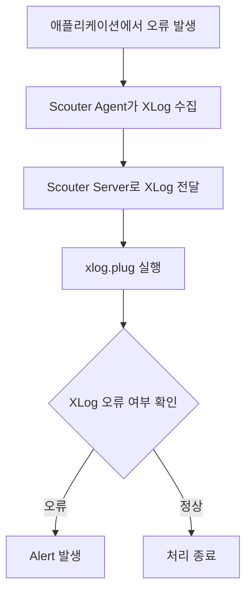

`Customizable Alert`를 이용하면 `Scouter Server`가 수집한 Counter 값을 기준으로 CPU 사용률, TPS, 응답 시간과 같은 운영 지표의 이상 상태를 감지할 수 있습니다. 이전 포스팅에서는 TPS가 설정한 임계값보다 낮아지는 상황을 자동으로 감지하고, Warning Alert를 발생시키는 과정을 직접 확인하기도 했습니다.

여기서 한 가지 궁금증이 생겼습니다. **XLog에 기록되는 오류를 감지해서 Alert를 발생시키는 것도 가능하지 않을까요?**

---

## 1. Server Scripting Plugin

`Customizable Alert`는 `Scouter Server`가 수집하는 Counter 값을 기준으로 Alert 발생 조건을 정의하는 방식이었습니다. TPS를 기준으로 Alert를 발생시키려면 `TPS.alert` 파일을 만들고, 현재 수집된 TPS Counter가 설정한 임계값보다 낮은지 판단하도록 구성해야 했습니다.

그렇다면 XLog에 기록되는 오류도 같은 방법으로 처리할 수 있을까요?

애플리케이션에서 예외가 발생하면 `Scouter Agent`가 해당 요청의 정보를 수집하고, `Scouter Client`의 XLog에는 오류로 기록됩니다. 하지만 XLog에 기록되는 오류는 TPS와 같은 Counter 값이 아닙니다. 

따라서 Counter를 기준으로 조건을 판단하는 `Customizable Alert` 기능으로는 XLog에 기록되는 개별 오류를 직접 감지하기 어렵습니다.

`Scouter`에서는 이러한 데이터를 처리할 수 있도록 `Server Scripting Plugin`을 제공합니다. 그중 `xlog.plug`는 XLog 데이터가 수집될 때 실행되는 Plugin입니다. `xlog.plug`를 활용하면 수집된 XLog 정보를 확인하여 조건에 따라 추가적인 처리를 수행할 수 있습니다.

---

## 2. 오류 발생 API 구현

그래서 이번에는 애플리케이션에서 의도적으로 예외를 발생시켜 XLog에 오류가 기록되는 상황을 만들어 Alert를 발생시킬 수 있는지 확인해보도록 하겠습니다.

이를 위해 모니터링 대상 애플리케이션인 `simple-api` 프로젝트에 예외를 발생시키는 `/error` API를 추가했습니다. 

```java
@RequestMapping("/api")
public class ApiController {
    
    ...
    
    @GetMapping("/error")
    public Map<String, String> error() {
        throw new RuntimeException("Test error: " + serverName);
    }
    
    ...

}
```

`/error` API를 호출하면 `RuntimeException`이 발생하고 HTTP 500 응답이 반환됩니다.

현재 Object Tree에 등록되어 있는 `api-01`과 `api-02` 컨테이너에는 다음과 같이 해당 API를 호출할 수 있습니다.

* `api-01` : `GET http://192.168.56.11:8081/api/error`
* `api-02` : `GET http://192.168.56.11:8082/api/error`

실제 `api-01`과 `api-02`에 `/api/error` API를 몇 차례 호출해 의도적으로 예외를 발생시키고, 해당 요청이 `Scouter Client`의 XLog에 오류로 기록되는 것을 확인했습니다.

<div class="image-row">
  <figure>
    
    <figcaption>XLog에서 확인한 API 오류</figcaption>
  </figure>

  <figure>
    
    <figcaption>XLog List에서 확인한 API 오류</figcaption>
  </figure>
</div>

**참고**

> [simple-api의 소스코드 저장소](https://github.com/sanghoon-lee/simple-api)

---

## 3. 테스트 시나리오


