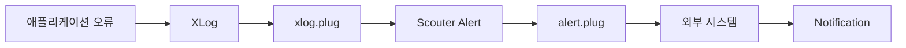
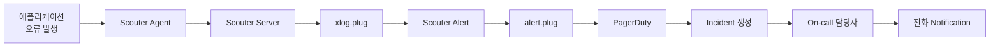
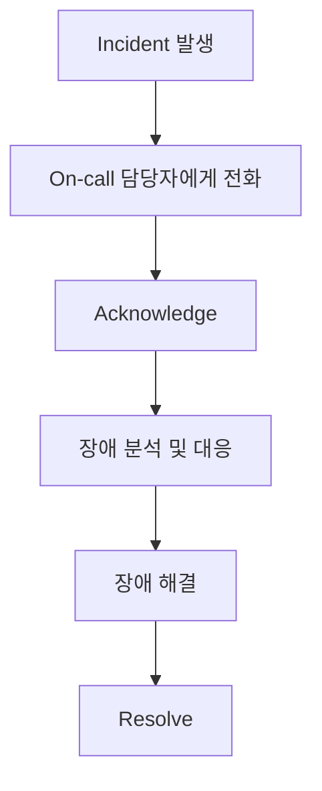
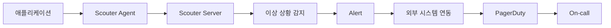

이전 포스팅에서 애플리케이션에서 발생한 오류를 `xlog.plug`에서 감지하여 `Scouter Alert`로 발생시키는 과정을 확인했습니다.

하지만 Alert가 발생하더라도 담당자가 `Scouter Client`를 확인하지 않는다면 장애 발생 사실을 인지할 수 없습니다. 특히, 새벽이나 휴일처럼 담당자가 모니터링 화면을 확인하기 어려운 시간에는 Alert를 외부 시스템으로 전달하여 담당자에게 전화(On-call)로 상황을 전달하는 방법이 가장 직관적으로 보입니다.

이번 포스팅에서는 `Scouter`에서 발생한 Alert를 외부 시스템으로 전달하는 방법을 알아보고, 이를 `PagerDuty`와 연동한다면 어떻게 담당 개발자에게 On-call까지 연결할 수 있는지 전체적인 흐름을 살펴보겠습니다.

---

## 1. Scouter Alert를 외부로 전달하려면

`Scouter`에서 Alert가 발생했다는 것은 이상 상황을 감지했다는 의미입니다. 하지만 Alert와 담당자에게 장애 발생 사실을 전달하는 Notification은 서로 다른 역할을 합니다.

이전 포스팅에서 `xlog.plug`를 이용하여 XLog에 기록된 오류를 Alert로 전환했다면, 이제는 발생한 Alert를 외부 시스템으로 전달해야 합니다.

Scouter에서는 `alert.plug`라는 `Server Scripting Plugin`을 이용하여 발생한 Alert를 처리할 수 있습니다.

`xlog.plug`가 XLog 데이터를 처리하는 Plugin이라면, `alert.plug`는 Scouter에서 Alert가 발생했을 때 호출되는 Plugin입니다.

따라서 `alert.plug`에서 외부 시스템의 API를 호출하도록 구현하면 Scouter에서 발생한 Alert를 외부 시스템으로 전달할 수 있습니다.

이러한 구조를 이용하면 Scouter는 이상 상황을 감지하는 역할에 집중하고, 실제 문자 메시지나 전화 등의 Notification은 별도의 외부 시스템에서 담당하도록 역할을 분리할 수 있습니다.

---

## 2. PagerDuty와 연동한다면

이번 시리즈를 시작하면서 최종적으로 구현하고 싶었던 구조는 Scouter에서 장애를 감지하고 이를 PagerDuty로 전달하여 담당 개발자에게 전화까지 연결하는 것이었습니다.

PagerDuty는 모니터링 시스템에서 전달받은 Event를 기반으로 Incident를 생성하고, 해당 서비스의 Escalation Policy와 On-call 담당자 설정에 따라 Notification을 전달할 수 있습니다.

Scouter와 PagerDuty를 연결한다면 전체적인 구조는 다음과 같이 구성할 수 있습니다.

alert.plug에서 Scouter Alert 정보를 받아 PagerDuty의 Events API로 전달하고, PagerDuty에서는 전달받은 Event를 기반으로 Incident를 생성하는 방식입니다.

따라서 지금까지 구현한 구조에서 alert.plug를 이용한 외부 API 호출 부분을 추가하면 Scouter와 PagerDuty를 연결할 수 있습니다.

---

## 3. PagerDuty의 On-call

PagerDuty에 Incident가 생성되면 해당 서비스에 설정된 Escalation Policy에 따라 현재 On-call 담당자에게 Notification이 전달됩니다.

전화 Notification을 설정했다면 담당자는 PagerDuty로부터 전화를 받을 수 있습니다.

여기서 중요한 것은 전화를 받았다고 해서 장애가 해결된 것은 아니라는 점입니다. 담당자가 장애를 확인하고 대응을 시작했다면 Incident를 Acknowledge할 수 있습니다.

Acknowledge는 담당자가 Incident를 인지하고 대응하고 있다는 의미입니다. Incident가 Acknowledge되면 Escalation이 중지되고, 실제 장애가 해결된 이후 Resolve하여 Incident를 종료할 수 있습니다.

따라서 담당자가 장애를 처리하는 동안에도 동일한 Incident에 대해 계속 전화가 반복되는 것을 방지하면서 장애 대응 상태를 관리할 수 있습니다.

---

## 4. PagerDuty 실습 보류

여기까지 확인한 내용을 바탕으로 실제 PagerDuty 계정을 생성하고 Scouter와 연동하여 전화 On-call까지 테스트해보려고 했습니다.

하지만 실습을 진행하는 과정에서 예상하지 못했던 제약사항이 있었습니다.

PagerDuty의 Trial 계정을 생성하려면 Work Email이 필요하며 Gmail과 같은 개인 이메일 계정으로는 가입할 수 없었습니다.

이번 프로젝트는 개인적인 학습을 위해 진행하고 있는 토이프로젝트이기 때문에 회사 이메일을 사용하여 PagerDuty 계정을 생성하는 것은 적절하지 않다고 판단했습니다.

아쉽지만 PagerDuty와의 실제 연동과 전화 On-call 테스트는 여기에서 보류하기로 했습니다.

대신 지금까지 확인한 내용을 통해 Scouter에서 발생한 Alert를 alert.plug를 통해 외부 시스템으로 전달하고, 이를 PagerDuty의 Incident와 On-call로 연결할 수 있다는 전체적인 구조를 이해하는 것으로 이번 실습을 마무리하려고 합니다.

---

## 5. 마무리

이번 시리즈를 시작하면서 목표로 했던 것은 단순히 Scouter를 설치하고 애플리케이션의 상태를 모니터링하는 것이 아니었습니다.

담당자가 모니터링 화면을 계속 확인하지 않더라도 시스템이 이상 상황을 자동으로 감지하고, 필요한 경우 담당 개발자에게 전화까지 연결되는 On-call 체계를 직접 구성해보고 싶었습니다.

지금까지 Scouter Agent를 이용한 애플리케이션 모니터링부터 Counter와 XLog를 이용한 이상 상황 감지, Alert 발생까지 하나씩 직접 구성하고 확인해보았습니다.

최종 목표였던 PagerDuty와의 연동 및 전화 On-call까지 직접 테스트하지는 못했지만, Scouter에서 발생한 Alert를 외부 시스템으로 전달하고 PagerDuty의 Incident와 On-call로 연결할 수 있는 전체적인 구조까지 살펴볼 수 있었습니다.

실제 운영 환경에서 On-call 체계를 구성한다면 Alert 조건과 임계값뿐만 아니라 불필요한 알림을 줄이기 위한 정책, 장애 등급, On-call 일정, Escalation Policy 등도 함께 고민해야 할 것입니다.

향후 실제 업무 환경에서 On-call 체계를 검토할 기회가 생긴다면 이번에 구성한 Scouter Alert를 기반으로 PagerDuty와의 실제 연동까지 이어서 확인해보고 싶습니다.

이것으로 Scouter와 PagerDuty로 장애 감지부터 On-call까지 시리즈를 마무리합니다.
