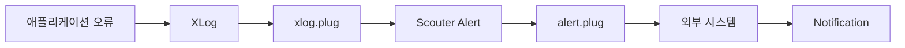
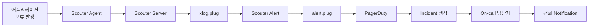
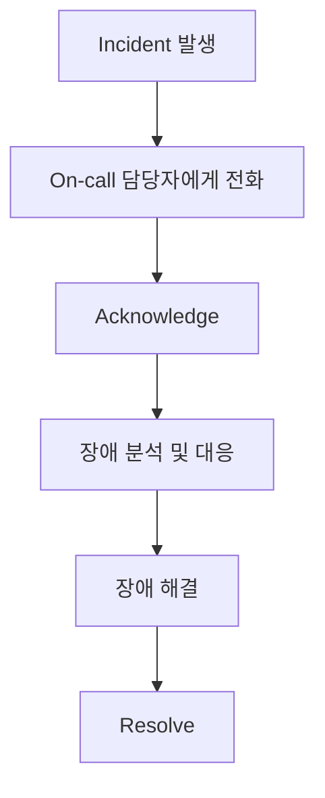

이전 포스팅에서 애플리케이션에서 발생한 오류를 `xlog.plug`에서 감지하여 `Scouter Alert`로 발생시키는 과정을 확인했습니다.

`Scouter`에서 Alert가 발생했다는 것은 이상 상황을 감지했다는 의미입니다. 하지만 Alert와 담당자에게 장애 발생 사실을 전달하는 Notification은 서로 다른 역할을 합니다.

이제는 발생한 Alert를 외부 시스템으로 전달하여 어떻게 담당자에게 Notification하는 과정을 자동화할 수 있는지 알아보도록 하겠습니다. 

---

## 1. Scouter Alert를 외부로 전달하는 방법

`xlog.plug`는 XLog 데이터를 처리하는 Plugin이고, `alert.plug`는 Alert가 발생했을 때 호출되는 Plugin입니다.

따라서 `alert.plug`에서 외부 시스템의 API를 호출하도록 구현하면 `Scouter`에서 발생한 Alert를 외부 시스템으로 전달할 수 있습니다.

이러한 구조를 이용하면 `Scouter`는 이상 상황을 감지하는 역할에 집중하고, 실제 문자 메시지의 발송이나 전화(On-call) 등의 Notification은 별도의 외부 시스템에서 담당하도록 역할을 분리할 수 있습니다.

---

## 2. Scouter와 PagerDuty의 연동

이번 시리즈를 시작하면서 최종적으로 구현하고 싶었던 구조는 `Scouter`에서 장애를 감지하고 이를 `PagerDuty`로 전달하여 담당 개발자에게 전화까지 연결하는 것이었습니다.

`PagerDuty`는 모니터링 시스템에서 전달받은 Event를 기반으로 `Incident`를 생성하고, 해당 서비스의 `Escalation Policy`와 `On-call` 담당자 설정에 따라 Notification을 전달할 수 있습니다.

`Scouter`와 `PagerDuty`를 연결한다면 전체적인 구조는 다음과 같이 구성할 수 있습니다.

`alert.plug`에서 `PagerDuty`의 Events API로 Alert를 전달하고, `PagerDuty`에서는 전달받은 Event를 기반으로 Incident를 생성하는 방식입니다.

따라서 지금까지 구현한 구조에서 `alert.plug`를 이용해 `PagerDuty`의 Events API를 호출하면 `Scouter`와 `PagerDuty`를 연동할 수 있습니다.

---

## 3. PagerDuty의 On-call

PagerDuty에 Incident가 생성되면 해당 서비스에 설정된 Escalation Policy에 따라 현재 On-call 담당자에게 Notification이 전달됩니다.

전화 Notification을 설정했다면 담당자는 PagerDuty로부터 전화를 받을 수 있습니다.

여기서 중요한 것은 전화를 받았다고 해서 장애가 해결된 것은 아니라는 점입니다. 담당자가 장애를 확인하고 대응을 시작했다면 Incident를 Acknowledge할 수 있습니다.

`Acknowledge`를 통해 담당자가 장애를 인지하고 대응 중이라는 상태를 표시할 수 있으며, 일반적인 `Escalation` 진행을 중단할 수 있습니다. 이후 실제 장애가 해결되면 `Resolve`하여 `Incident`를 종료합니다.

---

## 4. PagerDuty의 Trial 계정 생성에 대한 제약

최종 목표는 `PagerDuty`의 Trial 계정을 생성하고 `Scouter`와 연동하는 것이었습니다. 이를 통해 `Scouter`에서 특정 Alert가 발생하면 담당 개발자에게 전화가 연결되는 자동화된 On-call 체계를 직접 구성해보고 싶었습니다.

하지만 `PagerDuty`에서는 Gmail과 같은 개인 이메일 계정으로 Trial 계정을 생성하는 것이 허용되지 않았습니다. 그렇다고 개인적인 학습을 위해 회사 이메일 계정을 사용하는 것도 적절하지 않다고 생각했습니다.

이런 이유로 아쉽지만 `PagerDuty`와의 실제 연동은 보류하기로 했습니다. 이번 포스팅 시리즈는 지금까지 확인한 내용을 바탕으로 `Scouter Alert`를 외부 시스템인 `PagerDuty`로 전달하고, 자동화된 On-call 체계를 구축하기 위한 전체적인 구조를 정리해보는 것으로 마무리하기로 했습니다.

---

## 5. 마무리

실제 운영 환경에서 On-call 체계를 구성한다면 Alert 조건과 임계값뿐만 아니라 불필요한 알림을 줄이기 위한 정책, 장애 등급, On-call 일정, Escalation Policy 등도 함께 고민해야 할 것입니다.

비록 `PagerDuty`와의 실제 연동까지 완료하지는 못했지만, 애플리케이션의 이상 상황을 감지하고 Alert를 발생시킨 뒤 외부 Notification 시스템으로 연결하는 전체적인 흐름을 이해할 수 있었습니다.

향후 실제 업무 환경에서 On-call 체계를 검토할 기회가 생긴다면 이번에 구성한 `Scouter Alert`를 기반으로 `PagerDuty`와의 실제 연동까지 이어서 확인해보고 싶습니다.

이것으로 **Scouter와 PagerDuty로 장애 감지부터 On-call**까지 시리즈를 마무리합니다.
