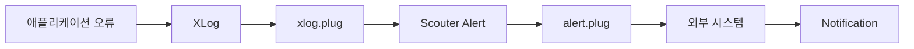
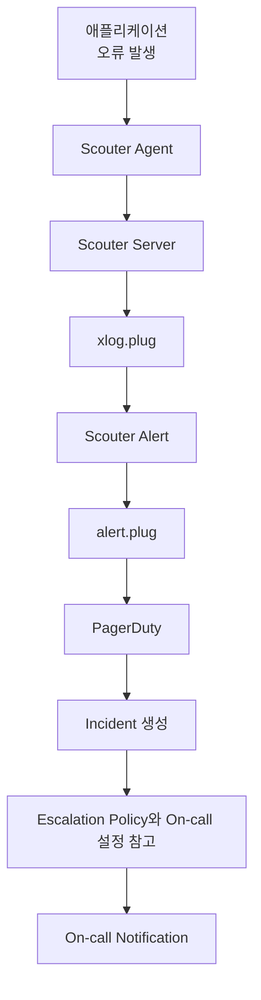
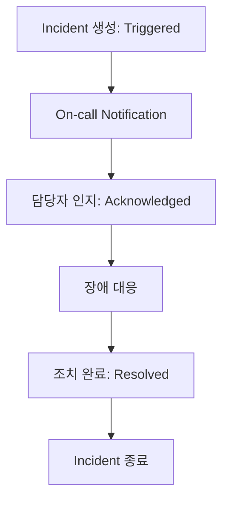

이전 포스팅에서 애플리케이션에서 발생한 오류를 `xlog.plug`에서 감지하여 `Scouter Alert`로 발생시키는 과정까지 확인했습니다.

`Scouter`에서 Alert가 발생했다는 것은 이상 상황을 감지했다는 의미입니다. 그렇다면 이상 상황을 담당자에게 전달하는 과정은 어떻게 자동화할 수 있을까요?

**참고**

> [이상 상태 감지(Alert)와 알림(Notification)](https://sanghoon-lee.github.io/2026/08/24/pagerduty5/#alert-notification)

---

## 1. alert.plug

`alert.plug`는 Alert가 발생했을 때 호출되는 Plugin입니다. 따라서 `alert.plug`에서 외부 시스템이 제공하는 API를 호출하는 방식으로 `Scouter`에서 발생한 Alert를 전달할 수 있습니다. 

이와 같은 구조를 이용하면 `Scouter`는 이상 상황을 감지하고 Alert를 발생시키는 역할에 집중하고, 감지된 이상 상황에 대한 Notification은 외부 시스템이 담당하도록 역할을 분리할 수 있습니다.

---

## 2. Scouter와 PagerDuty의 연동

이번 프로젝트의 최종 목표는 `Scouter`에서 감지한 이상 상황을 `PagerDuty`를 통해 담당자에게 전달하는 Notification 과정을 자동화하는 것이었습니다. 그리고 Notification 수단은 `On-call`(전화)로 구현해보고 싶었습니다. 특히 긴급한 장애 상황을 담당자에게 즉시 전달하기에는 On-call이 효과적일 것이라고 생각했습니다.

구현이 어렵게 보이지는 않았습니다. `alert.plug`에서 `PagerDuty`의 Events API를 호출하여 `Scouter Alert`를 `Event`로 전달하는 방식입니다.

* `Event`: `Scouter`가 `PagerDuty`에 전달한 이상 상황의 단위
* `Incident` : `PagerDuty`가 이상 상황 대응을 관리하는 단위

`PagerDuty`에서는 전달받은 `Event`를 기반으로 `Incident`를 생성합니다. 여기서 `Incident`는 `PagerDuty`가 대응이 필요한 장애나 이상 상황을 관리하기 위한 단위입니다. `Incident`를 통해 장애나 이상 상황의 발생뿐만 아니라 담당자의 인지와 대응, 최종 해결까지 포함하는 상태를 관리할 수 있습니다.

이후 해당 서비스의 `Escalation Policy`와 `On-call` 설정에 따라 담당자에게 전화로 이상 상황을 전달할 수 있습니다.

---

## 3. Incident 상태 관리

이번 프로젝트의 주제인 **Scouter와 PagerDuty로 장애 감지부터 On-call까지** 자동화해보는 아이디어에 대해서 회사 동료와 이야기를 하던 도중에 <mark>"장애가 발생해서 조치를 하고 있는데 동일한 장애로 계속 전화가 오면 어떡해?"</mark>라는 질문을 받은 적이 있었습니다.

순간 **"정말 어떡하지?"**라는 생각이 들었습니다. 그래서 찾아보니 `PagerDuty`에서는 `Incident`의 상태를 관리하여 담당자가 장애를 인지하고 대응하고 있는지를 구분할 수 있었습니다.

`Incident`가 생성되면 최초에는 `Triggered` 상태가 되고, 담당자에게 Notification이 전달됩니다. 

담당자가 장애를 인지하고 대응을 시작하면 `Acknowledged` 상태로 변경하여 `Escalation`을 중단할 수 있습니다. 이후 장애 조치가 완료되면 `Resolved` 상태로 변경하여 `Incident`를 종료합니다.

따라서 담당자가 장애를 인지하고 대응하고 있는 동안 동일한 `Incident`에 대한 `Escalation`과 `Notification`이 계속되는 것을 방지할 수 있습니다. 다만 `Acknowledgement Timeout`이 설정되어 있다면 일정 시간 동안 `Incident`가 해결되지 않았을 때 다시 `Triggered` 상태로 변경되어 Notification이 재개될 수 있습니다.

**참고**

> * `Escalation Policy`: 대응 요청을 누구에게 어떤 순서로 전달할 것인지 정의한 정책
> * `Escalation`: 장애에 대한 대응이 이루어지지 않을 때, 다음 담당자에게 대응 요청을 넘기는 것

---

## 4. PagerDuty의 Trial 계정 생성에 대한 제약

하지만 `PagerDuty`에서는 Gmail과 같은 개인 이메일 계정으로 Trial 계정을 생성할 수 없었습니다. 개인적인 학습을 위해 회사 이메일 계정을 사용하는 것도 적절하지 않다고 생각해서, 아쉽지만 `PagerDuty`와의 실제 연동은 보류해야 했습니다.

그래서 포스팅 시리즈는 `Scouter Alert`를 외부 시스템인 `PagerDuty`로 전달하고, On-call Notification으로 연결하는 전체적인 구조까지만 정리하는 것으로 마무리하려고 합니다.

---

## 5. 마무리

비록 `PagerDuty`와의 실제 연동까지 완료하지는 못했지만, `Scouter Alert`를 외부 시스템으로 전달하여 담당자에게 Notification하는 전체적인 흐름은 이해할 수 있었습니다.

향후 기회가 생긴다면 이번에 공부한 내용을 기반으로 Alert와 Notification의 자동화를 완성해보고 싶습니다. 

이것으로 **Scouter와 PagerDuty로 장애 감지부터 On-call**까지 시리즈를 마무리합니다.